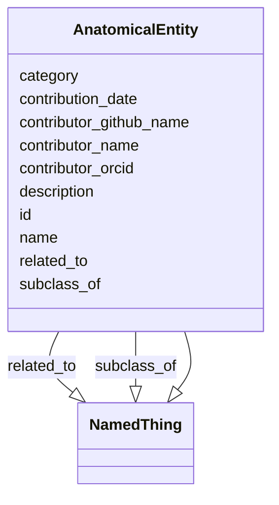

# Class: AnatomicalEntity


_A subcellular location, cell type or gross anatomical part_


URI: [data_sheets_schema:AnatomicalEntity](https://w3id.org/bridge2ai/data-sheets-schema/AnatomicalEntity)





## Inheritance
* [NamedThing](NamedThing.md)
    * **AnatomicalEntity**


## Slots

| Name | Cardinality and Range | Description | Inheritance |
| ---  | --- | --- | --- |
| [id](id.md) | 1..1 <br/> [Uriorcurie](Uriorcurie.md) | A unique identifier for a thing | [NamedThing](NamedThing.md) |
| [category](category.md) | 0..1 <br/> [CategoryType](CategoryType.md) | Name of the high level ontology class in which this entity is categorized | [NamedThing](NamedThing.md) |
| [name](name.md) | 0..1 <br/> [String](String.md) | A human-readable name for a thing | [NamedThing](NamedThing.md) |
| [description](description.md) | 0..1 <br/> [String](String.md) | A human-readable description for a thing | [NamedThing](NamedThing.md) |
| [subclass_of](subclass_of.md) | 0..* <br/> [NamedThing](NamedThing.md) | Holds between two classes where the domain class is a specialization of the r... | [NamedThing](NamedThing.md) |
| [related_to](related_to.md) | 0..* <br/> [NamedThing](NamedThing.md) | A relationship that is asserted between two named things | [NamedThing](NamedThing.md) |
| [contributor_name](contributor_name.md) | 0..1 <br/> [String](String.md) | The name of the person who added this node | [NamedThing](NamedThing.md) |
| [contributor_github_name](contributor_github_name.md) | 0..1 <br/> [String](String.md) | The name of the github user who added this node | [NamedThing](NamedThing.md) |
| [contributor_orcid](contributor_orcid.md) | 0..1 <br/> [Uriorcurie](Uriorcurie.md) | The ORCiD of the person who added this node | [NamedThing](NamedThing.md) |
| [contribution_date](contribution_date.md) | 0..1 <br/> [Date](Date.md) | The date on which the node was added | [NamedThing](NamedThing.md) |


## Identifier and Mapping Information


### Valid ID Prefixes

Instances of this class *should* have identifiers with one of the following prefixes:

* uberon


### Schema Source


* from schema: https://w3id.org/bridge2ai/data-sheets-schema


## Mappings

| Mapping Type | Mapped Value |
| ---  | ---  |
| self | data_sheets_schema:AnatomicalEntity |
| native | data_sheets_schema:AnatomicalEntity |
| exact | uberon:0001062, wikidata:Q4936952 |
| narrow | ncit:C12219 |


## LinkML Source

<!-- TODO: investigate https://stackoverflow.com/questions/37606292/how-to-create-tabbed-code-blocks-in-mkdocs-or-sphinx -->

### Direct

<details>
```yaml
name: AnatomicalEntity
id_prefixes:
- uberon
description: A subcellular location, cell type or gross anatomical part
from_schema: https://w3id.org/bridge2ai/data-sheets-schema
exact_mappings:
- uberon:0001062
- wikidata:Q4936952
narrow_mappings:
- ncit:C12219
is_a: NamedThing

```
</details>

### Induced

<details>
```yaml
name: AnatomicalEntity
id_prefixes:
- uberon
description: A subcellular location, cell type or gross anatomical part
from_schema: https://w3id.org/bridge2ai/data-sheets-schema
exact_mappings:
- uberon:0001062
- wikidata:Q4936952
narrow_mappings:
- ncit:C12219
is_a: NamedThing
attributes:
  id:
    name: id
    description: A unique identifier for a thing.
    from_schema: https://w3id.org/bridge2ai/data-sheets-schema
    rank: 1000
    slot_uri: schema:identifier
    identifier: true
    alias: id
    owner: AnatomicalEntity
    domain_of:
    - Information
    - FormatDialect
    - NamedThing
    range: uriorcurie
    required: true
  category:
    name: category
    description: Name of the high level ontology class in which this entity is categorized.
      Corresponds to the label for the entity type class, e.g., "BiomedicalStandard".
    from_schema: https://w3id.org/bridge2ai/data-sheets-schema
    rank: 1000
    is_a: type
    domain: NamedThing
    designates_type: true
    alias: category
    owner: AnatomicalEntity
    domain_of:
    - NamedThing
    range: category_type
  name:
    name: name
    description: A human-readable name for a thing.
    from_schema: https://w3id.org/bridge2ai/data-sheets-schema
    rank: 1000
    slot_uri: schema:name
    alias: name
    owner: AnatomicalEntity
    domain_of:
    - NamedThing
    range: string
  description:
    name: description
    description: A human-readable description for a thing.
    from_schema: https://w3id.org/bridge2ai/data-sheets-schema
    rank: 1000
    slot_uri: schema:description
    alias: description
    owner: AnatomicalEntity
    domain_of:
    - Information
    - Relationships
    - Splits
    - DataAnomaly
    - Confidentiality
    - Deidentification
    - SensitiveElement
    - InstanceAcquisition
    - CollectionMechanism
    - DataCollector
    - CollectionTimeframe
    - EthicalReview
    - DirectCollection
    - CollectionNotification
    - CollectionConsent
    - ConsentRevocation
    - DataProtectionImpact
    - PreprocessingStrategy
    - CleaningStrategy
    - LabelingStrategy
    - RawData
    - ExistingUse
    - UseRepository
    - OtherTask
    - FutureUseImpact
    - DiscouragedUse
    - ThirdPartySharing
    - DistributionFormat
    - DistributionDate
    - LicenseAndUseTerms
    - IPRestrictions
    - ExportControlRegulatoryRestrictions
    - Maintainer
    - Erratum
    - UpdatePlan
    - RetentionLimits
    - VersionAccess
    - ExtensionMechanism
    - NamedThing
    range: string
  subclass_of:
    name: subclass_of
    description: Holds between two classes where the domain class is a specialization
      of the range class.
    from_schema: https://w3id.org/bridge2ai/data-sheets-schema
    exact_mappings:
    - rdfs:subClassOf
    - MESH:isa
    narrow_mappings:
    - rdfs:subPropertyOf
    rank: 1000
    is_a: related_to
    domain: NamedThing
    multivalued: true
    inherited: true
    alias: subclass_of
    owner: AnatomicalEntity
    domain_of:
    - NamedThing
    range: NamedThing
  related_to:
    name: related_to
    description: A relationship that is asserted between two named things.
    from_schema: https://w3id.org/bridge2ai/data-sheets-schema
    rank: 1000
    domain: NamedThing
    multivalued: true
    inherited: true
    alias: related_to
    owner: AnatomicalEntity
    domain_of:
    - Organization
    - NamedThing
    symmetric: true
    range: NamedThing
  contributor_name:
    name: contributor_name
    description: The name of the person who added this node.
    from_schema: https://w3id.org/bridge2ai/data-sheets-schema
    rank: 1000
    is_a: node_property
    domain: NamedThing
    alias: contributor_name
    owner: AnatomicalEntity
    domain_of:
    - NamedThing
    range: string
  contributor_github_name:
    name: contributor_github_name
    description: The name of the github user who added this node.
    from_schema: https://w3id.org/bridge2ai/data-sheets-schema
    rank: 1000
    is_a: node_property
    domain: NamedThing
    alias: contributor_github_name
    owner: AnatomicalEntity
    domain_of:
    - NamedThing
    range: string
  contributor_orcid:
    name: contributor_orcid
    description: The ORCiD of the person who added this node.
    examples:
    - value: ORCID:0000-0001-1234-5678
    from_schema: https://w3id.org/bridge2ai/data-sheets-schema
    rank: 1000
    is_a: node_property
    domain: NamedThing
    alias: contributor_orcid
    owner: AnatomicalEntity
    domain_of:
    - NamedThing
    range: uriorcurie
  contribution_date:
    name: contribution_date
    description: The date on which the node was added.
    examples:
    - value: '2023-03-20'
    from_schema: https://w3id.org/bridge2ai/data-sheets-schema
    rank: 1000
    is_a: node_property
    domain: NamedThing
    alias: contribution_date
    owner: AnatomicalEntity
    domain_of:
    - NamedThing
    range: date

```
</details>