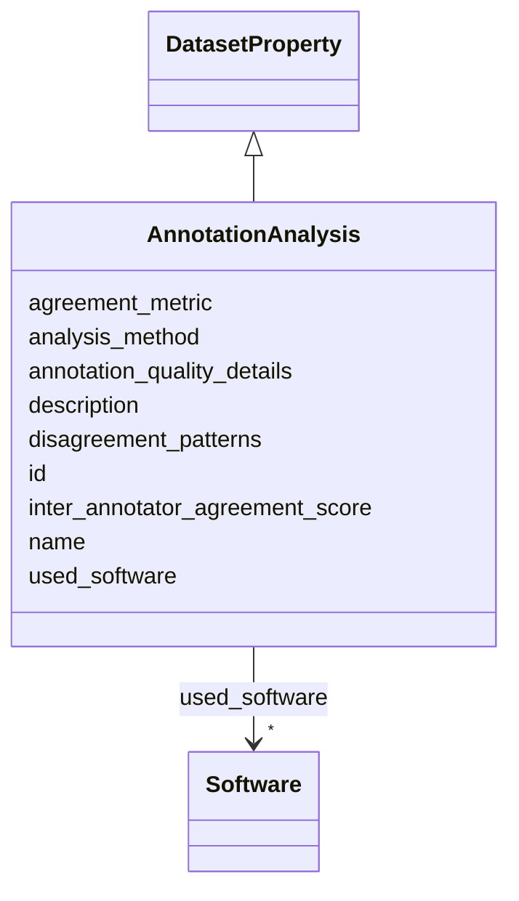

# Class: AnnotationAnalysis 


_Analysis of annotation quality, inter-annotator agreement metrics, and systematic patterns in annotation disagreements._

__


URI: [data_sheets_schema:AnnotationAnalysis](https://w3id.org/bridge2ai/data-sheets-schema/AnnotationAnalysis)





## Inheritance
* [DatasetProperty](DatasetProperty.md)
    * **AnnotationAnalysis**


## Slots

| Name | Cardinality and Range | Description | Inheritance |
| ---  | --- | --- | --- |
| [inter_annotator_agreement_score](inter_annotator_agreement_score.md) | 0..1 <br/> [Float](Float.md) | Measured agreement between annotators (e | direct |
| [agreement_metric](agreement_metric.md) | 0..1 <br/> [String](String.md) | Type of agreement metric used (Cohen's kappa, Fleiss' kappa, Krippendorff's a... | direct |
| [analysis_method](analysis_method.md) | 0..1 <br/> [String](String.md) | Methodology used to assess annotation quality and resolve disagreements | direct |
| [disagreement_patterns](disagreement_patterns.md) | * <br/> [String](String.md) | Systematic patterns in annotator disagreements (e | direct |
| [annotation_quality_details](annotation_quality_details.md) | * <br/> [String](String.md) | Additional details on annotation quality assessment and findings | direct |
| [id](id.md) | 0..1 <br/> [Uriorcurie](Uriorcurie.md) | An optional identifier for this property | [DatasetProperty](DatasetProperty.md) |
| [name](name.md) | 0..1 <br/> [String](String.md) | A human-readable name for this property | [DatasetProperty](DatasetProperty.md) |
| [description](description.md) | 0..1 <br/> [String](String.md) | A human-readable description for this property | [DatasetProperty](DatasetProperty.md) |
| [used_software](used_software.md) | * <br/> [Software](Software.md) | What software was used as part of this dataset property? | [DatasetProperty](DatasetProperty.md) |


## Usages

| used by | used in | type | used |
| ---  | --- | --- | --- |
| [Dataset](Dataset.md) | [annotation_analyses](annotation_analyses.md) | range | [AnnotationAnalysis](AnnotationAnalysis.md) |
| [DataSubset](DataSubset.md) | [annotation_analyses](annotation_analyses.md) | range | [AnnotationAnalysis](AnnotationAnalysis.md) |


## Identifier and Mapping Information


### Schema Source


* from schema: https://w3id.org/bridge2ai/data-sheets-schema


## Mappings

| Mapping Type | Mapped Value |
| ---  | ---  |
| self | data_sheets_schema:AnnotationAnalysis |
| native | data_sheets_schema:AnnotationAnalysis |
| exact | rai:dataAnnotationAnalysis |


## LinkML Source

<!-- TODO: investigate https://stackoverflow.com/questions/37606292/how-to-create-tabbed-code-blocks-in-mkdocs-or-sphinx -->

### Direct

<details>
```yaml
name: AnnotationAnalysis
description: 'Analysis of annotation quality, inter-annotator agreement metrics, and
  systematic patterns in annotation disagreements.

  '
from_schema: https://w3id.org/bridge2ai/data-sheets-schema
exact_mappings:
- rai:dataAnnotationAnalysis
is_a: DatasetProperty
attributes:
  inter_annotator_agreement_score:
    name: inter_annotator_agreement_score
    description: 'Measured agreement between annotators (e.g., Cohen''s kappa value,
      Fleiss'' kappa, Krippendorff''s alpha).

      '
    from_schema: https://w3id.org/bridge2ai/data-sheets-schema/preprocessing-cleaning-labeling
    rank: 1000
    domain_of:
    - AnnotationAnalysis
    range: float
  agreement_metric:
    name: agreement_metric
    description: 'Type of agreement metric used (Cohen''s kappa, Fleiss'' kappa, Krippendorff''s
      alpha, percentage agreement, etc.).

      '
    from_schema: https://w3id.org/bridge2ai/data-sheets-schema/preprocessing-cleaning-labeling
    rank: 1000
    domain_of:
    - AnnotationAnalysis
    range: string
  analysis_method:
    name: analysis_method
    description: 'Methodology used to assess annotation quality and resolve disagreements.

      '
    from_schema: https://w3id.org/bridge2ai/data-sheets-schema/preprocessing-cleaning-labeling
    rank: 1000
    domain_of:
    - AnnotationAnalysis
    range: string
  disagreement_patterns:
    name: disagreement_patterns
    description: 'Systematic patterns in annotator disagreements (e.g., by demographic
      group, annotation difficulty, task type).

      '
    from_schema: https://w3id.org/bridge2ai/data-sheets-schema/preprocessing-cleaning-labeling
    rank: 1000
    domain_of:
    - AnnotationAnalysis
    range: string
    multivalued: true
  annotation_quality_details:
    name: annotation_quality_details
    description: 'Additional details on annotation quality assessment and findings.

      '
    from_schema: https://w3id.org/bridge2ai/data-sheets-schema/preprocessing-cleaning-labeling
    rank: 1000
    domain_of:
    - AnnotationAnalysis
    range: string
    multivalued: true

```
</details>

### Induced

<details>
```yaml
name: AnnotationAnalysis
description: 'Analysis of annotation quality, inter-annotator agreement metrics, and
  systematic patterns in annotation disagreements.

  '
from_schema: https://w3id.org/bridge2ai/data-sheets-schema
exact_mappings:
- rai:dataAnnotationAnalysis
is_a: DatasetProperty
attributes:
  inter_annotator_agreement_score:
    name: inter_annotator_agreement_score
    description: 'Measured agreement between annotators (e.g., Cohen''s kappa value,
      Fleiss'' kappa, Krippendorff''s alpha).

      '
    from_schema: https://w3id.org/bridge2ai/data-sheets-schema/preprocessing-cleaning-labeling
    rank: 1000
    alias: inter_annotator_agreement_score
    owner: AnnotationAnalysis
    domain_of:
    - AnnotationAnalysis
    range: float
  agreement_metric:
    name: agreement_metric
    description: 'Type of agreement metric used (Cohen''s kappa, Fleiss'' kappa, Krippendorff''s
      alpha, percentage agreement, etc.).

      '
    from_schema: https://w3id.org/bridge2ai/data-sheets-schema/preprocessing-cleaning-labeling
    rank: 1000
    alias: agreement_metric
    owner: AnnotationAnalysis
    domain_of:
    - AnnotationAnalysis
    range: string
  analysis_method:
    name: analysis_method
    description: 'Methodology used to assess annotation quality and resolve disagreements.

      '
    from_schema: https://w3id.org/bridge2ai/data-sheets-schema/preprocessing-cleaning-labeling
    rank: 1000
    alias: analysis_method
    owner: AnnotationAnalysis
    domain_of:
    - AnnotationAnalysis
    range: string
  disagreement_patterns:
    name: disagreement_patterns
    description: 'Systematic patterns in annotator disagreements (e.g., by demographic
      group, annotation difficulty, task type).

      '
    from_schema: https://w3id.org/bridge2ai/data-sheets-schema/preprocessing-cleaning-labeling
    rank: 1000
    alias: disagreement_patterns
    owner: AnnotationAnalysis
    domain_of:
    - AnnotationAnalysis
    range: string
    multivalued: true
  annotation_quality_details:
    name: annotation_quality_details
    description: 'Additional details on annotation quality assessment and findings.

      '
    from_schema: https://w3id.org/bridge2ai/data-sheets-schema/preprocessing-cleaning-labeling
    rank: 1000
    alias: annotation_quality_details
    owner: AnnotationAnalysis
    domain_of:
    - AnnotationAnalysis
    range: string
    multivalued: true
  id:
    name: id
    description: An optional identifier for this property.
    from_schema: https://w3id.org/bridge2ai/data-sheets-schema/base
    slot_uri: schema:identifier
    alias: id
    owner: AnnotationAnalysis
    domain_of:
    - NamedThing
    - DatasetProperty
    range: uriorcurie
  name:
    name: name
    description: A human-readable name for this property.
    from_schema: https://w3id.org/bridge2ai/data-sheets-schema/base
    slot_uri: schema:name
    alias: name
    owner: AnnotationAnalysis
    domain_of:
    - NamedThing
    - DatasetProperty
    range: string
  description:
    name: description
    description: A human-readable description for this property.
    from_schema: https://w3id.org/bridge2ai/data-sheets-schema/base
    slot_uri: schema:description
    alias: description
    owner: AnnotationAnalysis
    domain_of:
    - NamedThing
    - DatasetProperty
    - DatasetRelationship
    range: string
  used_software:
    name: used_software
    description: What software was used as part of this dataset property?
    from_schema: https://w3id.org/bridge2ai/data-sheets-schema/base
    rank: 1000
    alias: used_software
    owner: AnnotationAnalysis
    domain_of:
    - DatasetProperty
    range: Software
    multivalued: true
    inlined: true
    inlined_as_list: true

```
</details>