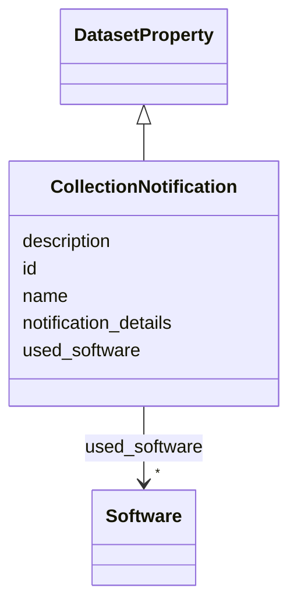

# Class: CollectionNotification 


_Were the individuals in question notified about the data collection? If so, please describe (or show with screenshots, etc.) how notice was provided, and reproduce the language of the notification itself if possible._

__


URI: [data_sheets_schema:CollectionNotification](https://w3id.org/bridge2ai/data-sheets-schema/CollectionNotification)





## Inheritance
* [DatasetProperty](DatasetProperty.md)
    * **CollectionNotification**


## Slots

| Name | Cardinality and Range | Description | Inheritance |
| ---  | --- | --- | --- |
| [notification_details](notification_details.md) | * <br/> [String](String.md) | Details on how individuals were notified about data collection | direct |
| [id](id.md) | 0..1 <br/> [Uriorcurie](Uriorcurie.md) | An optional identifier for this property | [DatasetProperty](DatasetProperty.md) |
| [name](name.md) | 0..1 <br/> [String](String.md) | A human-readable name for this property | [DatasetProperty](DatasetProperty.md) |
| [description](description.md) | 0..1 <br/> [String](String.md) | A human-readable description for this property | [DatasetProperty](DatasetProperty.md) |
| [used_software](used_software.md) | * <br/> [Software](Software.md) | What software was used as part of this dataset property? | [DatasetProperty](DatasetProperty.md) |


## Identifier and Mapping Information


### Schema Source


* from schema: https://w3id.org/bridge2ai/data-sheets-schema


## Mappings

| Mapping Type | Mapped Value |
| ---  | ---  |
| self | data_sheets_schema:CollectionNotification |
| native | data_sheets_schema:CollectionNotification |


## LinkML Source

<!-- TODO: investigate https://stackoverflow.com/questions/37606292/how-to-create-tabbed-code-blocks-in-mkdocs-or-sphinx -->

### Direct

<details>
```yaml
name: CollectionNotification
description: 'Were the individuals in question notified about the data collection?
  If so, please describe (or show with screenshots, etc.) how notice was provided,
  and reproduce the language of the notification itself if possible.

  '
from_schema: https://w3id.org/bridge2ai/data-sheets-schema
is_a: DatasetProperty
attributes:
  notification_details:
    name: notification_details
    description: 'Details on how individuals were notified about data collection.

      '
    from_schema: https://w3id.org/bridge2ai/data-sheets-schema/ethics
    rank: 1000
    slot_uri: dcterms:description
    domain_of:
    - CollectionNotification
    range: string
    multivalued: true

```
</details>

### Induced

<details>
```yaml
name: CollectionNotification
description: 'Were the individuals in question notified about the data collection?
  If so, please describe (or show with screenshots, etc.) how notice was provided,
  and reproduce the language of the notification itself if possible.

  '
from_schema: https://w3id.org/bridge2ai/data-sheets-schema
is_a: DatasetProperty
attributes:
  notification_details:
    name: notification_details
    description: 'Details on how individuals were notified about data collection.

      '
    from_schema: https://w3id.org/bridge2ai/data-sheets-schema/ethics
    rank: 1000
    slot_uri: dcterms:description
    alias: notification_details
    owner: CollectionNotification
    domain_of:
    - CollectionNotification
    range: string
    multivalued: true
  id:
    name: id
    description: An optional identifier for this property.
    from_schema: https://w3id.org/bridge2ai/data-sheets-schema/base
    slot_uri: schema:identifier
    alias: id
    owner: CollectionNotification
    domain_of:
    - NamedThing
    - DatasetProperty
    range: uriorcurie
  name:
    name: name
    description: A human-readable name for this property.
    from_schema: https://w3id.org/bridge2ai/data-sheets-schema/base
    slot_uri: schema:name
    alias: name
    owner: CollectionNotification
    domain_of:
    - NamedThing
    - DatasetProperty
    range: string
  description:
    name: description
    description: A human-readable description for this property.
    from_schema: https://w3id.org/bridge2ai/data-sheets-schema/base
    slot_uri: schema:description
    alias: description
    owner: CollectionNotification
    domain_of:
    - NamedThing
    - DatasetProperty
    - DatasetRelationship
    range: string
  used_software:
    name: used_software
    description: What software was used as part of this dataset property?
    from_schema: https://w3id.org/bridge2ai/data-sheets-schema/base
    rank: 1000
    alias: used_software
    owner: CollectionNotification
    domain_of:
    - DatasetProperty
    range: Software
    multivalued: true
    inlined: true
    inlined_as_list: true

```
</details>