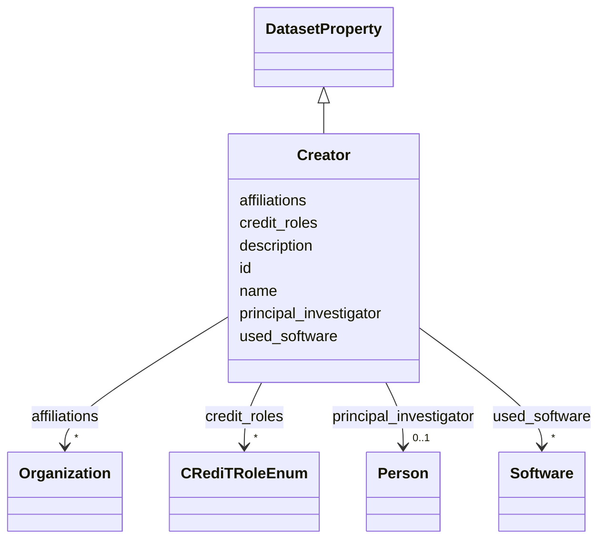

# Class: Creator 


_Who created the dataset (e.g., which team, research group) and on behalf of which entity (e.g., company, institution, organization)? This may also be considered a team._

__


URI: [data_sheets_schema:Creator](https://w3id.org/bridge2ai/data-sheets-schema/Creator)





## Inheritance
* [DatasetProperty](DatasetProperty.md)
    * **Creator**


## Slots

| Name | Cardinality and Range | Description | Inheritance |
| ---  | --- | --- | --- |
| [principal_investigator](principal_investigator.md) | 0..1 <br/> [Person](Person.md) | A key individual (Principal Investigator) responsible for or overseeing datas... | direct |
| [affiliations](affiliations.md) | * <br/> [Organization](Organization.md) | Organizations with which the creator or team is affiliated | direct |
| [credit_roles](credit_roles.md) | * <br/> [CRediTRoleEnum](CRediTRoleEnum.md) | Contributor roles using the CRediT (Contributor Roles Taxonomy) for the princ... | direct |
| [id](id.md) | 0..1 <br/> [Uriorcurie](Uriorcurie.md) | An optional identifier for this property | [DatasetProperty](DatasetProperty.md) |
| [name](name.md) | 0..1 <br/> [String](String.md) | A human-readable name for this property | [DatasetProperty](DatasetProperty.md) |
| [description](description.md) | 0..1 <br/> [String](String.md) | A human-readable description for this property | [DatasetProperty](DatasetProperty.md) |
| [used_software](used_software.md) | * <br/> [Software](Software.md) | What software was used as part of this dataset property? | [DatasetProperty](DatasetProperty.md) |


## Usages

| used by | used in | type | used |
| ---  | --- | --- | --- |
| [Dataset](Dataset.md) | [creators](creators.md) | range | [Creator](Creator.md) |
| [DataSubset](DataSubset.md) | [creators](creators.md) | range | [Creator](Creator.md) |


## Identifier and Mapping Information


### Schema Source


* from schema: https://w3id.org/bridge2ai/data-sheets-schema


## Mappings

| Mapping Type | Mapped Value |
| ---  | ---  |
| self | data_sheets_schema:Creator |
| native | data_sheets_schema:Creator |


## LinkML Source

<!-- TODO: investigate https://stackoverflow.com/questions/37606292/how-to-create-tabbed-code-blocks-in-mkdocs-or-sphinx -->

### Direct

<details>
```yaml
name: Creator
description: 'Who created the dataset (e.g., which team, research group) and on behalf
  of which entity (e.g., company, institution, organization)? This may also be considered
  a team.

  '
from_schema: https://w3id.org/bridge2ai/data-sheets-schema
is_a: DatasetProperty
attributes:
  principal_investigator:
    name: principal_investigator
    description: A key individual (Principal Investigator) responsible for or overseeing
      dataset creation.
    from_schema: https://w3id.org/bridge2ai/data-sheets-schema/motivation
    exact_mappings:
    - schema:creator
    rank: 1000
    slot_uri: dcterms:creator
    domain_of:
    - Creator
    range: Person
  affiliations:
    name: affiliations
    description: Organizations with which the creator or team is affiliated.
    from_schema: https://w3id.org/bridge2ai/data-sheets-schema/motivation
    rank: 1000
    slot_uri: schema:affiliation
    domain_of:
    - Creator
    range: Organization
    multivalued: true
    inlined: true
    inlined_as_list: true
  credit_roles:
    name: credit_roles
    description: 'Contributor roles using the CRediT (Contributor Roles Taxonomy)
      for the principal investigator or creator team. Specifies the specific contributions
      made to this dataset (e.g., Conceptualization, Data Curation, Methodology).
      Note: roles are specified here rather than on Person directly, since the same
      person may have different roles across different datasets.'
    from_schema: https://w3id.org/bridge2ai/data-sheets-schema/motivation
    rank: 1000
    domain_of:
    - Creator
    range: CRediTRoleEnum
    multivalued: true

```
</details>

### Induced

<details>
```yaml
name: Creator
description: 'Who created the dataset (e.g., which team, research group) and on behalf
  of which entity (e.g., company, institution, organization)? This may also be considered
  a team.

  '
from_schema: https://w3id.org/bridge2ai/data-sheets-schema
is_a: DatasetProperty
attributes:
  principal_investigator:
    name: principal_investigator
    description: A key individual (Principal Investigator) responsible for or overseeing
      dataset creation.
    from_schema: https://w3id.org/bridge2ai/data-sheets-schema/motivation
    exact_mappings:
    - schema:creator
    rank: 1000
    slot_uri: dcterms:creator
    alias: principal_investigator
    owner: Creator
    domain_of:
    - Creator
    range: Person
  affiliations:
    name: affiliations
    description: Organizations with which the creator or team is affiliated.
    from_schema: https://w3id.org/bridge2ai/data-sheets-schema/motivation
    rank: 1000
    slot_uri: schema:affiliation
    alias: affiliations
    owner: Creator
    domain_of:
    - Creator
    range: Organization
    multivalued: true
    inlined: true
    inlined_as_list: true
  credit_roles:
    name: credit_roles
    description: 'Contributor roles using the CRediT (Contributor Roles Taxonomy)
      for the principal investigator or creator team. Specifies the specific contributions
      made to this dataset (e.g., Conceptualization, Data Curation, Methodology).
      Note: roles are specified here rather than on Person directly, since the same
      person may have different roles across different datasets.'
    from_schema: https://w3id.org/bridge2ai/data-sheets-schema/motivation
    rank: 1000
    alias: credit_roles
    owner: Creator
    domain_of:
    - Creator
    range: CRediTRoleEnum
    multivalued: true
  id:
    name: id
    description: An optional identifier for this property.
    from_schema: https://w3id.org/bridge2ai/data-sheets-schema/base
    slot_uri: schema:identifier
    alias: id
    owner: Creator
    domain_of:
    - NamedThing
    - DatasetProperty
    range: uriorcurie
  name:
    name: name
    description: A human-readable name for this property.
    from_schema: https://w3id.org/bridge2ai/data-sheets-schema/base
    slot_uri: schema:name
    alias: name
    owner: Creator
    domain_of:
    - NamedThing
    - DatasetProperty
    range: string
  description:
    name: description
    description: A human-readable description for this property.
    from_schema: https://w3id.org/bridge2ai/data-sheets-schema/base
    slot_uri: schema:description
    alias: description
    owner: Creator
    domain_of:
    - NamedThing
    - DatasetProperty
    - DatasetRelationship
    range: string
  used_software:
    name: used_software
    description: What software was used as part of this dataset property?
    from_schema: https://w3id.org/bridge2ai/data-sheets-schema/base
    rank: 1000
    alias: used_software
    owner: Creator
    domain_of:
    - DatasetProperty
    range: Software
    multivalued: true
    inlined: true
    inlined_as_list: true

```
</details>