# Class: DataSubset 


_A subset of a dataset, likely containing multiple files of multiple potential purposes and properties._


URI: [data_sheets_schema:DataSubset](https://w3id.org/bridge2ai/data-sheets-schema/DataSubset)

```mermaid
 classDiagram
    class DataSubset
    click DataSubset href "../DataSubset/"
      Dataset <|-- DataSubset
        click Dataset href "../Dataset/"
      
      DataSubset : acquisition_methods
        
          
    
        
        
        DataSubset --> "*" InstanceAcquisition : acquisition_methods
        click InstanceAcquisition href "../InstanceAcquisition/"
    

        
      DataSubset : addressing_gaps
        
          
    
        
        
        DataSubset --> "*" AddressingGap : addressing_gaps
        click AddressingGap href "../AddressingGap/"
    

        
      DataSubset : annotation_analyses
        
          
    
        
        
        DataSubset --> "*" AnnotationAnalysis : annotation_analyses
        click AnnotationAnalysis href "../AnnotationAnalysis/"
    

        
      DataSubset : anomalies
        
          
    
        
        
        DataSubset --> "*" DataAnomaly : anomalies
        click DataAnomaly href "../DataAnomaly/"
    

        
      DataSubset : bytes
        
      DataSubset : citation
        
      DataSubset : cleaning_strategies
        
          
    
        
        
        DataSubset --> "*" CleaningStrategy : cleaning_strategies
        click CleaningStrategy href "../CleaningStrategy/"
    

        
      DataSubset : collection_mechanisms
        
          
    
        
        
        DataSubset --> "*" CollectionMechanism : collection_mechanisms
        click CollectionMechanism href "../CollectionMechanism/"
    

        
      DataSubset : collection_timeframes
        
          
    
        
        
        DataSubset --> "*" CollectionTimeframe : collection_timeframes
        click CollectionTimeframe href "../CollectionTimeframe/"
    

        
      DataSubset : compression
        
          
    
        
        
        DataSubset --> "0..1" CompressionEnum : compression
        click CompressionEnum href "../CompressionEnum/"
    

        
      DataSubset : confidential_elements
        
          
    
        
        
        DataSubset --> "*" Confidentiality : confidential_elements
        click Confidentiality href "../Confidentiality/"
    

        
      DataSubset : conforms_to
        
      DataSubset : conforms_to_class
        
      DataSubset : conforms_to_schema
        
      DataSubset : content_warnings
        
          
    
        
        
        DataSubset --> "*" ContentWarning : content_warnings
        click ContentWarning href "../ContentWarning/"
    

        
      DataSubset : created_by
        
      DataSubset : created_on
        
      DataSubset : creators
        
          
    
        
        
        DataSubset --> "*" Creator : creators
        click Creator href "../Creator/"
    

        
      DataSubset : data_collectors
        
          
    
        
        
        DataSubset --> "*" DataCollector : data_collectors
        click DataCollector href "../DataCollector/"
    

        
      DataSubset : data_protection_impacts
        
          
    
        
        
        DataSubset --> "*" DataProtectionImpact : data_protection_impacts
        click DataProtectionImpact href "../DataProtectionImpact/"
    

        
      DataSubset : description
        
      DataSubset : dialect
        
      DataSubset : discouraged_uses
        
          
    
        
        
        DataSubset --> "*" DiscouragedUse : discouraged_uses
        click DiscouragedUse href "../DiscouragedUse/"
    

        
      DataSubset : distribution_dates
        
          
    
        
        
        DataSubset --> "*" DistributionDate : distribution_dates
        click DistributionDate href "../DistributionDate/"
    

        
      DataSubset : distribution_formats
        
          
    
        
        
        DataSubset --> "*" DistributionFormat : distribution_formats
        click DistributionFormat href "../DistributionFormat/"
    

        
      DataSubset : doi
        
      DataSubset : download_url
        
      DataSubset : encoding
        
          
    
        
        
        DataSubset --> "0..1" EncodingEnum : encoding
        click EncodingEnum href "../EncodingEnum/"
    

        
      DataSubset : errata
        
          
    
        
        
        DataSubset --> "*" Erratum : errata
        click Erratum href "../Erratum/"
    

        
      DataSubset : ethical_reviews
        
          
    
        
        
        DataSubset --> "*" EthicalReview : ethical_reviews
        click EthicalReview href "../EthicalReview/"
    

        
      DataSubset : existing_uses
        
          
    
        
        
        DataSubset --> "*" ExistingUse : existing_uses
        click ExistingUse href "../ExistingUse/"
    

        
      DataSubset : extension_mechanism
        
          
    
        
        
        DataSubset --> "0..1" ExtensionMechanism : extension_mechanism
        click ExtensionMechanism href "../ExtensionMechanism/"
    

        
      DataSubset : external_resources
        
          
    
        
        
        DataSubset --> "*" ExternalResource : external_resources
        click ExternalResource href "../ExternalResource/"
    

        
      DataSubset : format
        
          
    
        
        
        DataSubset --> "0..1" FormatEnum : format
        click FormatEnum href "../FormatEnum/"
    

        
      DataSubset : funders
        
          
    
        
        
        DataSubset --> "*" FundingMechanism : funders
        click FundingMechanism href "../FundingMechanism/"
    

        
      DataSubset : future_use_impacts
        
          
    
        
        
        DataSubset --> "*" FutureUseImpact : future_use_impacts
        click FutureUseImpact href "../FutureUseImpact/"
    

        
      DataSubset : hash
        
      DataSubset : human_subject_research
        
          
    
        
        
        DataSubset --> "0..1" HumanSubjectResearch : human_subject_research
        click HumanSubjectResearch href "../HumanSubjectResearch/"
    

        
      DataSubset : id
        
      DataSubset : imputation_protocols
        
          
    
        
        
        DataSubset --> "*" ImputationProtocol : imputation_protocols
        click ImputationProtocol href "../ImputationProtocol/"
    

        
      DataSubset : informed_consent
        
          
    
        
        
        DataSubset --> "*" InformedConsent : informed_consent
        click InformedConsent href "../InformedConsent/"
    

        
      DataSubset : instances
        
          
    
        
        
        DataSubset --> "*" Instance : instances
        click Instance href "../Instance/"
    

        
      DataSubset : intended_uses
        
          
    
        
        
        DataSubset --> "*" IntendedUse : intended_uses
        click IntendedUse href "../IntendedUse/"
    

        
      DataSubset : ip_restrictions
        
          
    
        
        
        DataSubset --> "0..1" IPRestrictions : ip_restrictions
        click IPRestrictions href "../IPRestrictions/"
    

        
      DataSubset : is_data_split
        
      DataSubset : is_deidentified
        
          
    
        
        
        DataSubset --> "0..1" Deidentification : is_deidentified
        click Deidentification href "../Deidentification/"
    

        
      DataSubset : is_subpopulation
        
      DataSubset : is_tabular
        
      DataSubset : issued
        
      DataSubset : keywords
        
      DataSubset : known_biases
        
          
    
        
        
        DataSubset --> "*" DatasetBias : known_biases
        click DatasetBias href "../DatasetBias/"
    

        
      DataSubset : known_limitations
        
          
    
        
        
        DataSubset --> "*" DatasetLimitation : known_limitations
        click DatasetLimitation href "../DatasetLimitation/"
    

        
      DataSubset : labeling_strategies
        
          
    
        
        
        DataSubset --> "*" LabelingStrategy : labeling_strategies
        click LabelingStrategy href "../LabelingStrategy/"
    

        
      DataSubset : language
        
      DataSubset : last_updated_on
        
      DataSubset : license
        
      DataSubset : license_and_use_terms
        
          
    
        
        
        DataSubset --> "0..1" LicenseAndUseTerms : license_and_use_terms
        click LicenseAndUseTerms href "../LicenseAndUseTerms/"
    

        
      DataSubset : machine_annotation_tools
        
          
    
        
        
        DataSubset --> "*" MachineAnnotationTools : machine_annotation_tools
        click MachineAnnotationTools href "../MachineAnnotationTools/"
    

        
      DataSubset : maintainers
        
          
    
        
        
        DataSubset --> "*" Maintainer : maintainers
        click Maintainer href "../Maintainer/"
    

        
      DataSubset : md5
        
      DataSubset : media_type
        
          
    
        
        
        DataSubset --> "0..1" MediaTypeEnum : media_type
        click MediaTypeEnum href "../MediaTypeEnum/"
    

        
      DataSubset : missing_data_documentation
        
          
    
        
        
        DataSubset --> "*" MissingDataDocumentation : missing_data_documentation
        click MissingDataDocumentation href "../MissingDataDocumentation/"
    

        
      DataSubset : modified_by
        
      DataSubset : name
        
      DataSubset : other_tasks
        
          
    
        
        
        DataSubset --> "*" OtherTask : other_tasks
        click OtherTask href "../OtherTask/"
    

        
      DataSubset : page
        
      DataSubset : parent_datasets
        
          
    
        
        
        DataSubset --> "*" Dataset : parent_datasets
        click Dataset href "../Dataset/"
    

        
      DataSubset : participant_compensation
        
          
    
        
        
        DataSubset --> "0..1" HumanSubjectCompensation : participant_compensation
        click HumanSubjectCompensation href "../HumanSubjectCompensation/"
    

        
      DataSubset : participant_privacy
        
          
    
        
        
        DataSubset --> "*" ParticipantPrivacy : participant_privacy
        click ParticipantPrivacy href "../ParticipantPrivacy/"
    

        
      DataSubset : path
        
      DataSubset : preprocessing_strategies
        
          
    
        
        
        DataSubset --> "*" PreprocessingStrategy : preprocessing_strategies
        click PreprocessingStrategy href "../PreprocessingStrategy/"
    

        
      DataSubset : prohibited_uses
        
          
    
        
        
        DataSubset --> "*" ProhibitedUse : prohibited_uses
        click ProhibitedUse href "../ProhibitedUse/"
    

        
      DataSubset : publisher
        
      DataSubset : purposes
        
          
    
        
        
        DataSubset --> "*" Purpose : purposes
        click Purpose href "../Purpose/"
    

        
      DataSubset : raw_data_sources
        
          
    
        
        
        DataSubset --> "*" RawDataSource : raw_data_sources
        click RawDataSource href "../RawDataSource/"
    

        
      DataSubset : raw_sources
        
          
    
        
        
        DataSubset --> "*" RawData : raw_sources
        click RawData href "../RawData/"
    

        
      DataSubset : regulatory_restrictions
        
          
    
        
        
        DataSubset --> "0..1" ExportControlRegulatoryRestrictions : regulatory_restrictions
        click ExportControlRegulatoryRestrictions href "../ExportControlRegulatoryRestrictions/"
    

        
      DataSubset : related_datasets
        
          
    
        
        
        DataSubset --> "*" DatasetRelationship : related_datasets
        click DatasetRelationship href "../DatasetRelationship/"
    

        
      DataSubset : resources
        
          
    
        
        
        DataSubset --> "*" Dataset : resources
        click Dataset href "../Dataset/"
    

        
      DataSubset : retention_limit
        
          
    
        
        
        DataSubset --> "0..1" RetentionLimits : retention_limit
        click RetentionLimits href "../RetentionLimits/"
    

        
      DataSubset : sampling_strategies
        
          
    
        
        
        DataSubset --> "*" SamplingStrategy : sampling_strategies
        click SamplingStrategy href "../SamplingStrategy/"
    

        
      DataSubset : sensitive_elements
        
          
    
        
        
        DataSubset --> "*" SensitiveElement : sensitive_elements
        click SensitiveElement href "../SensitiveElement/"
    

        
      DataSubset : sha256
        
      DataSubset : status
        
      DataSubset : subpopulations
        
          
    
        
        
        DataSubset --> "*" Subpopulation : subpopulations
        click Subpopulation href "../Subpopulation/"
    

        
      DataSubset : subsets
        
          
    
        
        
        DataSubset --> "*" DataSubset : subsets
        click DataSubset href "../DataSubset/"
    

        
      DataSubset : tasks
        
          
    
        
        
        DataSubset --> "*" Task : tasks
        click Task href "../Task/"
    

        
      DataSubset : title
        
      DataSubset : updates
        
          
    
        
        
        DataSubset --> "0..1" UpdatePlan : updates
        click UpdatePlan href "../UpdatePlan/"
    

        
      DataSubset : use_repository
        
          
    
        
        
        DataSubset --> "*" UseRepository : use_repository
        click UseRepository href "../UseRepository/"
    

        
      DataSubset : variables
        
          
    
        
        
        DataSubset --> "*" VariableMetadata : variables
        click VariableMetadata href "../VariableMetadata/"
    

        
      DataSubset : version
        
      DataSubset : version_access
        
          
    
        
        
        DataSubset --> "0..1" VersionAccess : version_access
        click VersionAccess href "../VersionAccess/"
    

        
      DataSubset : vulnerable_populations
        
          
    
        
        
        DataSubset --> "0..1" VulnerablePopulations : vulnerable_populations
        click VulnerablePopulations href "../VulnerablePopulations/"
    

        
      DataSubset : was_derived_from
        
      
```





## Inheritance
* [NamedThing](NamedThing.md)
    * [Information](Information.md)
        * [Dataset](Dataset.md)
            * **DataSubset**


## Slots

| Name | Cardinality and Range | Description | Inheritance |
| ---  | --- | --- | --- |
| [is_data_split](is_data_split.md) | 0..1 <br/> [Boolean](Boolean.md) | Is this subset a split of the larger dataset, e | direct |
| [is_subpopulation](is_subpopulation.md) | 0..1 <br/> [Boolean](Boolean.md) | Is this subset a subpopulation of the larger dataset, e | direct |
| [bytes](bytes.md) | 0..1 <br/> [Integer](Integer.md) | Size of the data in bytes | [Dataset](Dataset.md) |
| [dialect](dialect.md) | 0..1 <br/> [String](String.md) |  | [Dataset](Dataset.md) |
| [encoding](encoding.md) | 0..1 <br/> [EncodingEnum](EncodingEnum.md) | the character encoding of the data | [Dataset](Dataset.md) |
| [format](format.md) | 0..1 <br/> [FormatEnum](FormatEnum.md) | The file format, physical medium, or dimensions of a resource | [Dataset](Dataset.md) |
| [hash](hash.md) | 0..1 <br/> [String](String.md) | hash of the data | [Dataset](Dataset.md) |
| [md5](md5.md) | 0..1 <br/> [String](String.md) | md5 hash of the data | [Dataset](Dataset.md) |
| [media_type](media_type.md) | 0..1 <br/> [MediaTypeEnum](MediaTypeEnum.md) | The media type of the data | [Dataset](Dataset.md) |
| [path](path.md) | 0..1 <br/> [String](String.md) |  | [Dataset](Dataset.md) |
| [sha256](sha256.md) | 0..1 <br/> [String](String.md) | sha256 hash of the data | [Dataset](Dataset.md) |
| [external_resources](external_resources.md) | * <br/> [ExternalResource](ExternalResource.md) | Links or identifiers for external resources | [Dataset](Dataset.md) |
| [resources](resources.md) | * <br/> [Dataset](Dataset.md) | Sub-resources or component datasets that are part of this dataset | [Dataset](Dataset.md) |
| [purposes](purposes.md) | * <br/> [Purpose](Purpose.md) |  | [Dataset](Dataset.md) |
| [tasks](tasks.md) | * <br/> [Task](Task.md) |  | [Dataset](Dataset.md) |
| [addressing_gaps](addressing_gaps.md) | * <br/> [AddressingGap](AddressingGap.md) |  | [Dataset](Dataset.md) |
| [creators](creators.md) | * <br/> [Creator](Creator.md) |  | [Dataset](Dataset.md) |
| [funders](funders.md) | * <br/> [FundingMechanism](FundingMechanism.md) |  | [Dataset](Dataset.md) |
| [subsets](subsets.md) | * <br/> [DataSubset](DataSubset.md) |  | [Dataset](Dataset.md) |
| [instances](instances.md) | * <br/> [Instance](Instance.md) |  | [Dataset](Dataset.md) |
| [anomalies](anomalies.md) | * <br/> [DataAnomaly](DataAnomaly.md) |  | [Dataset](Dataset.md) |
| [known_biases](known_biases.md) | * <br/> [DatasetBias](DatasetBias.md) | Known biases present in the dataset that may affect fairness, representativen... | [Dataset](Dataset.md) |
| [known_limitations](known_limitations.md) | * <br/> [DatasetLimitation](DatasetLimitation.md) | Known limitations of the dataset that may affect its use or interpretation | [Dataset](Dataset.md) |
| [confidential_elements](confidential_elements.md) | * <br/> [Confidentiality](Confidentiality.md) |  | [Dataset](Dataset.md) |
| [content_warnings](content_warnings.md) | * <br/> [ContentWarning](ContentWarning.md) |  | [Dataset](Dataset.md) |
| [subpopulations](subpopulations.md) | * <br/> [Subpopulation](Subpopulation.md) |  | [Dataset](Dataset.md) |
| [sensitive_elements](sensitive_elements.md) | * <br/> [SensitiveElement](SensitiveElement.md) |  | [Dataset](Dataset.md) |
| [acquisition_methods](acquisition_methods.md) | * <br/> [InstanceAcquisition](InstanceAcquisition.md) |  | [Dataset](Dataset.md) |
| [collection_mechanisms](collection_mechanisms.md) | * <br/> [CollectionMechanism](CollectionMechanism.md) |  | [Dataset](Dataset.md) |
| [sampling_strategies](sampling_strategies.md) | * <br/> [SamplingStrategy](SamplingStrategy.md) |  | [Dataset](Dataset.md) |
| [data_collectors](data_collectors.md) | * <br/> [DataCollector](DataCollector.md) |  | [Dataset](Dataset.md) |
| [collection_timeframes](collection_timeframes.md) | * <br/> [CollectionTimeframe](CollectionTimeframe.md) |  | [Dataset](Dataset.md) |
| [missing_data_documentation](missing_data_documentation.md) | * <br/> [MissingDataDocumentation](MissingDataDocumentation.md) | Documentation of missing data patterns and handling strategies | [Dataset](Dataset.md) |
| [raw_data_sources](raw_data_sources.md) | * <br/> [RawDataSource](RawDataSource.md) | Description of raw data sources before preprocessing | [Dataset](Dataset.md) |
| [ethical_reviews](ethical_reviews.md) | * <br/> [EthicalReview](EthicalReview.md) |  | [Dataset](Dataset.md) |
| [data_protection_impacts](data_protection_impacts.md) | * <br/> [DataProtectionImpact](DataProtectionImpact.md) |  | [Dataset](Dataset.md) |
| [human_subject_research](human_subject_research.md) | 0..1 <br/> [HumanSubjectResearch](HumanSubjectResearch.md) | Information about whether dataset involves human subjects research, including... | [Dataset](Dataset.md) |
| [informed_consent](informed_consent.md) | * <br/> [InformedConsent](InformedConsent.md) | Details about informed consent procedures, including consent type, documentat... | [Dataset](Dataset.md) |
| [participant_privacy](participant_privacy.md) | * <br/> [ParticipantPrivacy](ParticipantPrivacy.md) | Privacy protections and anonymization procedures for human research participa... | [Dataset](Dataset.md) |
| [participant_compensation](participant_compensation.md) | 0..1 <br/> [HumanSubjectCompensation](HumanSubjectCompensation.md) | Compensation or incentives provided to human research participants | [Dataset](Dataset.md) |
| [vulnerable_populations](vulnerable_populations.md) | 0..1 <br/> [VulnerablePopulations](VulnerablePopulations.md) | Information about protections for vulnerable populations (e | [Dataset](Dataset.md) |
| [preprocessing_strategies](preprocessing_strategies.md) | * <br/> [PreprocessingStrategy](PreprocessingStrategy.md) |  | [Dataset](Dataset.md) |
| [cleaning_strategies](cleaning_strategies.md) | * <br/> [CleaningStrategy](CleaningStrategy.md) |  | [Dataset](Dataset.md) |
| [labeling_strategies](labeling_strategies.md) | * <br/> [LabelingStrategy](LabelingStrategy.md) |  | [Dataset](Dataset.md) |
| [raw_sources](raw_sources.md) | * <br/> [RawData](RawData.md) |  | [Dataset](Dataset.md) |
| [imputation_protocols](imputation_protocols.md) | * <br/> [ImputationProtocol](ImputationProtocol.md) | Data imputation methodology and techniques | [Dataset](Dataset.md) |
| [annotation_analyses](annotation_analyses.md) | * <br/> [AnnotationAnalysis](AnnotationAnalysis.md) | Analysis of annotation quality and inter-annotator agreement | [Dataset](Dataset.md) |
| [machine_annotation_tools](machine_annotation_tools.md) | * <br/> [MachineAnnotationTools](MachineAnnotationTools.md) | Automated annotation tools used in dataset creation | [Dataset](Dataset.md) |
| [existing_uses](existing_uses.md) | * <br/> [ExistingUse](ExistingUse.md) |  | [Dataset](Dataset.md) |
| [use_repository](use_repository.md) | * <br/> [UseRepository](UseRepository.md) |  | [Dataset](Dataset.md) |
| [other_tasks](other_tasks.md) | * <br/> [OtherTask](OtherTask.md) |  | [Dataset](Dataset.md) |
| [future_use_impacts](future_use_impacts.md) | * <br/> [FutureUseImpact](FutureUseImpact.md) |  | [Dataset](Dataset.md) |
| [discouraged_uses](discouraged_uses.md) | * <br/> [DiscouragedUse](DiscouragedUse.md) |  | [Dataset](Dataset.md) |
| [intended_uses](intended_uses.md) | * <br/> [IntendedUse](IntendedUse.md) | Explicit intended and recommended uses for this dataset | [Dataset](Dataset.md) |
| [prohibited_uses](prohibited_uses.md) | * <br/> [ProhibitedUse](ProhibitedUse.md) | Explicitly prohibited or forbidden uses for this dataset | [Dataset](Dataset.md) |
| [distribution_formats](distribution_formats.md) | * <br/> [DistributionFormat](DistributionFormat.md) |  | [Dataset](Dataset.md) |
| [distribution_dates](distribution_dates.md) | * <br/> [DistributionDate](DistributionDate.md) |  | [Dataset](Dataset.md) |
| [license_and_use_terms](license_and_use_terms.md) | 0..1 <br/> [LicenseAndUseTerms](LicenseAndUseTerms.md) |  | [Dataset](Dataset.md) |
| [ip_restrictions](ip_restrictions.md) | 0..1 <br/> [IPRestrictions](IPRestrictions.md) |  | [Dataset](Dataset.md) |
| [regulatory_restrictions](regulatory_restrictions.md) | 0..1 <br/> [ExportControlRegulatoryRestrictions](ExportControlRegulatoryRestrictions.md) |  | [Dataset](Dataset.md) |
| [maintainers](maintainers.md) | * <br/> [Maintainer](Maintainer.md) |  | [Dataset](Dataset.md) |
| [errata](errata.md) | * <br/> [Erratum](Erratum.md) |  | [Dataset](Dataset.md) |
| [updates](updates.md) | 0..1 <br/> [UpdatePlan](UpdatePlan.md) |  | [Dataset](Dataset.md) |
| [retention_limit](retention_limit.md) | 0..1 <br/> [RetentionLimits](RetentionLimits.md) |  | [Dataset](Dataset.md) |
| [version_access](version_access.md) | 0..1 <br/> [VersionAccess](VersionAccess.md) |  | [Dataset](Dataset.md) |
| [extension_mechanism](extension_mechanism.md) | 0..1 <br/> [ExtensionMechanism](ExtensionMechanism.md) |  | [Dataset](Dataset.md) |
| [variables](variables.md) | * <br/> [VariableMetadata](VariableMetadata.md) | Metadata describing individual variables, fields, or columns in the dataset | [Dataset](Dataset.md) |
| [is_deidentified](is_deidentified.md) | 0..1 <br/> [Deidentification](Deidentification.md) |  | [Dataset](Dataset.md) |
| [is_tabular](is_tabular.md) | 0..1 <br/> [Boolean](Boolean.md) |  | [Dataset](Dataset.md) |
| [citation](citation.md) | 0..1 <br/> [String](String.md) | Recommended citation for this dataset in DataCite or BibTeX format | [Dataset](Dataset.md) |
| [parent_datasets](parent_datasets.md) | * <br/> [Dataset](Dataset.md) | Parent datasets that this dataset is part of or derived from | [Dataset](Dataset.md) |
| [related_datasets](related_datasets.md) | * <br/> [DatasetRelationship](DatasetRelationship.md) | Related datasets with typed relationships (e | [Dataset](Dataset.md) |
| [compression](compression.md) | 0..1 <br/> [CompressionEnum](CompressionEnum.md) | compression format used, if any | [Information](Information.md) |
| [conforms_to](conforms_to.md) | 0..1 <br/> [String](String.md) |  | [Information](Information.md) |
| [conforms_to_class](conforms_to_class.md) | 0..1 <br/> [String](String.md) |  | [Information](Information.md) |
| [conforms_to_schema](conforms_to_schema.md) | 0..1 <br/> [String](String.md) |  | [Information](Information.md) |
| [created_by](created_by.md) | 0..1 <br/> [String](String.md) |  | [Information](Information.md) |
| [created_on](created_on.md) | 0..1 <br/> [Datetime](Datetime.md) |  | [Information](Information.md) |
| [doi](doi.md) | 0..1 <br/> [String](String.md) | digital object identifier | [Information](Information.md) |
| [download_url](download_url.md) | 0..1 <br/> [Uri](Uri.md) | URL from which the data can be downloaded | [Information](Information.md) |
| [issued](issued.md) | 0..1 <br/> [Datetime](Datetime.md) |  | [Information](Information.md) |
| [keywords](keywords.md) | * <br/> [String](String.md) |  | [Information](Information.md) |
| [language](language.md) | 0..1 <br/> [String](String.md) | language in which the information is expressed | [Information](Information.md) |
| [last_updated_on](last_updated_on.md) | 0..1 <br/> [Datetime](Datetime.md) |  | [Information](Information.md) |
| [license](license.md) | 0..1 <br/> [String](String.md) |  | [Information](Information.md) |
| [modified_by](modified_by.md) | 0..1 <br/> [String](String.md) |  | [Information](Information.md) |
| [page](page.md) | 0..1 <br/> [String](String.md) |  | [Information](Information.md) |
| [publisher](publisher.md) | 0..1 <br/> [Uriorcurie](Uriorcurie.md) |  | [Information](Information.md) |
| [status](status.md) | 0..1 <br/> [String](String.md) |  | [Information](Information.md) |
| [title](title.md) | 0..1 <br/> [String](String.md) | the official title of the element | [Information](Information.md) |
| [version](version.md) | 0..1 <br/> [String](String.md) |  | [Information](Information.md) |
| [was_derived_from](was_derived_from.md) | 0..1 <br/> [String](String.md) |  | [Information](Information.md) |
| [id](id.md) | 1 <br/> [Uriorcurie](Uriorcurie.md) | A unique identifier for a thing | [NamedThing](NamedThing.md) |
| [name](name.md) | 0..1 <br/> [String](String.md) | A human-readable name for a thing | [NamedThing](NamedThing.md) |
| [description](description.md) | 0..1 <br/> [String](String.md) | A human-readable description for a thing | [NamedThing](NamedThing.md) |


## Usages

| used by | used in | type | used |
| ---  | --- | --- | --- |
| [Dataset](Dataset.md) | [subsets](subsets.md) | range | [DataSubset](DataSubset.md) |
| [DataSubset](DataSubset.md) | [subsets](subsets.md) | range | [DataSubset](DataSubset.md) |


## Identifier and Mapping Information


### Schema Source


* from schema: https://w3id.org/bridge2ai/data-sheets-schema


## Mappings

| Mapping Type | Mapped Value |
| ---  | ---  |
| self | data_sheets_schema:DataSubset |
| native | data_sheets_schema:DataSubset |


## LinkML Source

<!-- TODO: investigate https://stackoverflow.com/questions/37606292/how-to-create-tabbed-code-blocks-in-mkdocs-or-sphinx -->

### Direct

<details>
```yaml
name: DataSubset
description: A subset of a dataset, likely containing multiple files of multiple potential
  purposes and properties.
from_schema: https://w3id.org/bridge2ai/data-sheets-schema
is_a: Dataset
attributes:
  is_data_split:
    name: is_data_split
    description: Is this subset a split of the larger dataset, e.g., is it a set for
      model training, testing, or validation?
    from_schema: https://w3id.org/bridge2ai/data-sheets-schema
    rank: 1000
    domain_of:
    - DataSubset
    range: boolean
  is_subpopulation:
    name: is_subpopulation
    description: Is this subset a subpopulation of the larger dataset, e.g., is it
      a set of data for a specific demographic?
    from_schema: https://w3id.org/bridge2ai/data-sheets-schema
    rank: 1000
    domain_of:
    - DataSubset
    range: boolean

```
</details>

### Induced

<details>
```yaml
name: DataSubset
description: A subset of a dataset, likely containing multiple files of multiple potential
  purposes and properties.
from_schema: https://w3id.org/bridge2ai/data-sheets-schema
is_a: Dataset
attributes:
  is_data_split:
    name: is_data_split
    description: Is this subset a split of the larger dataset, e.g., is it a set for
      model training, testing, or validation?
    from_schema: https://w3id.org/bridge2ai/data-sheets-schema
    rank: 1000
    alias: is_data_split
    owner: DataSubset
    domain_of:
    - DataSubset
    range: boolean
  is_subpopulation:
    name: is_subpopulation
    description: Is this subset a subpopulation of the larger dataset, e.g., is it
      a set of data for a specific demographic?
    from_schema: https://w3id.org/bridge2ai/data-sheets-schema
    rank: 1000
    alias: is_subpopulation
    owner: DataSubset
    domain_of:
    - DataSubset
    range: boolean
  bytes:
    name: bytes
    description: Size of the data in bytes.
    from_schema: https://w3id.org/bridge2ai/data-sheets-schema
    rank: 1000
    slot_uri: dcat:byteSize
    alias: bytes
    owner: DataSubset
    domain_of:
    - Dataset
    range: integer
  dialect:
    name: dialect
    from_schema: https://w3id.org/bridge2ai/data-sheets-schema
    rank: 1000
    alias: dialect
    owner: DataSubset
    domain_of:
    - Dataset
    range: string
  encoding:
    name: encoding
    description: the character encoding of the data
    from_schema: https://w3id.org/bridge2ai/data-sheets-schema
    rank: 1000
    slot_uri: dcat:mediaType
    alias: encoding
    owner: DataSubset
    domain_of:
    - Dataset
    range: EncodingEnum
  format:
    name: format
    description: The file format, physical medium, or dimensions of a resource. This
      should be a file extension or MIME type.
    from_schema: https://w3id.org/bridge2ai/data-sheets-schema
    rank: 1000
    slot_uri: dcterms:format
    alias: format
    owner: DataSubset
    domain_of:
    - Dataset
    range: FormatEnum
  hash:
    name: hash
    description: hash of the data
    from_schema: https://w3id.org/bridge2ai/data-sheets-schema
    rank: 1000
    slot_uri: dcterms:identifier
    alias: hash
    owner: DataSubset
    domain_of:
    - Dataset
    range: string
  md5:
    name: md5
    description: md5 hash of the data
    from_schema: https://w3id.org/bridge2ai/data-sheets-schema
    rank: 1000
    slot_uri: dcterms:identifier
    alias: md5
    owner: DataSubset
    domain_of:
    - Dataset
    range: string
  media_type:
    name: media_type
    description: The media type of the data. This should be a MIME type.
    from_schema: https://w3id.org/bridge2ai/data-sheets-schema
    exact_mappings:
    - schema:encodingFormat
    rank: 1000
    slot_uri: dcat:mediaType
    alias: media_type
    owner: DataSubset
    domain_of:
    - Dataset
    range: MediaTypeEnum
  path:
    name: path
    from_schema: https://w3id.org/bridge2ai/data-sheets-schema
    rank: 1000
    slot_uri: schema:contentUrl
    alias: path
    owner: DataSubset
    domain_of:
    - Dataset
    range: string
  sha256:
    name: sha256
    description: sha256 hash of the data
    from_schema: https://w3id.org/bridge2ai/data-sheets-schema
    rank: 1000
    slot_uri: dcterms:identifier
    alias: sha256
    owner: DataSubset
    domain_of:
    - Dataset
    range: string
  external_resources:
    name: external_resources
    description: Links or identifiers for external resources. Can be used either as
      a list of ExternalResource objects (in Dataset) or as a list of URL strings
      (within ExternalResource class).
    from_schema: https://w3id.org/bridge2ai/data-sheets-schema
    rank: 1000
    slot_uri: dcterms:references
    alias: external_resources
    owner: DataSubset
    domain_of:
    - Dataset
    - ExternalResource
    range: ExternalResource
    multivalued: true
    inlined_as_list: true
  resources:
    name: resources
    description: Sub-resources or component datasets that are part of this dataset.
      Allows datasets to contain nested resource structures.
    from_schema: https://w3id.org/bridge2ai/data-sheets-schema
    rank: 1000
    alias: resources
    owner: DataSubset
    domain_of:
    - DatasetCollection
    - Dataset
    range: Dataset
    multivalued: true
    inlined_as_list: true
  purposes:
    name: purposes
    from_schema: https://w3id.org/bridge2ai/data-sheets-schema
    rank: 1000
    alias: purposes
    owner: DataSubset
    domain_of:
    - Dataset
    range: Purpose
    multivalued: true
    inlined: true
    inlined_as_list: true
  tasks:
    name: tasks
    from_schema: https://w3id.org/bridge2ai/data-sheets-schema
    rank: 1000
    alias: tasks
    owner: DataSubset
    domain_of:
    - Dataset
    range: Task
    multivalued: true
    inlined: true
    inlined_as_list: true
  addressing_gaps:
    name: addressing_gaps
    from_schema: https://w3id.org/bridge2ai/data-sheets-schema
    rank: 1000
    alias: addressing_gaps
    owner: DataSubset
    domain_of:
    - Dataset
    range: AddressingGap
    multivalued: true
    inlined: true
    inlined_as_list: true
  creators:
    name: creators
    from_schema: https://w3id.org/bridge2ai/data-sheets-schema
    rank: 1000
    alias: creators
    owner: DataSubset
    domain_of:
    - Dataset
    range: Creator
    multivalued: true
    inlined: true
    inlined_as_list: true
  funders:
    name: funders
    from_schema: https://w3id.org/bridge2ai/data-sheets-schema
    rank: 1000
    alias: funders
    owner: DataSubset
    domain_of:
    - Dataset
    range: FundingMechanism
    multivalued: true
    inlined: true
    inlined_as_list: true
  subsets:
    name: subsets
    from_schema: https://w3id.org/bridge2ai/data-sheets-schema
    exact_mappings:
    - schema:distribution
    rank: 1000
    slot_uri: dcat:distribution
    alias: subsets
    owner: DataSubset
    domain_of:
    - Dataset
    range: DataSubset
    multivalued: true
    inlined: true
    inlined_as_list: true
  instances:
    name: instances
    from_schema: https://w3id.org/bridge2ai/data-sheets-schema
    rank: 1000
    alias: instances
    owner: DataSubset
    domain_of:
    - Dataset
    range: Instance
    multivalued: true
    inlined: true
    inlined_as_list: true
  anomalies:
    name: anomalies
    from_schema: https://w3id.org/bridge2ai/data-sheets-schema
    rank: 1000
    alias: anomalies
    owner: DataSubset
    domain_of:
    - Dataset
    range: DataAnomaly
    multivalued: true
    inlined: true
    inlined_as_list: true
  known_biases:
    name: known_biases
    description: Known biases present in the dataset that may affect fairness, representativeness,
      or model performance. Uses BiasTypeEnum for standardized bias categorization
      mapped to the AI Ontology (AIO).
    from_schema: https://w3id.org/bridge2ai/data-sheets-schema
    rank: 1000
    alias: known_biases
    owner: DataSubset
    domain_of:
    - Dataset
    range: DatasetBias
    multivalued: true
    inlined: true
    inlined_as_list: true
  known_limitations:
    name: known_limitations
    description: Known limitations of the dataset that may affect its use or interpretation.
      Distinct from biases (systematic errors) and anomalies (data quality issues).
    from_schema: https://w3id.org/bridge2ai/data-sheets-schema
    rank: 1000
    alias: known_limitations
    owner: DataSubset
    domain_of:
    - Dataset
    range: DatasetLimitation
    multivalued: true
    inlined: true
    inlined_as_list: true
  confidential_elements:
    name: confidential_elements
    from_schema: https://w3id.org/bridge2ai/data-sheets-schema
    rank: 1000
    alias: confidential_elements
    owner: DataSubset
    domain_of:
    - Dataset
    range: Confidentiality
    multivalued: true
    inlined: true
    inlined_as_list: true
  content_warnings:
    name: content_warnings
    from_schema: https://w3id.org/bridge2ai/data-sheets-schema
    rank: 1000
    alias: content_warnings
    owner: DataSubset
    domain_of:
    - Dataset
    range: ContentWarning
    multivalued: true
    inlined: true
    inlined_as_list: true
  subpopulations:
    name: subpopulations
    from_schema: https://w3id.org/bridge2ai/data-sheets-schema
    rank: 1000
    alias: subpopulations
    owner: DataSubset
    domain_of:
    - Dataset
    range: Subpopulation
    multivalued: true
    inlined: true
    inlined_as_list: true
  sensitive_elements:
    name: sensitive_elements
    from_schema: https://w3id.org/bridge2ai/data-sheets-schema
    rank: 1000
    alias: sensitive_elements
    owner: DataSubset
    domain_of:
    - Dataset
    range: SensitiveElement
    multivalued: true
    inlined: true
    inlined_as_list: true
  acquisition_methods:
    name: acquisition_methods
    from_schema: https://w3id.org/bridge2ai/data-sheets-schema
    rank: 1000
    alias: acquisition_methods
    owner: DataSubset
    domain_of:
    - Dataset
    range: InstanceAcquisition
    multivalued: true
    inlined: true
    inlined_as_list: true
  collection_mechanisms:
    name: collection_mechanisms
    from_schema: https://w3id.org/bridge2ai/data-sheets-schema
    rank: 1000
    alias: collection_mechanisms
    owner: DataSubset
    domain_of:
    - Dataset
    range: CollectionMechanism
    multivalued: true
    inlined: true
    inlined_as_list: true
  sampling_strategies:
    name: sampling_strategies
    from_schema: https://w3id.org/bridge2ai/data-sheets-schema
    rank: 1000
    alias: sampling_strategies
    owner: DataSubset
    domain_of:
    - Dataset
    - Instance
    range: SamplingStrategy
    multivalued: true
    inlined: true
    inlined_as_list: true
  data_collectors:
    name: data_collectors
    from_schema: https://w3id.org/bridge2ai/data-sheets-schema
    rank: 1000
    alias: data_collectors
    owner: DataSubset
    domain_of:
    - Dataset
    range: DataCollector
    multivalued: true
    inlined: true
    inlined_as_list: true
  collection_timeframes:
    name: collection_timeframes
    from_schema: https://w3id.org/bridge2ai/data-sheets-schema
    rank: 1000
    alias: collection_timeframes
    owner: DataSubset
    domain_of:
    - Dataset
    range: CollectionTimeframe
    multivalued: true
    inlined: true
    inlined_as_list: true
  missing_data_documentation:
    name: missing_data_documentation
    description: Documentation of missing data patterns and handling strategies.
    from_schema: https://w3id.org/bridge2ai/data-sheets-schema
    rank: 1000
    alias: missing_data_documentation
    owner: DataSubset
    domain_of:
    - Dataset
    range: MissingDataDocumentation
    multivalued: true
    inlined: true
    inlined_as_list: true
  raw_data_sources:
    name: raw_data_sources
    description: Description of raw data sources before preprocessing.
    from_schema: https://w3id.org/bridge2ai/data-sheets-schema
    rank: 1000
    alias: raw_data_sources
    owner: DataSubset
    domain_of:
    - Dataset
    range: RawDataSource
    multivalued: true
    inlined: true
    inlined_as_list: true
  ethical_reviews:
    name: ethical_reviews
    from_schema: https://w3id.org/bridge2ai/data-sheets-schema
    rank: 1000
    alias: ethical_reviews
    owner: DataSubset
    domain_of:
    - Dataset
    range: EthicalReview
    multivalued: true
    inlined: true
    inlined_as_list: true
  data_protection_impacts:
    name: data_protection_impacts
    from_schema: https://w3id.org/bridge2ai/data-sheets-schema
    rank: 1000
    alias: data_protection_impacts
    owner: DataSubset
    domain_of:
    - Dataset
    range: DataProtectionImpact
    multivalued: true
    inlined: true
    inlined_as_list: true
  human_subject_research:
    name: human_subject_research
    description: Information about whether dataset involves human subjects research,
      including IRB approval, ethics review, and regulatory compliance.
    from_schema: https://w3id.org/bridge2ai/data-sheets-schema
    rank: 1000
    alias: human_subject_research
    owner: DataSubset
    domain_of:
    - Dataset
    range: HumanSubjectResearch
    inlined: true
  informed_consent:
    name: informed_consent
    description: Details about informed consent procedures, including consent type,
      documentation, and withdrawal mechanisms.
    from_schema: https://w3id.org/bridge2ai/data-sheets-schema
    rank: 1000
    alias: informed_consent
    owner: DataSubset
    domain_of:
    - Dataset
    range: InformedConsent
    multivalued: true
    inlined: true
    inlined_as_list: true
  participant_privacy:
    name: participant_privacy
    description: Privacy protections and anonymization procedures for human research
      participants, including reidentification risk assessment.
    from_schema: https://w3id.org/bridge2ai/data-sheets-schema
    rank: 1000
    alias: participant_privacy
    owner: DataSubset
    domain_of:
    - Dataset
    range: ParticipantPrivacy
    multivalued: true
    inlined: true
    inlined_as_list: true
  participant_compensation:
    name: participant_compensation
    description: Compensation or incentives provided to human research participants.
    from_schema: https://w3id.org/bridge2ai/data-sheets-schema
    rank: 1000
    alias: participant_compensation
    owner: DataSubset
    domain_of:
    - Dataset
    range: HumanSubjectCompensation
    inlined: true
  vulnerable_populations:
    name: vulnerable_populations
    description: Information about protections for vulnerable populations (e.g., minors,
      pregnant women, prisoners) including special safeguards and assent procedures.
    from_schema: https://w3id.org/bridge2ai/data-sheets-schema
    rank: 1000
    alias: vulnerable_populations
    owner: DataSubset
    domain_of:
    - Dataset
    range: VulnerablePopulations
    inlined: true
  preprocessing_strategies:
    name: preprocessing_strategies
    from_schema: https://w3id.org/bridge2ai/data-sheets-schema
    rank: 1000
    alias: preprocessing_strategies
    owner: DataSubset
    domain_of:
    - Dataset
    range: PreprocessingStrategy
    multivalued: true
    inlined: true
    inlined_as_list: true
  cleaning_strategies:
    name: cleaning_strategies
    from_schema: https://w3id.org/bridge2ai/data-sheets-schema
    rank: 1000
    alias: cleaning_strategies
    owner: DataSubset
    domain_of:
    - Dataset
    range: CleaningStrategy
    multivalued: true
    inlined: true
    inlined_as_list: true
  labeling_strategies:
    name: labeling_strategies
    from_schema: https://w3id.org/bridge2ai/data-sheets-schema
    rank: 1000
    alias: labeling_strategies
    owner: DataSubset
    domain_of:
    - Dataset
    range: LabelingStrategy
    multivalued: true
    inlined: true
    inlined_as_list: true
  raw_sources:
    name: raw_sources
    from_schema: https://w3id.org/bridge2ai/data-sheets-schema
    rank: 1000
    alias: raw_sources
    owner: DataSubset
    domain_of:
    - Dataset
    range: RawData
    multivalued: true
    inlined: true
    inlined_as_list: true
  imputation_protocols:
    name: imputation_protocols
    description: Data imputation methodology and techniques.
    from_schema: https://w3id.org/bridge2ai/data-sheets-schema
    rank: 1000
    alias: imputation_protocols
    owner: DataSubset
    domain_of:
    - Dataset
    range: ImputationProtocol
    multivalued: true
    inlined: true
    inlined_as_list: true
  annotation_analyses:
    name: annotation_analyses
    description: Analysis of annotation quality and inter-annotator agreement.
    from_schema: https://w3id.org/bridge2ai/data-sheets-schema
    rank: 1000
    alias: annotation_analyses
    owner: DataSubset
    domain_of:
    - Dataset
    range: AnnotationAnalysis
    multivalued: true
    inlined: true
    inlined_as_list: true
  machine_annotation_tools:
    name: machine_annotation_tools
    description: Automated annotation tools used in dataset creation.
    from_schema: https://w3id.org/bridge2ai/data-sheets-schema
    rank: 1000
    alias: machine_annotation_tools
    owner: DataSubset
    domain_of:
    - Dataset
    range: MachineAnnotationTools
    multivalued: true
    inlined: true
    inlined_as_list: true
  existing_uses:
    name: existing_uses
    from_schema: https://w3id.org/bridge2ai/data-sheets-schema
    rank: 1000
    alias: existing_uses
    owner: DataSubset
    domain_of:
    - Dataset
    range: ExistingUse
    multivalued: true
    inlined: true
    inlined_as_list: true
  use_repository:
    name: use_repository
    from_schema: https://w3id.org/bridge2ai/data-sheets-schema
    rank: 1000
    alias: use_repository
    owner: DataSubset
    domain_of:
    - Dataset
    range: UseRepository
    multivalued: true
    inlined: true
    inlined_as_list: true
  other_tasks:
    name: other_tasks
    from_schema: https://w3id.org/bridge2ai/data-sheets-schema
    rank: 1000
    alias: other_tasks
    owner: DataSubset
    domain_of:
    - Dataset
    range: OtherTask
    multivalued: true
    inlined: true
    inlined_as_list: true
  future_use_impacts:
    name: future_use_impacts
    from_schema: https://w3id.org/bridge2ai/data-sheets-schema
    rank: 1000
    alias: future_use_impacts
    owner: DataSubset
    domain_of:
    - Dataset
    range: FutureUseImpact
    multivalued: true
    inlined: true
    inlined_as_list: true
  discouraged_uses:
    name: discouraged_uses
    from_schema: https://w3id.org/bridge2ai/data-sheets-schema
    rank: 1000
    alias: discouraged_uses
    owner: DataSubset
    domain_of:
    - Dataset
    range: DiscouragedUse
    multivalued: true
    inlined: true
    inlined_as_list: true
  intended_uses:
    name: intended_uses
    description: Explicit intended and recommended uses for this dataset. Complements
      future_use_impacts by focusing on positive applications.
    from_schema: https://w3id.org/bridge2ai/data-sheets-schema
    rank: 1000
    alias: intended_uses
    owner: DataSubset
    domain_of:
    - Dataset
    range: IntendedUse
    multivalued: true
    inlined: true
    inlined_as_list: true
  prohibited_uses:
    name: prohibited_uses
    description: Explicitly prohibited or forbidden uses for this dataset. Stronger
      than discouraged_uses - these are not permitted.
    from_schema: https://w3id.org/bridge2ai/data-sheets-schema
    rank: 1000
    alias: prohibited_uses
    owner: DataSubset
    domain_of:
    - Dataset
    range: ProhibitedUse
    multivalued: true
    inlined: true
    inlined_as_list: true
  distribution_formats:
    name: distribution_formats
    from_schema: https://w3id.org/bridge2ai/data-sheets-schema
    rank: 1000
    alias: distribution_formats
    owner: DataSubset
    domain_of:
    - Dataset
    range: DistributionFormat
    multivalued: true
    inlined: true
    inlined_as_list: true
  distribution_dates:
    name: distribution_dates
    from_schema: https://w3id.org/bridge2ai/data-sheets-schema
    rank: 1000
    alias: distribution_dates
    owner: DataSubset
    domain_of:
    - Dataset
    range: DistributionDate
    multivalued: true
    inlined: true
    inlined_as_list: true
  license_and_use_terms:
    name: license_and_use_terms
    from_schema: https://w3id.org/bridge2ai/data-sheets-schema
    rank: 1000
    alias: license_and_use_terms
    owner: DataSubset
    domain_of:
    - Dataset
    range: LicenseAndUseTerms
    inlined: true
  ip_restrictions:
    name: ip_restrictions
    from_schema: https://w3id.org/bridge2ai/data-sheets-schema
    rank: 1000
    alias: ip_restrictions
    owner: DataSubset
    domain_of:
    - Dataset
    range: IPRestrictions
    inlined: true
  regulatory_restrictions:
    name: regulatory_restrictions
    from_schema: https://w3id.org/bridge2ai/data-sheets-schema
    rank: 1000
    alias: regulatory_restrictions
    owner: DataSubset
    domain_of:
    - Dataset
    - ExportControlRegulatoryRestrictions
    range: ExportControlRegulatoryRestrictions
    inlined: true
  maintainers:
    name: maintainers
    from_schema: https://w3id.org/bridge2ai/data-sheets-schema
    rank: 1000
    alias: maintainers
    owner: DataSubset
    domain_of:
    - Dataset
    range: Maintainer
    multivalued: true
    inlined: true
    inlined_as_list: true
  errata:
    name: errata
    from_schema: https://w3id.org/bridge2ai/data-sheets-schema
    rank: 1000
    alias: errata
    owner: DataSubset
    domain_of:
    - Dataset
    range: Erratum
    multivalued: true
    inlined: true
    inlined_as_list: true
  updates:
    name: updates
    from_schema: https://w3id.org/bridge2ai/data-sheets-schema
    rank: 1000
    alias: updates
    owner: DataSubset
    domain_of:
    - Dataset
    range: UpdatePlan
    inlined: true
  retention_limit:
    name: retention_limit
    from_schema: https://w3id.org/bridge2ai/data-sheets-schema
    rank: 1000
    alias: retention_limit
    owner: DataSubset
    domain_of:
    - Dataset
    range: RetentionLimits
    inlined: true
  version_access:
    name: version_access
    from_schema: https://w3id.org/bridge2ai/data-sheets-schema
    rank: 1000
    alias: version_access
    owner: DataSubset
    domain_of:
    - Dataset
    range: VersionAccess
    inlined: true
  extension_mechanism:
    name: extension_mechanism
    from_schema: https://w3id.org/bridge2ai/data-sheets-schema
    rank: 1000
    alias: extension_mechanism
    owner: DataSubset
    domain_of:
    - Dataset
    range: ExtensionMechanism
    inlined: true
  variables:
    name: variables
    description: Metadata describing individual variables, fields, or columns in the
      dataset.
    from_schema: https://w3id.org/bridge2ai/data-sheets-schema
    exact_mappings:
    - schema:variableMeasured
    rank: 1000
    slot_uri: schema:variableMeasured
    alias: variables
    owner: DataSubset
    domain_of:
    - Dataset
    range: VariableMetadata
    multivalued: true
    inlined: true
    inlined_as_list: true
  is_deidentified:
    name: is_deidentified
    from_schema: https://w3id.org/bridge2ai/data-sheets-schema
    rank: 1000
    alias: is_deidentified
    owner: DataSubset
    domain_of:
    - Dataset
    range: Deidentification
    inlined: true
  is_tabular:
    name: is_tabular
    from_schema: https://w3id.org/bridge2ai/data-sheets-schema
    rank: 1000
    alias: is_tabular
    owner: DataSubset
    domain_of:
    - Dataset
    range: boolean
  citation:
    name: citation
    description: Recommended citation for this dataset in DataCite or BibTeX format.
      Provides a standard way to cite the dataset in publications.
    from_schema: https://w3id.org/bridge2ai/data-sheets-schema
    exact_mappings:
    - schema:citation
    rank: 1000
    slot_uri: schema:citation
    alias: citation
    owner: DataSubset
    domain_of:
    - Dataset
    range: string
  parent_datasets:
    name: parent_datasets
    description: Parent datasets that this dataset is part of or derived from. Enables
      hierarchical dataset composition (hasPart/isPartOf relationships).
    from_schema: https://w3id.org/bridge2ai/data-sheets-schema
    exact_mappings:
    - schema:isPartOf
    rank: 1000
    slot_uri: schema:isPartOf
    alias: parent_datasets
    owner: DataSubset
    domain_of:
    - Dataset
    range: Dataset
    multivalued: true
    inlined: true
    inlined_as_list: true
  related_datasets:
    name: related_datasets
    description: Related datasets with typed relationships (e.g., supplements, derives
      from, is version of). Use DatasetRelationship class to specify relationship
      types.
    from_schema: https://w3id.org/bridge2ai/data-sheets-schema
    rank: 1000
    alias: related_datasets
    owner: DataSubset
    domain_of:
    - Dataset
    range: DatasetRelationship
    multivalued: true
    inlined: true
    inlined_as_list: true
  compression:
    name: compression
    description: compression format used, if any. e.g., gzip, bzip2, zip
    from_schema: https://w3id.org/bridge2ai/data-sheets-schema
    rank: 1000
    slot_uri: dcat:compressFormat
    alias: compression
    owner: DataSubset
    domain_of:
    - Information
    range: CompressionEnum
  conforms_to:
    name: conforms_to
    from_schema: https://w3id.org/bridge2ai/data-sheets-schema
    rank: 1000
    slot_uri: dcterms:conformsTo
    alias: conforms_to
    owner: DataSubset
    domain_of:
    - Information
    range: string
  conforms_to_class:
    name: conforms_to_class
    from_schema: https://w3id.org/bridge2ai/data-sheets-schema
    rank: 1000
    slot_uri: dcterms:conformsTo
    alias: conforms_to_class
    owner: DataSubset
    domain_of:
    - Information
    range: string
  conforms_to_schema:
    name: conforms_to_schema
    from_schema: https://w3id.org/bridge2ai/data-sheets-schema
    rank: 1000
    slot_uri: dcterms:conformsTo
    alias: conforms_to_schema
    owner: DataSubset
    domain_of:
    - Information
    range: string
  created_by:
    name: created_by
    from_schema: https://w3id.org/bridge2ai/data-sheets-schema
    rank: 1000
    slot_uri: dcterms:creator
    alias: created_by
    owner: DataSubset
    domain_of:
    - Information
    range: string
  created_on:
    name: created_on
    from_schema: https://w3id.org/bridge2ai/data-sheets-schema
    rank: 1000
    slot_uri: dcterms:created
    alias: created_on
    owner: DataSubset
    domain_of:
    - Information
    range: datetime
  doi:
    name: doi
    description: digital object identifier
    from_schema: https://w3id.org/bridge2ai/data-sheets-schema
    rank: 1000
    slot_uri: dcterms:identifier
    alias: doi
    owner: DataSubset
    domain_of:
    - Information
    range: string
    pattern: 10\.\d{4,}\/.+
  download_url:
    name: download_url
    description: URL from which the data can be downloaded. This is not the same as
      the landing page, which is a page that describes the dataset. Rather, this URL
      points directly to the data itself.
    from_schema: https://w3id.org/bridge2ai/data-sheets-schema
    exact_mappings:
    - schema:url
    rank: 1000
    slot_uri: dcat:downloadURL
    alias: download_url
    owner: DataSubset
    domain_of:
    - Information
    range: uri
  issued:
    name: issued
    from_schema: https://w3id.org/bridge2ai/data-sheets-schema
    rank: 1000
    slot_uri: dcterms:issued
    alias: issued
    owner: DataSubset
    domain_of:
    - Information
    range: datetime
  keywords:
    name: keywords
    from_schema: https://w3id.org/bridge2ai/data-sheets-schema
    rank: 1000
    slot_uri: dcat:keyword
    alias: keywords
    owner: DataSubset
    domain_of:
    - Information
    range: string
    multivalued: true
  language:
    name: language
    description: language in which the information is expressed
    from_schema: https://w3id.org/bridge2ai/data-sheets-schema
    exact_mappings:
    - schema:inLanguage
    rank: 1000
    slot_uri: dcterms:language
    alias: language
    owner: DataSubset
    domain_of:
    - Information
    range: string
  last_updated_on:
    name: last_updated_on
    from_schema: https://w3id.org/bridge2ai/data-sheets-schema
    rank: 1000
    slot_uri: dcterms:modified
    alias: last_updated_on
    owner: DataSubset
    domain_of:
    - Information
    range: datetime
  license:
    name: license
    from_schema: https://w3id.org/bridge2ai/data-sheets-schema
    rank: 1000
    slot_uri: dcterms:license
    alias: license
    owner: DataSubset
    domain_of:
    - Software
    - Information
    range: string
  modified_by:
    name: modified_by
    from_schema: https://w3id.org/bridge2ai/data-sheets-schema
    rank: 1000
    slot_uri: dcterms:contributor
    alias: modified_by
    owner: DataSubset
    domain_of:
    - Information
    range: string
  page:
    name: page
    from_schema: https://w3id.org/bridge2ai/data-sheets-schema
    rank: 1000
    slot_uri: dcat:landingPage
    alias: page
    owner: DataSubset
    domain_of:
    - Information
    range: string
  publisher:
    name: publisher
    from_schema: https://w3id.org/bridge2ai/data-sheets-schema
    rank: 1000
    slot_uri: dcterms:publisher
    alias: publisher
    owner: DataSubset
    domain_of:
    - Information
    range: uriorcurie
  status:
    name: status
    from_schema: https://w3id.org/bridge2ai/data-sheets-schema
    rank: 1000
    slot_uri: dcterms:type
    alias: status
    owner: DataSubset
    domain_of:
    - Information
    range: string
  title:
    name: title
    description: the official title of the element
    from_schema: https://w3id.org/bridge2ai/data-sheets-schema
    rank: 1000
    slot_uri: dcterms:title
    alias: title
    owner: DataSubset
    domain_of:
    - Information
    range: string
  version:
    name: version
    from_schema: https://w3id.org/bridge2ai/data-sheets-schema
    rank: 1000
    slot_uri: dcterms:hasVersion
    alias: version
    owner: DataSubset
    domain_of:
    - Software
    - Information
    range: string
  was_derived_from:
    name: was_derived_from
    from_schema: https://w3id.org/bridge2ai/data-sheets-schema
    exact_mappings:
    - dcterms:source
    rank: 1000
    slot_uri: prov:wasDerivedFrom
    alias: was_derived_from
    owner: DataSubset
    domain_of:
    - Information
    range: string
  id:
    name: id
    description: A unique identifier for a thing.
    from_schema: https://w3id.org/bridge2ai/data-sheets-schema/base
    rank: 1000
    slot_uri: schema:identifier
    identifier: true
    alias: id
    owner: DataSubset
    domain_of:
    - NamedThing
    - DatasetProperty
    range: uriorcurie
    required: true
  name:
    name: name
    description: A human-readable name for a thing.
    from_schema: https://w3id.org/bridge2ai/data-sheets-schema/base
    rank: 1000
    slot_uri: schema:name
    alias: name
    owner: DataSubset
    domain_of:
    - NamedThing
    - DatasetProperty
    range: string
  description:
    name: description
    description: A human-readable description for a thing.
    from_schema: https://w3id.org/bridge2ai/data-sheets-schema/base
    rank: 1000
    slot_uri: schema:description
    alias: description
    owner: DataSubset
    domain_of:
    - NamedThing
    - DatasetProperty
    - DatasetRelationship
    range: string

```
</details>