# Class: Dataset 


_A single component of related observations and/or information that can be read, manipulated, transformed, and otherwise interpreted._


URI: [dcat:Distribution](http://www.w3.org/ns/dcat#Distribution)

```mermaid
 classDiagram
    class Dataset
    click Dataset href "../Dataset/"
      Information <|-- Dataset
        click Information href "../Information/"
      

      Dataset <|-- DataSubset
        click DataSubset href "../DataSubset/"
      

      Dataset : acquisition_methods
        
          
    
        
        
        Dataset --> "*" InstanceAcquisition : acquisition_methods
        click InstanceAcquisition href "../InstanceAcquisition/"
    

        
      Dataset : addressing_gaps
        
          
    
        
        
        Dataset --> "*" AddressingGap : addressing_gaps
        click AddressingGap href "../AddressingGap/"
    

        
      Dataset : anomalies
        
          
    
        
        
        Dataset --> "*" DataAnomaly : anomalies
        click DataAnomaly href "../DataAnomaly/"
    

        
      Dataset : bytes
        
      Dataset : cleaning_strategies
        
          
    
        
        
        Dataset --> "*" CleaningStrategy : cleaning_strategies
        click CleaningStrategy href "../CleaningStrategy/"
    

        
      Dataset : collection_mechanisms
        
          
    
        
        
        Dataset --> "*" CollectionMechanism : collection_mechanisms
        click CollectionMechanism href "../CollectionMechanism/"
    

        
      Dataset : collection_timeframes
        
          
    
        
        
        Dataset --> "*" CollectionTimeframe : collection_timeframes
        click CollectionTimeframe href "../CollectionTimeframe/"
    

        
      Dataset : compression
        
          
    
        
        
        Dataset --> "0..1" CompressionEnum : compression
        click CompressionEnum href "../CompressionEnum/"
    

        
      Dataset : confidential_elements
        
          
    
        
        
        Dataset --> "*" Confidentiality : confidential_elements
        click Confidentiality href "../Confidentiality/"
    

        
      Dataset : conforms_to
        
      Dataset : conforms_to_class
        
      Dataset : conforms_to_schema
        
      Dataset : content_warnings
        
          
    
        
        
        Dataset --> "*" ContentWarning : content_warnings
        click ContentWarning href "../ContentWarning/"
    

        
      Dataset : created_by
        
      Dataset : created_on
        
      Dataset : creators
        
          
    
        
        
        Dataset --> "*" Creator : creators
        click Creator href "../Creator/"
    

        
      Dataset : data_collectors
        
          
    
        
        
        Dataset --> "*" DataCollector : data_collectors
        click DataCollector href "../DataCollector/"
    

        
      Dataset : data_protection_impacts
        
          
    
        
        
        Dataset --> "*" DataProtectionImpact : data_protection_impacts
        click DataProtectionImpact href "../DataProtectionImpact/"
    

        
      Dataset : description
        
      Dataset : dialect
        
      Dataset : discouraged_uses
        
          
    
        
        
        Dataset --> "*" DiscouragedUse : discouraged_uses
        click DiscouragedUse href "../DiscouragedUse/"
    

        
      Dataset : distribution_dates
        
          
    
        
        
        Dataset --> "*" DistributionDate : distribution_dates
        click DistributionDate href "../DistributionDate/"
    

        
      Dataset : distribution_formats
        
          
    
        
        
        Dataset --> "*" DistributionFormat : distribution_formats
        click DistributionFormat href "../DistributionFormat/"
    

        
      Dataset : doi
        
      Dataset : download_url
        
      Dataset : encoding
        
          
    
        
        
        Dataset --> "0..1" EncodingEnum : encoding
        click EncodingEnum href "../EncodingEnum/"
    

        
      Dataset : errata
        
          
    
        
        
        Dataset --> "*" Erratum : errata
        click Erratum href "../Erratum/"
    

        
      Dataset : ethical_reviews
        
          
    
        
        
        Dataset --> "*" EthicalReview : ethical_reviews
        click EthicalReview href "../EthicalReview/"
    

        
      Dataset : existing_uses
        
          
    
        
        
        Dataset --> "*" ExistingUse : existing_uses
        click ExistingUse href "../ExistingUse/"
    

        
      Dataset : extension_mechanism
        
          
    
        
        
        Dataset --> "0..1" ExtensionMechanism : extension_mechanism
        click ExtensionMechanism href "../ExtensionMechanism/"
    

        
      Dataset : external_resources
        
          
    
        
        
        Dataset --> "*" ExternalResource : external_resources
        click ExternalResource href "../ExternalResource/"
    

        
      Dataset : format
        
          
    
        
        
        Dataset --> "0..1" FormatEnum : format
        click FormatEnum href "../FormatEnum/"
    

        
      Dataset : funders
        
          
    
        
        
        Dataset --> "*" FundingMechanism : funders
        click FundingMechanism href "../FundingMechanism/"
    

        
      Dataset : future_use_impacts
        
          
    
        
        
        Dataset --> "*" FutureUseImpact : future_use_impacts
        click FutureUseImpact href "../FutureUseImpact/"
    

        
      Dataset : hash
        
      Dataset : id
        
      Dataset : instances
        
          
    
        
        
        Dataset --> "*" Instance : instances
        click Instance href "../Instance/"
    

        
      Dataset : ip_restrictions
        
          
    
        
        
        Dataset --> "0..1" IPRestrictions : ip_restrictions
        click IPRestrictions href "../IPRestrictions/"
    

        
      Dataset : is_deidentified
        
          
    
        
        
        Dataset --> "0..1" Deidentification : is_deidentified
        click Deidentification href "../Deidentification/"
    

        
      Dataset : is_tabular
        
      Dataset : issued
        
      Dataset : keywords
        
      Dataset : labeling_strategies
        
          
    
        
        
        Dataset --> "*" LabelingStrategy : labeling_strategies
        click LabelingStrategy href "../LabelingStrategy/"
    

        
      Dataset : language
        
      Dataset : last_updated_on
        
      Dataset : license
        
      Dataset : license_and_use_terms
        
          
    
        
        
        Dataset --> "0..1" LicenseAndUseTerms : license_and_use_terms
        click LicenseAndUseTerms href "../LicenseAndUseTerms/"
    

        
      Dataset : maintainers
        
          
    
        
        
        Dataset --> "*" Maintainer : maintainers
        click Maintainer href "../Maintainer/"
    

        
      Dataset : md5
        
      Dataset : media_type
        
          
    
        
        
        Dataset --> "0..1" MediaTypeEnum : media_type
        click MediaTypeEnum href "../MediaTypeEnum/"
    

        
      Dataset : modified_by
        
      Dataset : name
        
      Dataset : other_tasks
        
          
    
        
        
        Dataset --> "*" OtherTask : other_tasks
        click OtherTask href "../OtherTask/"
    

        
      Dataset : page
        
      Dataset : path
        
      Dataset : preprocessing_strategies
        
          
    
        
        
        Dataset --> "*" PreprocessingStrategy : preprocessing_strategies
        click PreprocessingStrategy href "../PreprocessingStrategy/"
    

        
      Dataset : publisher
        
      Dataset : purposes
        
          
    
        
        
        Dataset --> "*" Purpose : purposes
        click Purpose href "../Purpose/"
    

        
      Dataset : raw_sources
        
          
    
        
        
        Dataset --> "*" RawData : raw_sources
        click RawData href "../RawData/"
    

        
      Dataset : regulatory_restrictions
        
          
    
        
        
        Dataset --> "0..1" ExportControlRegulatoryRestrictions : regulatory_restrictions
        click ExportControlRegulatoryRestrictions href "../ExportControlRegulatoryRestrictions/"
    

        
      Dataset : retention_limit
        
          
    
        
        
        Dataset --> "0..1" RetentionLimits : retention_limit
        click RetentionLimits href "../RetentionLimits/"
    

        
      Dataset : sampling_strategies
        
          
    
        
        
        Dataset --> "*" SamplingStrategy : sampling_strategies
        click SamplingStrategy href "../SamplingStrategy/"
    

        
      Dataset : sensitive_elements
        
          
    
        
        
        Dataset --> "*" SensitiveElement : sensitive_elements
        click SensitiveElement href "../SensitiveElement/"
    

        
      Dataset : sha256
        
      Dataset : status
        
      Dataset : subpopulations
        
          
    
        
        
        Dataset --> "*" Subpopulation : subpopulations
        click Subpopulation href "../Subpopulation/"
    

        
      Dataset : subsets
        
          
    
        
        
        Dataset --> "*" DataSubset : subsets
        click DataSubset href "../DataSubset/"
    

        
      Dataset : tasks
        
          
    
        
        
        Dataset --> "*" Task : tasks
        click Task href "../Task/"
    

        
      Dataset : title
        
      Dataset : updates
        
          
    
        
        
        Dataset --> "0..1" UpdatePlan : updates
        click UpdatePlan href "../UpdatePlan/"
    

        
      Dataset : use_repository
        
          
    
        
        
        Dataset --> "*" UseRepository : use_repository
        click UseRepository href "../UseRepository/"
    

        
      Dataset : version
        
      Dataset : version_access
        
          
    
        
        
        Dataset --> "0..1" VersionAccess : version_access
        click VersionAccess href "../VersionAccess/"
    

        
      Dataset : was_derived_from
        
      
```





## Inheritance
* [NamedThing](NamedThing.md)
    * [Information](Information.md)
        * **Dataset**
            * [DataSubset](DataSubset.md)


## Slots

| Name | Cardinality and Range | Description | Inheritance |
| ---  | --- | --- | --- |
| [bytes](bytes.md) | 0..1 <br/> [Integer](Integer.md) | Size of the data in bytes | direct |
| [dialect](dialect.md) | 0..1 <br/> [String](String.md) |  | direct |
| [encoding](encoding.md) | 0..1 <br/> [EncodingEnum](EncodingEnum.md) | the character encoding of the data | direct |
| [format](format.md) | 0..1 <br/> [FormatEnum](FormatEnum.md) | The file format, physical medium, or dimensions of a resource | direct |
| [hash](hash.md) | 0..1 <br/> [String](String.md) | hash of the data | direct |
| [md5](md5.md) | 0..1 <br/> [String](String.md) | md5 hash of the data | direct |
| [media_type](media_type.md) | 0..1 <br/> [MediaTypeEnum](MediaTypeEnum.md) | The media type of the data | direct |
| [path](path.md) | 0..1 <br/> [String](String.md) |  | direct |
| [sha256](sha256.md) | 0..1 <br/> [String](String.md) | sha256 hash of the data | direct |
| [purposes](purposes.md) | * <br/> [Purpose](Purpose.md) |  | direct |
| [tasks](tasks.md) | * <br/> [Task](Task.md) |  | direct |
| [addressing_gaps](addressing_gaps.md) | * <br/> [AddressingGap](AddressingGap.md) |  | direct |
| [creators](creators.md) | * <br/> [Creator](Creator.md) |  | direct |
| [funders](funders.md) | * <br/> [FundingMechanism](FundingMechanism.md) |  | direct |
| [subsets](subsets.md) | * <br/> [DataSubset](DataSubset.md) |  | direct |
| [instances](instances.md) | * <br/> [Instance](Instance.md) |  | direct |
| [anomalies](anomalies.md) | * <br/> [DataAnomaly](DataAnomaly.md) |  | direct |
| [external_resources](external_resources.md) | * <br/> [ExternalResource](ExternalResource.md) |  | direct |
| [confidential_elements](confidential_elements.md) | * <br/> [Confidentiality](Confidentiality.md) |  | direct |
| [content_warnings](content_warnings.md) | * <br/> [ContentWarning](ContentWarning.md) |  | direct |
| [subpopulations](subpopulations.md) | * <br/> [Subpopulation](Subpopulation.md) |  | direct |
| [sensitive_elements](sensitive_elements.md) | * <br/> [SensitiveElement](SensitiveElement.md) |  | direct |
| [acquisition_methods](acquisition_methods.md) | * <br/> [InstanceAcquisition](InstanceAcquisition.md) |  | direct |
| [collection_mechanisms](collection_mechanisms.md) | * <br/> [CollectionMechanism](CollectionMechanism.md) |  | direct |
| [sampling_strategies](sampling_strategies.md) | * <br/> [SamplingStrategy](SamplingStrategy.md) |  | direct |
| [data_collectors](data_collectors.md) | * <br/> [DataCollector](DataCollector.md) |  | direct |
| [collection_timeframes](collection_timeframes.md) | * <br/> [CollectionTimeframe](CollectionTimeframe.md) |  | direct |
| [ethical_reviews](ethical_reviews.md) | * <br/> [EthicalReview](EthicalReview.md) |  | direct |
| [data_protection_impacts](data_protection_impacts.md) | * <br/> [DataProtectionImpact](DataProtectionImpact.md) |  | direct |
| [preprocessing_strategies](preprocessing_strategies.md) | * <br/> [PreprocessingStrategy](PreprocessingStrategy.md) |  | direct |
| [cleaning_strategies](cleaning_strategies.md) | * <br/> [CleaningStrategy](CleaningStrategy.md) |  | direct |
| [labeling_strategies](labeling_strategies.md) | * <br/> [LabelingStrategy](LabelingStrategy.md) |  | direct |
| [raw_sources](raw_sources.md) | * <br/> [RawData](RawData.md) |  | direct |
| [existing_uses](existing_uses.md) | * <br/> [ExistingUse](ExistingUse.md) |  | direct |
| [use_repository](use_repository.md) | * <br/> [UseRepository](UseRepository.md) |  | direct |
| [other_tasks](other_tasks.md) | * <br/> [OtherTask](OtherTask.md) |  | direct |
| [future_use_impacts](future_use_impacts.md) | * <br/> [FutureUseImpact](FutureUseImpact.md) |  | direct |
| [discouraged_uses](discouraged_uses.md) | * <br/> [DiscouragedUse](DiscouragedUse.md) |  | direct |
| [distribution_formats](distribution_formats.md) | * <br/> [DistributionFormat](DistributionFormat.md) |  | direct |
| [distribution_dates](distribution_dates.md) | * <br/> [DistributionDate](DistributionDate.md) |  | direct |
| [license_and_use_terms](license_and_use_terms.md) | 0..1 <br/> [LicenseAndUseTerms](LicenseAndUseTerms.md) |  | direct |
| [ip_restrictions](ip_restrictions.md) | 0..1 <br/> [IPRestrictions](IPRestrictions.md) |  | direct |
| [regulatory_restrictions](regulatory_restrictions.md) | 0..1 <br/> [ExportControlRegulatoryRestrictions](ExportControlRegulatoryRestrictions.md) |  | direct |
| [maintainers](maintainers.md) | * <br/> [Maintainer](Maintainer.md) |  | direct |
| [errata](errata.md) | * <br/> [Erratum](Erratum.md) |  | direct |
| [updates](updates.md) | 0..1 <br/> [UpdatePlan](UpdatePlan.md) |  | direct |
| [retention_limit](retention_limit.md) | 0..1 <br/> [RetentionLimits](RetentionLimits.md) |  | direct |
| [version_access](version_access.md) | 0..1 <br/> [VersionAccess](VersionAccess.md) |  | direct |
| [extension_mechanism](extension_mechanism.md) | 0..1 <br/> [ExtensionMechanism](ExtensionMechanism.md) |  | direct |
| [is_deidentified](is_deidentified.md) | 0..1 <br/> [Deidentification](Deidentification.md) |  | direct |
| [is_tabular](is_tabular.md) | 0..1 <br/> [Boolean](Boolean.md) |  | direct |
| [compression](compression.md) | 0..1 <br/> [CompressionEnum](CompressionEnum.md) | compression format used, if any | [Information](Information.md) |
| [conforms_to](conforms_to.md) | 0..1 <br/> [String](String.md) |  | [Information](Information.md) |
| [conforms_to_class](conforms_to_class.md) | 0..1 <br/> [String](String.md) |  | [Information](Information.md) |
| [conforms_to_schema](conforms_to_schema.md) | 0..1 <br/> [String](String.md) |  | [Information](Information.md) |
| [created_by](created_by.md) | 0..1 <br/> [String](String.md) |  | [Information](Information.md) |
| [created_on](created_on.md) | 0..1 <br/> [Datetime](Datetime.md) |  | [Information](Information.md) |
| [doi](doi.md) | 0..1 <br/> [String](String.md) | digital object identifier | [Information](Information.md) |
| [download_url](download_url.md) | 0..1 <br/> [Uri](Uri.md) | URL from which the data can be downloaded | [Information](Information.md) |
| [issued](issued.md) | 0..1 <br/> [Datetime](Datetime.md) |  | [Information](Information.md) |
| [keywords](keywords.md) | * <br/> [String](String.md) |  | [Information](Information.md) |
| [language](language.md) | 0..1 <br/> [String](String.md) | language in which the information is expressed | [Information](Information.md) |
| [last_updated_on](last_updated_on.md) | 0..1 <br/> [Datetime](Datetime.md) |  | [Information](Information.md) |
| [license](license.md) | 0..1 <br/> [String](String.md) |  | [Information](Information.md) |
| [modified_by](modified_by.md) | 0..1 <br/> [String](String.md) |  | [Information](Information.md) |
| [page](page.md) | 0..1 <br/> [String](String.md) |  | [Information](Information.md) |
| [publisher](publisher.md) | 0..1 <br/> [Uriorcurie](Uriorcurie.md) |  | [Information](Information.md) |
| [status](status.md) | 0..1 <br/> [String](String.md) |  | [Information](Information.md) |
| [title](title.md) | 0..1 <br/> [String](String.md) | the official title of the element | [Information](Information.md) |
| [version](version.md) | 0..1 <br/> [String](String.md) |  | [Information](Information.md) |
| [was_derived_from](was_derived_from.md) | 0..1 <br/> [String](String.md) |  | [Information](Information.md) |
| [id](id.md) | 1 <br/> [Uriorcurie](Uriorcurie.md) | A unique identifier for a thing | [NamedThing](NamedThing.md) |
| [name](name.md) | 0..1 <br/> [String](String.md) | A human-readable name for a thing | [NamedThing](NamedThing.md) |
| [description](description.md) | 0..1 <br/> [String](String.md) | A human-readable description for a thing | [NamedThing](NamedThing.md) |


## Usages

| used by | used in | type | used |
| ---  | --- | --- | --- |
| [DatasetCollection](DatasetCollection.md) | [resources](resources.md) | range | [Dataset](Dataset.md) |


## Aliases


* data resource
* data file
* data package


## See Also

* [https://specs.frictionlessdata.io/data-resource](https://specs.frictionlessdata.io/data-resource)

## Identifier and Mapping Information


### Schema Source


* from schema: https://w3id.org/bridge2ai/data-sheets-schema


## Mappings

| Mapping Type | Mapped Value |
| ---  | ---  |
| self | dcat:Distribution |
| native | data_sheets_schema:Dataset |
| exact | schema:DataDownload |


## LinkML Source

<!-- TODO: investigate https://stackoverflow.com/questions/37606292/how-to-create-tabbed-code-blocks-in-mkdocs-or-sphinx -->

### Direct

<details>
```yaml
name: Dataset
description: A single component of related observations and/or information that can
  be read, manipulated, transformed, and otherwise interpreted.
from_schema: https://w3id.org/bridge2ai/data-sheets-schema
see_also:
- https://specs.frictionlessdata.io/data-resource
aliases:
- data resource
- data file
- data package
exact_mappings:
- schema:DataDownload
is_a: Information
slots:
- bytes
- dialect
- encoding
- format
- hash
- md5
- media_type
- path
- sha256
attributes:
  purposes:
    name: purposes
    from_schema: https://w3id.org/bridge2ai/data-sheets-schema
    rank: 1000
    domain_of:
    - Dataset
    range: Purpose
    multivalued: true
  tasks:
    name: tasks
    from_schema: https://w3id.org/bridge2ai/data-sheets-schema
    rank: 1000
    domain_of:
    - Dataset
    range: Task
    multivalued: true
  addressing_gaps:
    name: addressing_gaps
    from_schema: https://w3id.org/bridge2ai/data-sheets-schema
    rank: 1000
    domain_of:
    - Dataset
    range: AddressingGap
    multivalued: true
  creators:
    name: creators
    from_schema: https://w3id.org/bridge2ai/data-sheets-schema
    rank: 1000
    domain_of:
    - Dataset
    range: Creator
    multivalued: true
  funders:
    name: funders
    from_schema: https://w3id.org/bridge2ai/data-sheets-schema
    rank: 1000
    domain_of:
    - Dataset
    range: FundingMechanism
    multivalued: true
  subsets:
    name: subsets
    from_schema: https://w3id.org/bridge2ai/data-sheets-schema
    exact_mappings:
    - schema:distribution
    rank: 1000
    slot_uri: dcat:distribution
    domain_of:
    - Dataset
    range: DataSubset
    multivalued: true
  instances:
    name: instances
    from_schema: https://w3id.org/bridge2ai/data-sheets-schema
    rank: 1000
    domain_of:
    - Dataset
    range: Instance
    multivalued: true
  anomalies:
    name: anomalies
    from_schema: https://w3id.org/bridge2ai/data-sheets-schema
    rank: 1000
    domain_of:
    - Dataset
    range: DataAnomaly
    multivalued: true
  external_resources:
    name: external_resources
    from_schema: https://w3id.org/bridge2ai/data-sheets-schema
    rank: 1000
    domain_of:
    - Dataset
    - ExternalResource
    range: ExternalResource
    multivalued: true
  confidential_elements:
    name: confidential_elements
    from_schema: https://w3id.org/bridge2ai/data-sheets-schema
    rank: 1000
    domain_of:
    - Dataset
    range: Confidentiality
    multivalued: true
  content_warnings:
    name: content_warnings
    from_schema: https://w3id.org/bridge2ai/data-sheets-schema
    rank: 1000
    domain_of:
    - Dataset
    range: ContentWarning
    multivalued: true
  subpopulations:
    name: subpopulations
    from_schema: https://w3id.org/bridge2ai/data-sheets-schema
    rank: 1000
    domain_of:
    - Dataset
    range: Subpopulation
    multivalued: true
  sensitive_elements:
    name: sensitive_elements
    from_schema: https://w3id.org/bridge2ai/data-sheets-schema
    rank: 1000
    domain_of:
    - Dataset
    range: SensitiveElement
    multivalued: true
  acquisition_methods:
    name: acquisition_methods
    from_schema: https://w3id.org/bridge2ai/data-sheets-schema
    rank: 1000
    domain_of:
    - Dataset
    range: InstanceAcquisition
    multivalued: true
  collection_mechanisms:
    name: collection_mechanisms
    from_schema: https://w3id.org/bridge2ai/data-sheets-schema
    rank: 1000
    domain_of:
    - Dataset
    range: CollectionMechanism
    multivalued: true
  sampling_strategies:
    name: sampling_strategies
    from_schema: https://w3id.org/bridge2ai/data-sheets-schema
    rank: 1000
    domain_of:
    - Dataset
    - Instance
    range: SamplingStrategy
    multivalued: true
  data_collectors:
    name: data_collectors
    from_schema: https://w3id.org/bridge2ai/data-sheets-schema
    rank: 1000
    domain_of:
    - Dataset
    range: DataCollector
    multivalued: true
  collection_timeframes:
    name: collection_timeframes
    from_schema: https://w3id.org/bridge2ai/data-sheets-schema
    rank: 1000
    domain_of:
    - Dataset
    range: CollectionTimeframe
    multivalued: true
  ethical_reviews:
    name: ethical_reviews
    from_schema: https://w3id.org/bridge2ai/data-sheets-schema
    rank: 1000
    domain_of:
    - Dataset
    range: EthicalReview
    multivalued: true
  data_protection_impacts:
    name: data_protection_impacts
    from_schema: https://w3id.org/bridge2ai/data-sheets-schema
    rank: 1000
    domain_of:
    - Dataset
    range: DataProtectionImpact
    multivalued: true
  preprocessing_strategies:
    name: preprocessing_strategies
    from_schema: https://w3id.org/bridge2ai/data-sheets-schema
    rank: 1000
    domain_of:
    - Dataset
    range: PreprocessingStrategy
    multivalued: true
  cleaning_strategies:
    name: cleaning_strategies
    from_schema: https://w3id.org/bridge2ai/data-sheets-schema
    rank: 1000
    domain_of:
    - Dataset
    range: CleaningStrategy
    multivalued: true
  labeling_strategies:
    name: labeling_strategies
    from_schema: https://w3id.org/bridge2ai/data-sheets-schema
    rank: 1000
    domain_of:
    - Dataset
    range: LabelingStrategy
    multivalued: true
  raw_sources:
    name: raw_sources
    from_schema: https://w3id.org/bridge2ai/data-sheets-schema
    rank: 1000
    domain_of:
    - Dataset
    range: RawData
    multivalued: true
  existing_uses:
    name: existing_uses
    from_schema: https://w3id.org/bridge2ai/data-sheets-schema
    rank: 1000
    domain_of:
    - Dataset
    range: ExistingUse
    multivalued: true
  use_repository:
    name: use_repository
    from_schema: https://w3id.org/bridge2ai/data-sheets-schema
    rank: 1000
    domain_of:
    - Dataset
    range: UseRepository
    multivalued: true
  other_tasks:
    name: other_tasks
    from_schema: https://w3id.org/bridge2ai/data-sheets-schema
    rank: 1000
    domain_of:
    - Dataset
    range: OtherTask
    multivalued: true
  future_use_impacts:
    name: future_use_impacts
    from_schema: https://w3id.org/bridge2ai/data-sheets-schema
    rank: 1000
    domain_of:
    - Dataset
    range: FutureUseImpact
    multivalued: true
  discouraged_uses:
    name: discouraged_uses
    from_schema: https://w3id.org/bridge2ai/data-sheets-schema
    rank: 1000
    domain_of:
    - Dataset
    range: DiscouragedUse
    multivalued: true
  distribution_formats:
    name: distribution_formats
    from_schema: https://w3id.org/bridge2ai/data-sheets-schema
    rank: 1000
    domain_of:
    - Dataset
    range: DistributionFormat
    multivalued: true
  distribution_dates:
    name: distribution_dates
    from_schema: https://w3id.org/bridge2ai/data-sheets-schema
    rank: 1000
    domain_of:
    - Dataset
    range: DistributionDate
    multivalued: true
  license_and_use_terms:
    name: license_and_use_terms
    from_schema: https://w3id.org/bridge2ai/data-sheets-schema
    rank: 1000
    domain_of:
    - Dataset
    range: LicenseAndUseTerms
  ip_restrictions:
    name: ip_restrictions
    from_schema: https://w3id.org/bridge2ai/data-sheets-schema
    rank: 1000
    domain_of:
    - Dataset
    range: IPRestrictions
  regulatory_restrictions:
    name: regulatory_restrictions
    from_schema: https://w3id.org/bridge2ai/data-sheets-schema
    rank: 1000
    domain_of:
    - Dataset
    range: ExportControlRegulatoryRestrictions
  maintainers:
    name: maintainers
    from_schema: https://w3id.org/bridge2ai/data-sheets-schema
    rank: 1000
    domain_of:
    - Dataset
    range: Maintainer
    multivalued: true
  errata:
    name: errata
    from_schema: https://w3id.org/bridge2ai/data-sheets-schema
    rank: 1000
    domain_of:
    - Dataset
    range: Erratum
    multivalued: true
  updates:
    name: updates
    from_schema: https://w3id.org/bridge2ai/data-sheets-schema
    rank: 1000
    domain_of:
    - Dataset
    range: UpdatePlan
  retention_limit:
    name: retention_limit
    from_schema: https://w3id.org/bridge2ai/data-sheets-schema
    rank: 1000
    domain_of:
    - Dataset
    range: RetentionLimits
  version_access:
    name: version_access
    from_schema: https://w3id.org/bridge2ai/data-sheets-schema
    rank: 1000
    domain_of:
    - Dataset
    range: VersionAccess
  extension_mechanism:
    name: extension_mechanism
    from_schema: https://w3id.org/bridge2ai/data-sheets-schema
    rank: 1000
    domain_of:
    - Dataset
    range: ExtensionMechanism
  is_deidentified:
    name: is_deidentified
    from_schema: https://w3id.org/bridge2ai/data-sheets-schema
    rank: 1000
    domain_of:
    - Dataset
    range: Deidentification
  is_tabular:
    name: is_tabular
    from_schema: https://w3id.org/bridge2ai/data-sheets-schema
    rank: 1000
    domain_of:
    - Dataset
    range: boolean
class_uri: dcat:Distribution

```
</details>

### Induced

<details>
```yaml
name: Dataset
description: A single component of related observations and/or information that can
  be read, manipulated, transformed, and otherwise interpreted.
from_schema: https://w3id.org/bridge2ai/data-sheets-schema
see_also:
- https://specs.frictionlessdata.io/data-resource
aliases:
- data resource
- data file
- data package
exact_mappings:
- schema:DataDownload
is_a: Information
attributes:
  purposes:
    name: purposes
    from_schema: https://w3id.org/bridge2ai/data-sheets-schema
    rank: 1000
    alias: purposes
    owner: Dataset
    domain_of:
    - Dataset
    range: Purpose
    multivalued: true
  tasks:
    name: tasks
    from_schema: https://w3id.org/bridge2ai/data-sheets-schema
    rank: 1000
    alias: tasks
    owner: Dataset
    domain_of:
    - Dataset
    range: Task
    multivalued: true
  addressing_gaps:
    name: addressing_gaps
    from_schema: https://w3id.org/bridge2ai/data-sheets-schema
    rank: 1000
    alias: addressing_gaps
    owner: Dataset
    domain_of:
    - Dataset
    range: AddressingGap
    multivalued: true
  creators:
    name: creators
    from_schema: https://w3id.org/bridge2ai/data-sheets-schema
    rank: 1000
    alias: creators
    owner: Dataset
    domain_of:
    - Dataset
    range: Creator
    multivalued: true
  funders:
    name: funders
    from_schema: https://w3id.org/bridge2ai/data-sheets-schema
    rank: 1000
    alias: funders
    owner: Dataset
    domain_of:
    - Dataset
    range: FundingMechanism
    multivalued: true
  subsets:
    name: subsets
    from_schema: https://w3id.org/bridge2ai/data-sheets-schema
    exact_mappings:
    - schema:distribution
    rank: 1000
    slot_uri: dcat:distribution
    alias: subsets
    owner: Dataset
    domain_of:
    - Dataset
    range: DataSubset
    multivalued: true
  instances:
    name: instances
    from_schema: https://w3id.org/bridge2ai/data-sheets-schema
    rank: 1000
    alias: instances
    owner: Dataset
    domain_of:
    - Dataset
    range: Instance
    multivalued: true
  anomalies:
    name: anomalies
    from_schema: https://w3id.org/bridge2ai/data-sheets-schema
    rank: 1000
    alias: anomalies
    owner: Dataset
    domain_of:
    - Dataset
    range: DataAnomaly
    multivalued: true
  external_resources:
    name: external_resources
    from_schema: https://w3id.org/bridge2ai/data-sheets-schema
    rank: 1000
    alias: external_resources
    owner: Dataset
    domain_of:
    - Dataset
    - ExternalResource
    range: ExternalResource
    multivalued: true
  confidential_elements:
    name: confidential_elements
    from_schema: https://w3id.org/bridge2ai/data-sheets-schema
    rank: 1000
    alias: confidential_elements
    owner: Dataset
    domain_of:
    - Dataset
    range: Confidentiality
    multivalued: true
  content_warnings:
    name: content_warnings
    from_schema: https://w3id.org/bridge2ai/data-sheets-schema
    rank: 1000
    alias: content_warnings
    owner: Dataset
    domain_of:
    - Dataset
    range: ContentWarning
    multivalued: true
  subpopulations:
    name: subpopulations
    from_schema: https://w3id.org/bridge2ai/data-sheets-schema
    rank: 1000
    alias: subpopulations
    owner: Dataset
    domain_of:
    - Dataset
    range: Subpopulation
    multivalued: true
  sensitive_elements:
    name: sensitive_elements
    from_schema: https://w3id.org/bridge2ai/data-sheets-schema
    rank: 1000
    alias: sensitive_elements
    owner: Dataset
    domain_of:
    - Dataset
    range: SensitiveElement
    multivalued: true
  acquisition_methods:
    name: acquisition_methods
    from_schema: https://w3id.org/bridge2ai/data-sheets-schema
    rank: 1000
    alias: acquisition_methods
    owner: Dataset
    domain_of:
    - Dataset
    range: InstanceAcquisition
    multivalued: true
  collection_mechanisms:
    name: collection_mechanisms
    from_schema: https://w3id.org/bridge2ai/data-sheets-schema
    rank: 1000
    alias: collection_mechanisms
    owner: Dataset
    domain_of:
    - Dataset
    range: CollectionMechanism
    multivalued: true
  sampling_strategies:
    name: sampling_strategies
    from_schema: https://w3id.org/bridge2ai/data-sheets-schema
    rank: 1000
    alias: sampling_strategies
    owner: Dataset
    domain_of:
    - Dataset
    - Instance
    range: SamplingStrategy
    multivalued: true
  data_collectors:
    name: data_collectors
    from_schema: https://w3id.org/bridge2ai/data-sheets-schema
    rank: 1000
    alias: data_collectors
    owner: Dataset
    domain_of:
    - Dataset
    range: DataCollector
    multivalued: true
  collection_timeframes:
    name: collection_timeframes
    from_schema: https://w3id.org/bridge2ai/data-sheets-schema
    rank: 1000
    alias: collection_timeframes
    owner: Dataset
    domain_of:
    - Dataset
    range: CollectionTimeframe
    multivalued: true
  ethical_reviews:
    name: ethical_reviews
    from_schema: https://w3id.org/bridge2ai/data-sheets-schema
    rank: 1000
    alias: ethical_reviews
    owner: Dataset
    domain_of:
    - Dataset
    range: EthicalReview
    multivalued: true
  data_protection_impacts:
    name: data_protection_impacts
    from_schema: https://w3id.org/bridge2ai/data-sheets-schema
    rank: 1000
    alias: data_protection_impacts
    owner: Dataset
    domain_of:
    - Dataset
    range: DataProtectionImpact
    multivalued: true
  preprocessing_strategies:
    name: preprocessing_strategies
    from_schema: https://w3id.org/bridge2ai/data-sheets-schema
    rank: 1000
    alias: preprocessing_strategies
    owner: Dataset
    domain_of:
    - Dataset
    range: PreprocessingStrategy
    multivalued: true
  cleaning_strategies:
    name: cleaning_strategies
    from_schema: https://w3id.org/bridge2ai/data-sheets-schema
    rank: 1000
    alias: cleaning_strategies
    owner: Dataset
    domain_of:
    - Dataset
    range: CleaningStrategy
    multivalued: true
  labeling_strategies:
    name: labeling_strategies
    from_schema: https://w3id.org/bridge2ai/data-sheets-schema
    rank: 1000
    alias: labeling_strategies
    owner: Dataset
    domain_of:
    - Dataset
    range: LabelingStrategy
    multivalued: true
  raw_sources:
    name: raw_sources
    from_schema: https://w3id.org/bridge2ai/data-sheets-schema
    rank: 1000
    alias: raw_sources
    owner: Dataset
    domain_of:
    - Dataset
    range: RawData
    multivalued: true
  existing_uses:
    name: existing_uses
    from_schema: https://w3id.org/bridge2ai/data-sheets-schema
    rank: 1000
    alias: existing_uses
    owner: Dataset
    domain_of:
    - Dataset
    range: ExistingUse
    multivalued: true
  use_repository:
    name: use_repository
    from_schema: https://w3id.org/bridge2ai/data-sheets-schema
    rank: 1000
    alias: use_repository
    owner: Dataset
    domain_of:
    - Dataset
    range: UseRepository
    multivalued: true
  other_tasks:
    name: other_tasks
    from_schema: https://w3id.org/bridge2ai/data-sheets-schema
    rank: 1000
    alias: other_tasks
    owner: Dataset
    domain_of:
    - Dataset
    range: OtherTask
    multivalued: true
  future_use_impacts:
    name: future_use_impacts
    from_schema: https://w3id.org/bridge2ai/data-sheets-schema
    rank: 1000
    alias: future_use_impacts
    owner: Dataset
    domain_of:
    - Dataset
    range: FutureUseImpact
    multivalued: true
  discouraged_uses:
    name: discouraged_uses
    from_schema: https://w3id.org/bridge2ai/data-sheets-schema
    rank: 1000
    alias: discouraged_uses
    owner: Dataset
    domain_of:
    - Dataset
    range: DiscouragedUse
    multivalued: true
  distribution_formats:
    name: distribution_formats
    from_schema: https://w3id.org/bridge2ai/data-sheets-schema
    rank: 1000
    alias: distribution_formats
    owner: Dataset
    domain_of:
    - Dataset
    range: DistributionFormat
    multivalued: true
  distribution_dates:
    name: distribution_dates
    from_schema: https://w3id.org/bridge2ai/data-sheets-schema
    rank: 1000
    alias: distribution_dates
    owner: Dataset
    domain_of:
    - Dataset
    range: DistributionDate
    multivalued: true
  license_and_use_terms:
    name: license_and_use_terms
    from_schema: https://w3id.org/bridge2ai/data-sheets-schema
    rank: 1000
    alias: license_and_use_terms
    owner: Dataset
    domain_of:
    - Dataset
    range: LicenseAndUseTerms
  ip_restrictions:
    name: ip_restrictions
    from_schema: https://w3id.org/bridge2ai/data-sheets-schema
    rank: 1000
    alias: ip_restrictions
    owner: Dataset
    domain_of:
    - Dataset
    range: IPRestrictions
  regulatory_restrictions:
    name: regulatory_restrictions
    from_schema: https://w3id.org/bridge2ai/data-sheets-schema
    rank: 1000
    alias: regulatory_restrictions
    owner: Dataset
    domain_of:
    - Dataset
    range: ExportControlRegulatoryRestrictions
  maintainers:
    name: maintainers
    from_schema: https://w3id.org/bridge2ai/data-sheets-schema
    rank: 1000
    alias: maintainers
    owner: Dataset
    domain_of:
    - Dataset
    range: Maintainer
    multivalued: true
  errata:
    name: errata
    from_schema: https://w3id.org/bridge2ai/data-sheets-schema
    rank: 1000
    alias: errata
    owner: Dataset
    domain_of:
    - Dataset
    range: Erratum
    multivalued: true
  updates:
    name: updates
    from_schema: https://w3id.org/bridge2ai/data-sheets-schema
    rank: 1000
    alias: updates
    owner: Dataset
    domain_of:
    - Dataset
    range: UpdatePlan
  retention_limit:
    name: retention_limit
    from_schema: https://w3id.org/bridge2ai/data-sheets-schema
    rank: 1000
    alias: retention_limit
    owner: Dataset
    domain_of:
    - Dataset
    range: RetentionLimits
  version_access:
    name: version_access
    from_schema: https://w3id.org/bridge2ai/data-sheets-schema
    rank: 1000
    alias: version_access
    owner: Dataset
    domain_of:
    - Dataset
    range: VersionAccess
  extension_mechanism:
    name: extension_mechanism
    from_schema: https://w3id.org/bridge2ai/data-sheets-schema
    rank: 1000
    alias: extension_mechanism
    owner: Dataset
    domain_of:
    - Dataset
    range: ExtensionMechanism
  is_deidentified:
    name: is_deidentified
    from_schema: https://w3id.org/bridge2ai/data-sheets-schema
    rank: 1000
    alias: is_deidentified
    owner: Dataset
    domain_of:
    - Dataset
    range: Deidentification
  is_tabular:
    name: is_tabular
    from_schema: https://w3id.org/bridge2ai/data-sheets-schema
    rank: 1000
    alias: is_tabular
    owner: Dataset
    domain_of:
    - Dataset
    range: boolean
  bytes:
    name: bytes
    description: Size of the data in bytes.
    from_schema: https://w3id.org/bridge2ai/data-sheets-schema
    rank: 1000
    slot_uri: dcat:byteSize
    alias: bytes
    owner: Dataset
    domain_of:
    - Dataset
    range: integer
  dialect:
    name: dialect
    from_schema: https://w3id.org/bridge2ai/data-sheets-schema
    rank: 1000
    slot_uri: csvw:dialect
    alias: dialect
    owner: Dataset
    domain_of:
    - Dataset
    range: string
  encoding:
    name: encoding
    description: the character encoding of the data
    from_schema: https://w3id.org/bridge2ai/data-sheets-schema
    rank: 1000
    slot_uri: dcat:mediaType
    alias: encoding
    owner: Dataset
    domain_of:
    - Dataset
    range: EncodingEnum
  format:
    name: format
    description: The file format, physical medium, or dimensions of a resource. This
      should be a file extension or MIME type.
    from_schema: https://w3id.org/bridge2ai/data-sheets-schema
    rank: 1000
    slot_uri: dcterms:format
    alias: format
    owner: Dataset
    domain_of:
    - Dataset
    range: FormatEnum
  hash:
    name: hash
    description: hash of the data
    from_schema: https://w3id.org/bridge2ai/data-sheets-schema
    rank: 1000
    alias: hash
    owner: Dataset
    domain_of:
    - Dataset
    range: string
  md5:
    name: md5
    description: md5 hash of the data
    from_schema: https://w3id.org/bridge2ai/data-sheets-schema
    rank: 1000
    alias: md5
    owner: Dataset
    domain_of:
    - Dataset
    range: string
  media_type:
    name: media_type
    description: The media type of the data. This should be a MIME type.
    from_schema: https://w3id.org/bridge2ai/data-sheets-schema
    rank: 1000
    alias: media_type
    owner: Dataset
    domain_of:
    - Dataset
    range: MediaTypeEnum
  path:
    name: path
    from_schema: https://w3id.org/bridge2ai/data-sheets-schema
    close_mappings:
    - frictionless:path
    rank: 1000
    alias: path
    owner: Dataset
    domain_of:
    - Dataset
    range: string
  sha256:
    name: sha256
    description: sha256 hash of the data
    from_schema: https://w3id.org/bridge2ai/data-sheets-schema
    rank: 1000
    alias: sha256
    owner: Dataset
    domain_of:
    - Dataset
    range: string
  compression:
    name: compression
    description: compression format used, if any. e.g., gzip, bzip2, zip
    from_schema: https://w3id.org/bridge2ai/data-sheets-schema
    rank: 1000
    alias: compression
    owner: Dataset
    domain_of:
    - Information
    range: CompressionEnum
  conforms_to:
    name: conforms_to
    from_schema: https://w3id.org/bridge2ai/data-sheets-schema
    rank: 1000
    slot_uri: dcterms:conformsTo
    alias: conforms_to
    owner: Dataset
    domain_of:
    - Information
    range: string
  conforms_to_class:
    name: conforms_to_class
    from_schema: https://w3id.org/bridge2ai/data-sheets-schema
    rank: 1000
    slot_uri: dcterms:conformsTo
    alias: conforms_to_class
    owner: Dataset
    domain_of:
    - Information
    range: string
  conforms_to_schema:
    name: conforms_to_schema
    from_schema: https://w3id.org/bridge2ai/data-sheets-schema
    rank: 1000
    slot_uri: dcterms:conformsTo
    alias: conforms_to_schema
    owner: Dataset
    domain_of:
    - Information
    range: string
  created_by:
    name: created_by
    from_schema: https://w3id.org/bridge2ai/data-sheets-schema
    rank: 1000
    slot_uri: pav:createdBy
    alias: created_by
    owner: Dataset
    domain_of:
    - Information
    range: string
  created_on:
    name: created_on
    from_schema: https://w3id.org/bridge2ai/data-sheets-schema
    rank: 1000
    slot_uri: pav:createdOn
    alias: created_on
    owner: Dataset
    domain_of:
    - Information
    range: datetime
  doi:
    name: doi
    description: digital object identifier
    from_schema: https://w3id.org/bridge2ai/data-sheets-schema
    rank: 1000
    slot_uri: void:uriRegexPattern
    alias: doi
    owner: Dataset
    domain_of:
    - Information
    range: string
    pattern: 10\.\d{4,}\/.+
  download_url:
    name: download_url
    description: URL from which the data can be downloaded. This is not the same as
      the landing page, which is a page that describes the dataset. Rather, this URL
      points directly to the data itself.
    from_schema: https://w3id.org/bridge2ai/data-sheets-schema
    exact_mappings:
    - schema:url
    close_mappings:
    - frictionless:path
    rank: 1000
    slot_uri: dcat:downloadURL
    alias: download_url
    owner: Dataset
    domain_of:
    - Information
    range: uri
  issued:
    name: issued
    from_schema: https://w3id.org/bridge2ai/data-sheets-schema
    rank: 1000
    slot_uri: dcterms:issued
    alias: issued
    owner: Dataset
    domain_of:
    - Information
    range: datetime
  keywords:
    name: keywords
    from_schema: https://w3id.org/bridge2ai/data-sheets-schema
    rank: 1000
    slot_uri: dcat:keyword
    alias: keywords
    owner: Dataset
    domain_of:
    - Information
    range: string
    multivalued: true
  language:
    name: language
    description: language in which the information is expressed
    from_schema: https://w3id.org/bridge2ai/data-sheets-schema
    rank: 1000
    alias: language
    owner: Dataset
    domain_of:
    - Information
    range: string
  last_updated_on:
    name: last_updated_on
    from_schema: https://w3id.org/bridge2ai/data-sheets-schema
    rank: 1000
    slot_uri: pav:lastUpdatedOn
    alias: last_updated_on
    owner: Dataset
    domain_of:
    - Information
    range: datetime
  license:
    name: license
    from_schema: https://w3id.org/bridge2ai/data-sheets-schema
    rank: 1000
    slot_uri: dcterms:license
    alias: license
    owner: Dataset
    domain_of:
    - Software
    - Information
    range: string
  modified_by:
    name: modified_by
    from_schema: https://w3id.org/bridge2ai/data-sheets-schema
    rank: 1000
    slot_uri: pav:lastUpdateBy
    alias: modified_by
    owner: Dataset
    domain_of:
    - Information
    range: string
  page:
    name: page
    from_schema: https://w3id.org/bridge2ai/data-sheets-schema
    rank: 1000
    slot_uri: dcat:landingPage
    alias: page
    owner: Dataset
    domain_of:
    - Information
    range: string
  publisher:
    name: publisher
    from_schema: https://w3id.org/bridge2ai/data-sheets-schema
    rank: 1000
    slot_uri: dcterms:publisher
    alias: publisher
    owner: Dataset
    domain_of:
    - Information
    range: uriorcurie
  status:
    name: status
    from_schema: https://w3id.org/bridge2ai/data-sheets-schema
    rank: 1000
    alias: status
    owner: Dataset
    domain_of:
    - Information
    range: string
  title:
    name: title
    description: the official title of the element
    from_schema: https://w3id.org/bridge2ai/data-sheets-schema
    rank: 1000
    slot_uri: dcterms:title
    alias: title
    owner: Dataset
    domain_of:
    - Information
    range: string
  version:
    name: version
    from_schema: https://w3id.org/bridge2ai/data-sheets-schema
    rank: 1000
    slot_uri: pav:version
    alias: version
    owner: Dataset
    domain_of:
    - Software
    - Information
    range: string
  was_derived_from:
    name: was_derived_from
    from_schema: https://w3id.org/bridge2ai/data-sheets-schema
    rank: 1000
    slot_uri: pav:derivedFrom
    alias: was_derived_from
    owner: Dataset
    domain_of:
    - Information
    range: string
  id:
    name: id
    description: A unique identifier for a thing.
    from_schema: https://w3id.org/bridge2ai/data-sheets-schema/base
    rank: 1000
    slot_uri: schema:identifier
    identifier: true
    alias: id
    owner: Dataset
    domain_of:
    - NamedThing
    range: uriorcurie
    required: true
  name:
    name: name
    description: A human-readable name for a thing.
    from_schema: https://w3id.org/bridge2ai/data-sheets-schema/base
    rank: 1000
    slot_uri: schema:name
    alias: name
    owner: Dataset
    domain_of:
    - NamedThing
    range: string
  description:
    name: description
    description: A human-readable description for a thing.
    from_schema: https://w3id.org/bridge2ai/data-sheets-schema/base
    rank: 1000
    slot_uri: schema:description
    alias: description
    owner: Dataset
    domain_of:
    - NamedThing
    - Relationships
    - Splits
    - DataAnomaly
    - Confidentiality
    - Deidentification
    - SensitiveElement
    - InstanceAcquisition
    - CollectionMechanism
    - DataCollector
    - CollectionTimeframe
    - DirectCollection
    - PreprocessingStrategy
    - CleaningStrategy
    - LabelingStrategy
    - RawData
    - ExistingUse
    - UseRepository
    - OtherTask
    - FutureUseImpact
    - DiscouragedUse
    - ThirdPartySharing
    - DistributionFormat
    - DistributionDate
    - Maintainer
    - Erratum
    - UpdatePlan
    - RetentionLimits
    - VersionAccess
    - ExtensionMechanism
    - EthicalReview
    - DataProtectionImpact
    - CollectionNotification
    - CollectionConsent
    - ConsentRevocation
    - LicenseAndUseTerms
    - IPRestrictions
    - ExportControlRegulatoryRestrictions
    range: string
class_uri: dcat:Distribution

```
</details>