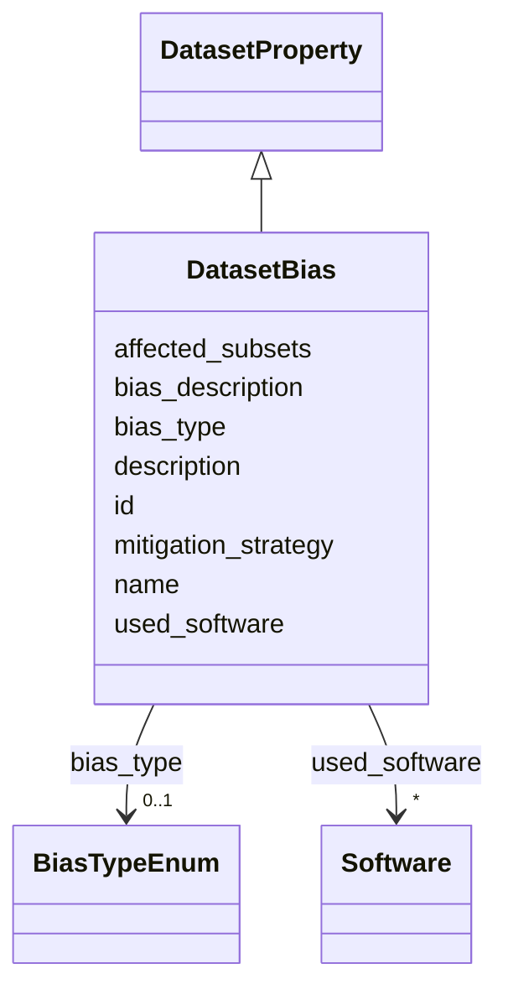

# Class: DatasetBias 


_Documents known biases present in the dataset. Biases are systematic errors or prejudices that may affect the representativeness or fairness of the data. Distinct from anomalies (data quality issues) and limitations (scope constraints)._

__


URI: [data_sheets_schema:DatasetBias](https://w3id.org/bridge2ai/data-sheets-schema/DatasetBias)





## Inheritance
* [DatasetProperty](DatasetProperty.md)
    * **DatasetBias**


## Slots

| Name | Cardinality and Range | Description | Inheritance |
| ---  | --- | --- | --- |
| [bias_type](bias_type.md) | 0..1 <br/> [BiasTypeEnum](BiasTypeEnum.md) | The type of bias identified, using standardized categories from the Artificia... | direct |
| [bias_description](bias_description.md) | 0..1 <br/> [String](String.md) | Detailed description of how this bias manifests in the dataset, including aff... | direct |
| [mitigation_strategy](mitigation_strategy.md) | 0..1 <br/> [String](String.md) | Steps taken or recommended to mitigate this bias | direct |
| [affected_subsets](affected_subsets.md) | * <br/> [String](String.md) | Specific subsets or features of the dataset affected by this bias | direct |
| [id](id.md) | 0..1 <br/> [Uriorcurie](Uriorcurie.md) | An optional identifier for this property | [DatasetProperty](DatasetProperty.md) |
| [name](name.md) | 0..1 <br/> [String](String.md) | A human-readable name for this property | [DatasetProperty](DatasetProperty.md) |
| [description](description.md) | 0..1 <br/> [String](String.md) | A human-readable description for this property | [DatasetProperty](DatasetProperty.md) |
| [used_software](used_software.md) | * <br/> [Software](Software.md) | What software was used as part of this dataset property? | [DatasetProperty](DatasetProperty.md) |


## Usages

| used by | used in | type | used |
| ---  | --- | --- | --- |
| [Dataset](Dataset.md) | [known_biases](known_biases.md) | range | [DatasetBias](DatasetBias.md) |
| [DataSubset](DataSubset.md) | [known_biases](known_biases.md) | range | [DatasetBias](DatasetBias.md) |


## Identifier and Mapping Information


### Schema Source


* from schema: https://w3id.org/bridge2ai/data-sheets-schema


## Mappings

| Mapping Type | Mapped Value |
| ---  | ---  |
| self | data_sheets_schema:DatasetBias |
| native | data_sheets_schema:DatasetBias |
| exact | rai:dataBiases |


## LinkML Source

<!-- TODO: investigate https://stackoverflow.com/questions/37606292/how-to-create-tabbed-code-blocks-in-mkdocs-or-sphinx -->

### Direct

<details>
```yaml
name: DatasetBias
description: 'Documents known biases present in the dataset. Biases are systematic
  errors or prejudices that may affect the representativeness or fairness of the data.
  Distinct from anomalies (data quality issues) and limitations (scope constraints).

  '
from_schema: https://w3id.org/bridge2ai/data-sheets-schema
exact_mappings:
- rai:dataBiases
is_a: DatasetProperty
attributes:
  bias_type:
    name: bias_type
    description: 'The type of bias identified, using standardized categories from
      the Artificial Intelligence Ontology (AIO).

      '
    from_schema: https://w3id.org/bridge2ai/data-sheets-schema/composition
    rank: 1000
    domain_of:
    - DatasetBias
    range: BiasTypeEnum
  bias_description:
    name: bias_description
    description: 'Detailed description of how this bias manifests in the dataset,
      including affected populations, features, or outcomes.

      '
    from_schema: https://w3id.org/bridge2ai/data-sheets-schema/composition
    rank: 1000
    slot_uri: dcterms:description
    domain_of:
    - DatasetBias
    range: string
  mitigation_strategy:
    name: mitigation_strategy
    description: 'Steps taken or recommended to mitigate this bias.

      '
    from_schema: https://w3id.org/bridge2ai/data-sheets-schema/composition
    rank: 1000
    domain_of:
    - DatasetBias
    range: string
  affected_subsets:
    name: affected_subsets
    description: 'Specific subsets or features of the dataset affected by this bias.

      '
    from_schema: https://w3id.org/bridge2ai/data-sheets-schema/composition
    rank: 1000
    domain_of:
    - DatasetBias
    range: string
    multivalued: true

```
</details>

### Induced

<details>
```yaml
name: DatasetBias
description: 'Documents known biases present in the dataset. Biases are systematic
  errors or prejudices that may affect the representativeness or fairness of the data.
  Distinct from anomalies (data quality issues) and limitations (scope constraints).

  '
from_schema: https://w3id.org/bridge2ai/data-sheets-schema
exact_mappings:
- rai:dataBiases
is_a: DatasetProperty
attributes:
  bias_type:
    name: bias_type
    description: 'The type of bias identified, using standardized categories from
      the Artificial Intelligence Ontology (AIO).

      '
    from_schema: https://w3id.org/bridge2ai/data-sheets-schema/composition
    rank: 1000
    alias: bias_type
    owner: DatasetBias
    domain_of:
    - DatasetBias
    range: BiasTypeEnum
  bias_description:
    name: bias_description
    description: 'Detailed description of how this bias manifests in the dataset,
      including affected populations, features, or outcomes.

      '
    from_schema: https://w3id.org/bridge2ai/data-sheets-schema/composition
    rank: 1000
    slot_uri: dcterms:description
    alias: bias_description
    owner: DatasetBias
    domain_of:
    - DatasetBias
    range: string
  mitigation_strategy:
    name: mitigation_strategy
    description: 'Steps taken or recommended to mitigate this bias.

      '
    from_schema: https://w3id.org/bridge2ai/data-sheets-schema/composition
    rank: 1000
    alias: mitigation_strategy
    owner: DatasetBias
    domain_of:
    - DatasetBias
    range: string
  affected_subsets:
    name: affected_subsets
    description: 'Specific subsets or features of the dataset affected by this bias.

      '
    from_schema: https://w3id.org/bridge2ai/data-sheets-schema/composition
    rank: 1000
    alias: affected_subsets
    owner: DatasetBias
    domain_of:
    - DatasetBias
    range: string
    multivalued: true
  id:
    name: id
    description: An optional identifier for this property.
    from_schema: https://w3id.org/bridge2ai/data-sheets-schema/base
    slot_uri: schema:identifier
    alias: id
    owner: DatasetBias
    domain_of:
    - NamedThing
    - DatasetProperty
    range: uriorcurie
  name:
    name: name
    description: A human-readable name for this property.
    from_schema: https://w3id.org/bridge2ai/data-sheets-schema/base
    slot_uri: schema:name
    alias: name
    owner: DatasetBias
    domain_of:
    - NamedThing
    - DatasetProperty
    range: string
  description:
    name: description
    description: A human-readable description for this property.
    from_schema: https://w3id.org/bridge2ai/data-sheets-schema/base
    slot_uri: schema:description
    alias: description
    owner: DatasetBias
    domain_of:
    - NamedThing
    - DatasetProperty
    - DatasetRelationship
    range: string
  used_software:
    name: used_software
    description: What software was used as part of this dataset property?
    from_schema: https://w3id.org/bridge2ai/data-sheets-schema/base
    rank: 1000
    alias: used_software
    owner: DatasetBias
    domain_of:
    - DatasetProperty
    range: Software
    multivalued: true
    inlined: true
    inlined_as_list: true

```
</details>