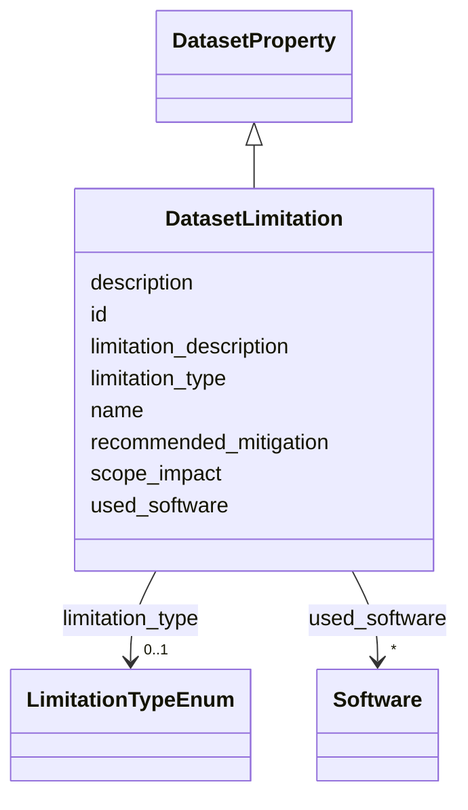

# Class: DatasetLimitation 


_Documents known limitations of the dataset that may affect its use or interpretation. Distinct from biases (systematic errors) and anomalies (data quality issues)._

__


URI: [data_sheets_schema:DatasetLimitation](https://w3id.org/bridge2ai/data-sheets-schema/DatasetLimitation)





## Inheritance
* [DatasetProperty](DatasetProperty.md)
    * **DatasetLimitation**


## Slots

| Name | Cardinality and Range | Description | Inheritance |
| ---  | --- | --- | --- |
| [limitation_type](limitation_type.md) | 0..1 <br/> [LimitationTypeEnum](LimitationTypeEnum.md) | Category of limitation (e | direct |
| [limitation_description](limitation_description.md) | 0..1 <br/> [String](String.md) | Detailed description of the limitation and its implications | direct |
| [scope_impact](scope_impact.md) | 0..1 <br/> [String](String.md) | How this limitation affects the scope or applicability of the dataset | direct |
| [recommended_mitigation](recommended_mitigation.md) | 0..1 <br/> [String](String.md) | Recommended approaches for users to address this limitation | direct |
| [id](id.md) | 0..1 <br/> [Uriorcurie](Uriorcurie.md) | An optional identifier for this property | [DatasetProperty](DatasetProperty.md) |
| [name](name.md) | 0..1 <br/> [String](String.md) | A human-readable name for this property | [DatasetProperty](DatasetProperty.md) |
| [description](description.md) | 0..1 <br/> [String](String.md) | A human-readable description for this property | [DatasetProperty](DatasetProperty.md) |
| [used_software](used_software.md) | * <br/> [Software](Software.md) | What software was used as part of this dataset property? | [DatasetProperty](DatasetProperty.md) |


## Usages

| used by | used in | type | used |
| ---  | --- | --- | --- |
| [Dataset](Dataset.md) | [known_limitations](known_limitations.md) | range | [DatasetLimitation](DatasetLimitation.md) |
| [DataSubset](DataSubset.md) | [known_limitations](known_limitations.md) | range | [DatasetLimitation](DatasetLimitation.md) |


## Identifier and Mapping Information


### Schema Source


* from schema: https://w3id.org/bridge2ai/data-sheets-schema


## Mappings

| Mapping Type | Mapped Value |
| ---  | ---  |
| self | data_sheets_schema:DatasetLimitation |
| native | data_sheets_schema:DatasetLimitation |
| exact | rai:dataLimitations |


## LinkML Source

<!-- TODO: investigate https://stackoverflow.com/questions/37606292/how-to-create-tabbed-code-blocks-in-mkdocs-or-sphinx -->

### Direct

<details>
```yaml
name: DatasetLimitation
description: 'Documents known limitations of the dataset that may affect its use or
  interpretation. Distinct from biases (systematic errors) and anomalies (data quality
  issues).

  '
from_schema: https://w3id.org/bridge2ai/data-sheets-schema
exact_mappings:
- rai:dataLimitations
is_a: DatasetProperty
attributes:
  limitation_type:
    name: limitation_type
    description: 'Category of limitation (e.g., scope, coverage, temporal, methodological).

      '
    from_schema: https://w3id.org/bridge2ai/data-sheets-schema/composition
    rank: 1000
    domain_of:
    - DatasetLimitation
    range: LimitationTypeEnum
  limitation_description:
    name: limitation_description
    description: 'Detailed description of the limitation and its implications.

      '
    from_schema: https://w3id.org/bridge2ai/data-sheets-schema/composition
    rank: 1000
    slot_uri: dcterms:description
    domain_of:
    - DatasetLimitation
    range: string
  scope_impact:
    name: scope_impact
    description: 'How this limitation affects the scope or applicability of the dataset.

      '
    from_schema: https://w3id.org/bridge2ai/data-sheets-schema/composition
    rank: 1000
    domain_of:
    - DatasetLimitation
    range: string
  recommended_mitigation:
    name: recommended_mitigation
    description: 'Recommended approaches for users to address this limitation.

      '
    from_schema: https://w3id.org/bridge2ai/data-sheets-schema/composition
    rank: 1000
    domain_of:
    - DatasetLimitation
    range: string

```
</details>

### Induced

<details>
```yaml
name: DatasetLimitation
description: 'Documents known limitations of the dataset that may affect its use or
  interpretation. Distinct from biases (systematic errors) and anomalies (data quality
  issues).

  '
from_schema: https://w3id.org/bridge2ai/data-sheets-schema
exact_mappings:
- rai:dataLimitations
is_a: DatasetProperty
attributes:
  limitation_type:
    name: limitation_type
    description: 'Category of limitation (e.g., scope, coverage, temporal, methodological).

      '
    from_schema: https://w3id.org/bridge2ai/data-sheets-schema/composition
    rank: 1000
    alias: limitation_type
    owner: DatasetLimitation
    domain_of:
    - DatasetLimitation
    range: LimitationTypeEnum
  limitation_description:
    name: limitation_description
    description: 'Detailed description of the limitation and its implications.

      '
    from_schema: https://w3id.org/bridge2ai/data-sheets-schema/composition
    rank: 1000
    slot_uri: dcterms:description
    alias: limitation_description
    owner: DatasetLimitation
    domain_of:
    - DatasetLimitation
    range: string
  scope_impact:
    name: scope_impact
    description: 'How this limitation affects the scope or applicability of the dataset.

      '
    from_schema: https://w3id.org/bridge2ai/data-sheets-schema/composition
    rank: 1000
    alias: scope_impact
    owner: DatasetLimitation
    domain_of:
    - DatasetLimitation
    range: string
  recommended_mitigation:
    name: recommended_mitigation
    description: 'Recommended approaches for users to address this limitation.

      '
    from_schema: https://w3id.org/bridge2ai/data-sheets-schema/composition
    rank: 1000
    alias: recommended_mitigation
    owner: DatasetLimitation
    domain_of:
    - DatasetLimitation
    range: string
  id:
    name: id
    description: An optional identifier for this property.
    from_schema: https://w3id.org/bridge2ai/data-sheets-schema/base
    slot_uri: schema:identifier
    alias: id
    owner: DatasetLimitation
    domain_of:
    - NamedThing
    - DatasetProperty
    range: uriorcurie
  name:
    name: name
    description: A human-readable name for this property.
    from_schema: https://w3id.org/bridge2ai/data-sheets-schema/base
    slot_uri: schema:name
    alias: name
    owner: DatasetLimitation
    domain_of:
    - NamedThing
    - DatasetProperty
    range: string
  description:
    name: description
    description: A human-readable description for this property.
    from_schema: https://w3id.org/bridge2ai/data-sheets-schema/base
    slot_uri: schema:description
    alias: description
    owner: DatasetLimitation
    domain_of:
    - NamedThing
    - DatasetProperty
    - DatasetRelationship
    range: string
  used_software:
    name: used_software
    description: What software was used as part of this dataset property?
    from_schema: https://w3id.org/bridge2ai/data-sheets-schema/base
    rank: 1000
    alias: used_software
    owner: DatasetLimitation
    domain_of:
    - DatasetProperty
    range: Software
    multivalued: true
    inlined: true
    inlined_as_list: true

```
</details>