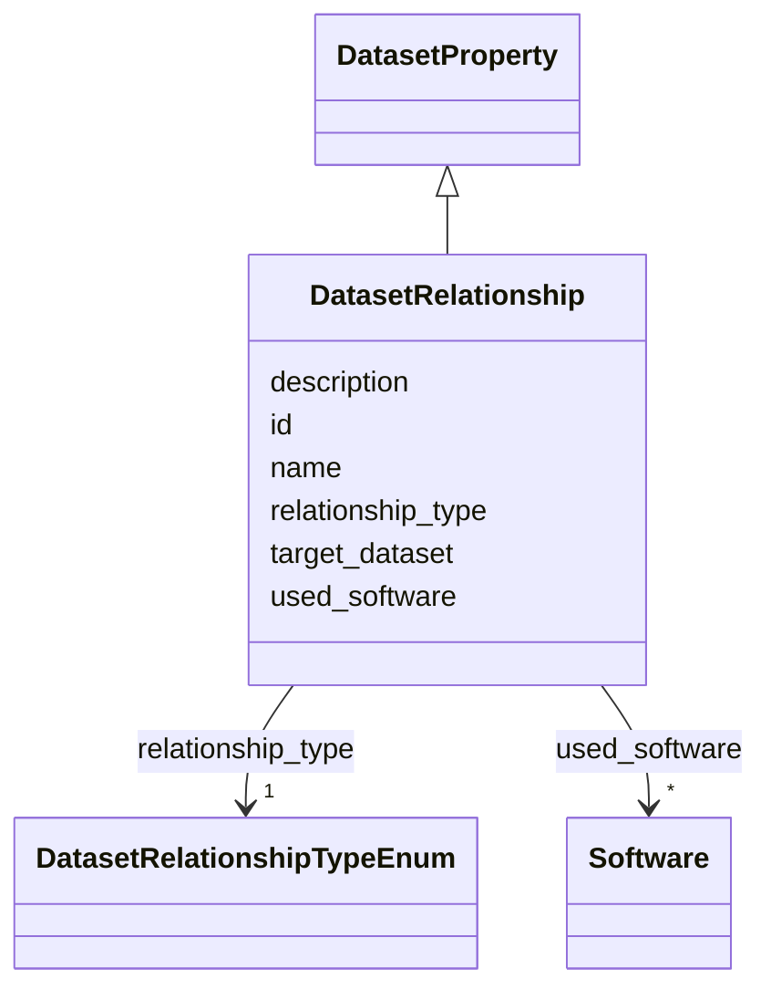

# Class: DatasetRelationship 


_Typed relationship to another dataset, enabling precise specification of how datasets relate to each other (e.g., supplements, derives from, is version of). Supports RO-Crate-style dataset interlinking._

__


URI: [data_sheets_schema:DatasetRelationship](https://w3id.org/bridge2ai/data-sheets-schema/DatasetRelationship)





## Inheritance
* [DatasetProperty](DatasetProperty.md)
    * **DatasetRelationship**


## Slots

| Name | Cardinality and Range | Description | Inheritance |
| ---  | --- | --- | --- |
| [target_dataset](target_dataset.md) | 1 <br/> [String](String.md) | The dataset that this relationship points to | direct |
| [relationship_type](relationship_type.md) | 1 <br/> [DatasetRelationshipTypeEnum](DatasetRelationshipTypeEnum.md) | The type of relationship (e | direct |
| [description](description.md) | 0..1 <br/> [String](String.md) | Free-text description providing additional context about the relationship | direct |
| [id](id.md) | 0..1 <br/> [Uriorcurie](Uriorcurie.md) | An optional identifier for this property | [DatasetProperty](DatasetProperty.md) |
| [name](name.md) | 0..1 <br/> [String](String.md) | A human-readable name for this property | [DatasetProperty](DatasetProperty.md) |
| [used_software](used_software.md) | * <br/> [Software](Software.md) | What software was used as part of this dataset property? | [DatasetProperty](DatasetProperty.md) |


## Usages

| used by | used in | type | used |
| ---  | --- | --- | --- |
| [Dataset](Dataset.md) | [related_datasets](related_datasets.md) | range | [DatasetRelationship](DatasetRelationship.md) |
| [DataSubset](DataSubset.md) | [related_datasets](related_datasets.md) | range | [DatasetRelationship](DatasetRelationship.md) |


## Identifier and Mapping Information


### Schema Source


* from schema: https://w3id.org/bridge2ai/data-sheets-schema


## Mappings

| Mapping Type | Mapped Value |
| ---  | ---  |
| self | data_sheets_schema:DatasetRelationship |
| native | data_sheets_schema:DatasetRelationship |


## LinkML Source

<!-- TODO: investigate https://stackoverflow.com/questions/37606292/how-to-create-tabbed-code-blocks-in-mkdocs-or-sphinx -->

### Direct

<details>
```yaml
name: DatasetRelationship
description: 'Typed relationship to another dataset, enabling precise specification
  of how datasets relate to each other (e.g., supplements, derives from, is version
  of). Supports RO-Crate-style dataset interlinking.

  '
from_schema: https://w3id.org/bridge2ai/data-sheets-schema
is_a: DatasetProperty
attributes:
  target_dataset:
    name: target_dataset
    description: The dataset that this relationship points to. Can be specified by
      identifier, URL, or Dataset object.
    from_schema: https://w3id.org/bridge2ai/data-sheets-schema/composition
    rank: 1000
    domain_of:
    - DatasetRelationship
    range: string
    required: true
  relationship_type:
    name: relationship_type
    description: The type of relationship (e.g., derives_from, supplements, is_version_of).
      Uses DatasetRelationshipTypeEnum for standardized relationship types.
    from_schema: https://w3id.org/bridge2ai/data-sheets-schema/composition
    rank: 1000
    domain_of:
    - DatasetRelationship
    range: DatasetRelationshipTypeEnum
    required: true
  description:
    name: description
    description: Free-text description providing additional context about the relationship.
    from_schema: https://w3id.org/bridge2ai/data-sheets-schema/composition
    domain_of:
    - NamedThing
    - DatasetProperty
    - DatasetRelationship
    range: string

```
</details>

### Induced

<details>
```yaml
name: DatasetRelationship
description: 'Typed relationship to another dataset, enabling precise specification
  of how datasets relate to each other (e.g., supplements, derives from, is version
  of). Supports RO-Crate-style dataset interlinking.

  '
from_schema: https://w3id.org/bridge2ai/data-sheets-schema
is_a: DatasetProperty
attributes:
  target_dataset:
    name: target_dataset
    description: The dataset that this relationship points to. Can be specified by
      identifier, URL, or Dataset object.
    from_schema: https://w3id.org/bridge2ai/data-sheets-schema/composition
    rank: 1000
    alias: target_dataset
    owner: DatasetRelationship
    domain_of:
    - DatasetRelationship
    range: string
    required: true
  relationship_type:
    name: relationship_type
    description: The type of relationship (e.g., derives_from, supplements, is_version_of).
      Uses DatasetRelationshipTypeEnum for standardized relationship types.
    from_schema: https://w3id.org/bridge2ai/data-sheets-schema/composition
    rank: 1000
    alias: relationship_type
    owner: DatasetRelationship
    domain_of:
    - DatasetRelationship
    range: DatasetRelationshipTypeEnum
    required: true
  description:
    name: description
    description: Free-text description providing additional context about the relationship.
    from_schema: https://w3id.org/bridge2ai/data-sheets-schema/composition
    alias: description
    owner: DatasetRelationship
    domain_of:
    - NamedThing
    - DatasetProperty
    - DatasetRelationship
    range: string
  id:
    name: id
    description: An optional identifier for this property.
    from_schema: https://w3id.org/bridge2ai/data-sheets-schema/base
    slot_uri: schema:identifier
    alias: id
    owner: DatasetRelationship
    domain_of:
    - NamedThing
    - DatasetProperty
    range: uriorcurie
  name:
    name: name
    description: A human-readable name for this property.
    from_schema: https://w3id.org/bridge2ai/data-sheets-schema/base
    slot_uri: schema:name
    alias: name
    owner: DatasetRelationship
    domain_of:
    - NamedThing
    - DatasetProperty
    range: string
  used_software:
    name: used_software
    description: What software was used as part of this dataset property?
    from_schema: https://w3id.org/bridge2ai/data-sheets-schema/base
    rank: 1000
    alias: used_software
    owner: DatasetRelationship
    domain_of:
    - DatasetProperty
    range: Software
    multivalued: true
    inlined: true
    inlined_as_list: true

```
</details>