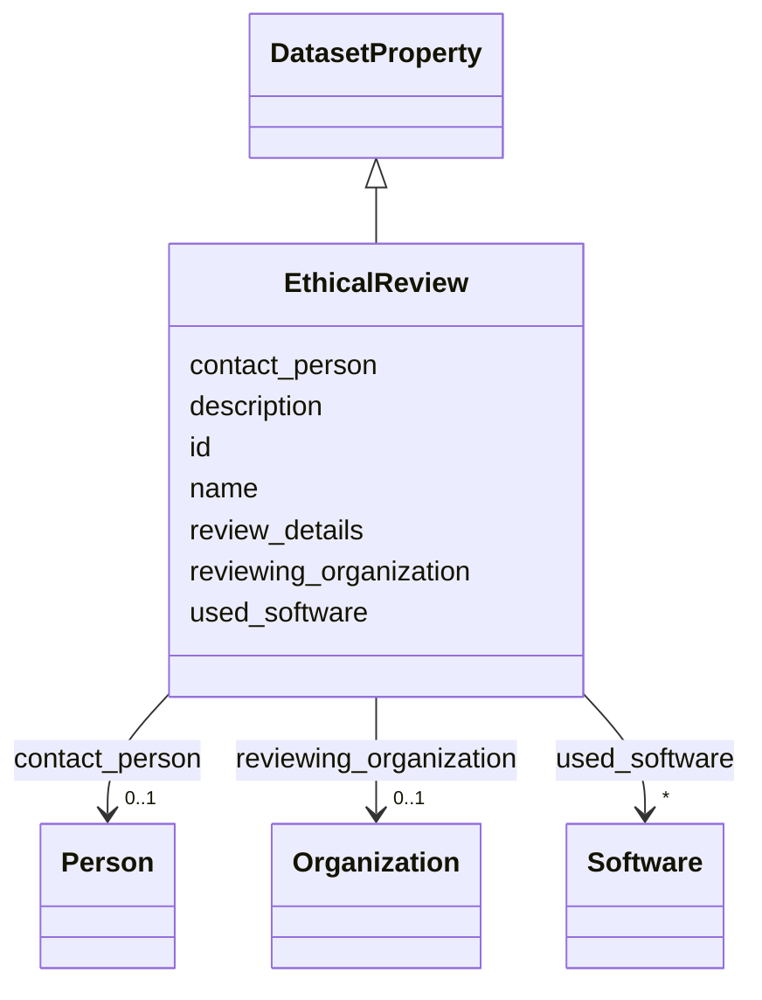

# Class: EthicalReview 


_Were any ethical or compliance review processes conducted (e.g., by an institutional review board)? If so, please provide a description of these review processes, including the frequency of review and documentation of outcomes, as well as a link or other access point to any supporting documentation._

__


URI: [data_sheets_schema:EthicalReview](https://w3id.org/bridge2ai/data-sheets-schema/EthicalReview)





## Inheritance
* [DatasetProperty](DatasetProperty.md)
    * **EthicalReview**


## Slots

| Name | Cardinality and Range | Description | Inheritance |
| ---  | --- | --- | --- |
| [contact_person](contact_person.md) | 0..1 <br/> [Person](Person.md) | Contact person for questions about ethical review | direct |
| [reviewing_organization](reviewing_organization.md) | 0..1 <br/> [Organization](Organization.md) | Organization that conducted the ethical review (e | direct |
| [review_details](review_details.md) | * <br/> [String](String.md) | Details on ethical review processes, outcomes, and supporting documentation | direct |
| [id](id.md) | 0..1 <br/> [Uriorcurie](Uriorcurie.md) | An optional identifier for this property | [DatasetProperty](DatasetProperty.md) |
| [name](name.md) | 0..1 <br/> [String](String.md) | A human-readable name for this property | [DatasetProperty](DatasetProperty.md) |
| [description](description.md) | 0..1 <br/> [String](String.md) | A human-readable description for this property | [DatasetProperty](DatasetProperty.md) |
| [used_software](used_software.md) | * <br/> [Software](Software.md) | What software was used as part of this dataset property? | [DatasetProperty](DatasetProperty.md) |


## Usages

| used by | used in | type | used |
| ---  | --- | --- | --- |
| [Dataset](Dataset.md) | [ethical_reviews](ethical_reviews.md) | range | [EthicalReview](EthicalReview.md) |
| [DataSubset](DataSubset.md) | [ethical_reviews](ethical_reviews.md) | range | [EthicalReview](EthicalReview.md) |


## Identifier and Mapping Information


### Schema Source


* from schema: https://w3id.org/bridge2ai/data-sheets-schema


## Mappings

| Mapping Type | Mapped Value |
| ---  | ---  |
| self | data_sheets_schema:EthicalReview |
| native | data_sheets_schema:EthicalReview |


## LinkML Source

<!-- TODO: investigate https://stackoverflow.com/questions/37606292/how-to-create-tabbed-code-blocks-in-mkdocs-or-sphinx -->

### Direct

<details>
```yaml
name: EthicalReview
description: 'Were any ethical or compliance review processes conducted (e.g., by
  an institutional review board)? If so, please provide a description of these review
  processes, including the frequency of review and documentation of outcomes, as well
  as a link or other access point to any supporting documentation.

  '
from_schema: https://w3id.org/bridge2ai/data-sheets-schema
is_a: DatasetProperty
attributes:
  contact_person:
    name: contact_person
    description: Contact person for questions about ethical review. Provides structured
      contact information including name, email, affiliation, and optional ORCID.
    from_schema: https://w3id.org/bridge2ai/data-sheets-schema/ethics
    exact_mappings:
    - schema:contactPoint
    rank: 1000
    slot_uri: schema:contactPoint
    domain_of:
    - EthicalReview
    - LicenseAndUseTerms
    range: Person
  reviewing_organization:
    name: reviewing_organization
    description: Organization that conducted the ethical review (e.g., Institutional
      Review Board, Ethics Committee, Research Ethics Board). Provides information
      about the body responsible for ethical oversight.
    from_schema: https://w3id.org/bridge2ai/data-sheets-schema/ethics
    exact_mappings:
    - schema:provider
    rank: 1000
    slot_uri: schema:provider
    domain_of:
    - EthicalReview
    range: Organization
  review_details:
    name: review_details
    description: 'Details on ethical review processes, outcomes, and supporting documentation.

      '
    from_schema: https://w3id.org/bridge2ai/data-sheets-schema/ethics
    rank: 1000
    slot_uri: dcterms:description
    domain_of:
    - EthicalReview
    range: string
    multivalued: true

```
</details>

### Induced

<details>
```yaml
name: EthicalReview
description: 'Were any ethical or compliance review processes conducted (e.g., by
  an institutional review board)? If so, please provide a description of these review
  processes, including the frequency of review and documentation of outcomes, as well
  as a link or other access point to any supporting documentation.

  '
from_schema: https://w3id.org/bridge2ai/data-sheets-schema
is_a: DatasetProperty
attributes:
  contact_person:
    name: contact_person
    description: Contact person for questions about ethical review. Provides structured
      contact information including name, email, affiliation, and optional ORCID.
    from_schema: https://w3id.org/bridge2ai/data-sheets-schema/ethics
    exact_mappings:
    - schema:contactPoint
    rank: 1000
    slot_uri: schema:contactPoint
    alias: contact_person
    owner: EthicalReview
    domain_of:
    - EthicalReview
    - LicenseAndUseTerms
    range: Person
  reviewing_organization:
    name: reviewing_organization
    description: Organization that conducted the ethical review (e.g., Institutional
      Review Board, Ethics Committee, Research Ethics Board). Provides information
      about the body responsible for ethical oversight.
    from_schema: https://w3id.org/bridge2ai/data-sheets-schema/ethics
    exact_mappings:
    - schema:provider
    rank: 1000
    slot_uri: schema:provider
    alias: reviewing_organization
    owner: EthicalReview
    domain_of:
    - EthicalReview
    range: Organization
  review_details:
    name: review_details
    description: 'Details on ethical review processes, outcomes, and supporting documentation.

      '
    from_schema: https://w3id.org/bridge2ai/data-sheets-schema/ethics
    rank: 1000
    slot_uri: dcterms:description
    alias: review_details
    owner: EthicalReview
    domain_of:
    - EthicalReview
    range: string
    multivalued: true
  id:
    name: id
    description: An optional identifier for this property.
    from_schema: https://w3id.org/bridge2ai/data-sheets-schema/base
    slot_uri: schema:identifier
    alias: id
    owner: EthicalReview
    domain_of:
    - NamedThing
    - DatasetProperty
    range: uriorcurie
  name:
    name: name
    description: A human-readable name for this property.
    from_schema: https://w3id.org/bridge2ai/data-sheets-schema/base
    slot_uri: schema:name
    alias: name
    owner: EthicalReview
    domain_of:
    - NamedThing
    - DatasetProperty
    range: string
  description:
    name: description
    description: A human-readable description for this property.
    from_schema: https://w3id.org/bridge2ai/data-sheets-schema/base
    slot_uri: schema:description
    alias: description
    owner: EthicalReview
    domain_of:
    - NamedThing
    - DatasetProperty
    - DatasetRelationship
    range: string
  used_software:
    name: used_software
    description: What software was used as part of this dataset property?
    from_schema: https://w3id.org/bridge2ai/data-sheets-schema/base
    rank: 1000
    alias: used_software
    owner: EthicalReview
    domain_of:
    - DatasetProperty
    range: Software
    multivalued: true
    inlined: true
    inlined_as_list: true

```
</details>