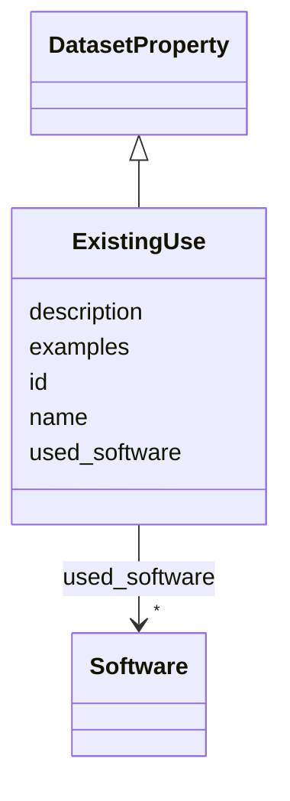

# Class: ExistingUse 


_Has the dataset been used for any tasks already?_

__


URI: [data_sheets_schema:ExistingUse](https://w3id.org/bridge2ai/data-sheets-schema/ExistingUse)





## Inheritance
* [DatasetProperty](DatasetProperty.md)
    * **ExistingUse**


## Slots

| Name | Cardinality and Range | Description | Inheritance |
| ---  | --- | --- | --- |
| [examples](examples.md) | * <br/> [String](String.md) | List of examples of known/previous uses of the dataset | direct |
| [id](id.md) | 0..1 <br/> [Uriorcurie](Uriorcurie.md) | An optional identifier for this property | [DatasetProperty](DatasetProperty.md) |
| [name](name.md) | 0..1 <br/> [String](String.md) | A human-readable name for this property | [DatasetProperty](DatasetProperty.md) |
| [description](description.md) | 0..1 <br/> [String](String.md) | A human-readable description for this property | [DatasetProperty](DatasetProperty.md) |
| [used_software](used_software.md) | * <br/> [Software](Software.md) | What software was used as part of this dataset property? | [DatasetProperty](DatasetProperty.md) |


## Usages

| used by | used in | type | used |
| ---  | --- | --- | --- |
| [Dataset](Dataset.md) | [existing_uses](existing_uses.md) | range | [ExistingUse](ExistingUse.md) |
| [DataSubset](DataSubset.md) | [existing_uses](existing_uses.md) | range | [ExistingUse](ExistingUse.md) |


## Identifier and Mapping Information


### Schema Source


* from schema: https://w3id.org/bridge2ai/data-sheets-schema


## Mappings

| Mapping Type | Mapped Value |
| ---  | ---  |
| self | data_sheets_schema:ExistingUse |
| native | data_sheets_schema:ExistingUse |


## LinkML Source

<!-- TODO: investigate https://stackoverflow.com/questions/37606292/how-to-create-tabbed-code-blocks-in-mkdocs-or-sphinx -->

### Direct

<details>
```yaml
name: ExistingUse
description: 'Has the dataset been used for any tasks already?

  '
from_schema: https://w3id.org/bridge2ai/data-sheets-schema
is_a: DatasetProperty
attributes:
  examples:
    name: examples
    description: List of examples of known/previous uses of the dataset.
    from_schema: https://w3id.org/bridge2ai/data-sheets-schema/uses
    rank: 1000
    domain_of:
    - ExistingUse
    - IntendedUse
    - VariableMetadata
    range: string
    multivalued: true

```
</details>

### Induced

<details>
```yaml
name: ExistingUse
description: 'Has the dataset been used for any tasks already?

  '
from_schema: https://w3id.org/bridge2ai/data-sheets-schema
is_a: DatasetProperty
attributes:
  examples:
    name: examples
    description: List of examples of known/previous uses of the dataset.
    from_schema: https://w3id.org/bridge2ai/data-sheets-schema/uses
    rank: 1000
    alias: examples
    owner: ExistingUse
    domain_of:
    - ExistingUse
    - IntendedUse
    - VariableMetadata
    range: string
    multivalued: true
  id:
    name: id
    description: An optional identifier for this property.
    from_schema: https://w3id.org/bridge2ai/data-sheets-schema/base
    slot_uri: schema:identifier
    alias: id
    owner: ExistingUse
    domain_of:
    - NamedThing
    - DatasetProperty
    range: uriorcurie
  name:
    name: name
    description: A human-readable name for this property.
    from_schema: https://w3id.org/bridge2ai/data-sheets-schema/base
    slot_uri: schema:name
    alias: name
    owner: ExistingUse
    domain_of:
    - NamedThing
    - DatasetProperty
    range: string
  description:
    name: description
    description: A human-readable description for this property.
    from_schema: https://w3id.org/bridge2ai/data-sheets-schema/base
    slot_uri: schema:description
    alias: description
    owner: ExistingUse
    domain_of:
    - NamedThing
    - DatasetProperty
    - DatasetRelationship
    range: string
  used_software:
    name: used_software
    description: What software was used as part of this dataset property?
    from_schema: https://w3id.org/bridge2ai/data-sheets-schema/base
    rank: 1000
    alias: used_software
    owner: ExistingUse
    domain_of:
    - DatasetProperty
    range: Software
    multivalued: true
    inlined: true
    inlined_as_list: true

```
</details>