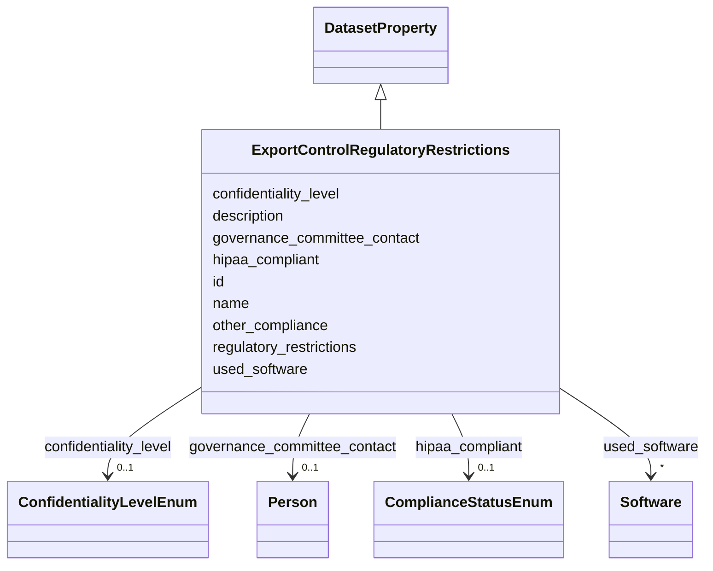

# Class: ExportControlRegulatoryRestrictions 


_Do any export controls or other regulatory restrictions apply to the dataset or to individual instances? Includes compliance tracking for regulations like HIPAA and other US regulations. If so, please describe these restrictions and provide a link or copy of any supporting documentation. Maps to DUO terms related to ethics approval, geographic restrictions, and institutional requirements._

__


URI: [data_sheets_schema:ExportControlRegulatoryRestrictions](https://w3id.org/bridge2ai/data-sheets-schema/ExportControlRegulatoryRestrictions)





## Inheritance
* [DatasetProperty](DatasetProperty.md)
    * **ExportControlRegulatoryRestrictions**


## Slots

| Name | Cardinality and Range | Description | Inheritance |
| ---  | --- | --- | --- |
| [regulatory_restrictions](regulatory_restrictions.md) | * <br/> [String](String.md) | Export or regulatory restrictions on the dataset | direct |
| [hipaa_compliant](hipaa_compliant.md) | 0..1 <br/> [ComplianceStatusEnum](ComplianceStatusEnum.md) | Indicates compliance with the Health Insurance Portability and Accountability... | direct |
| [other_compliance](other_compliance.md) | * <br/> [String](String.md) | Other regulatory compliance frameworks applicable to this dataset (e | direct |
| [confidentiality_level](confidentiality_level.md) | 0..1 <br/> [ConfidentialityLevelEnum](ConfidentialityLevelEnum.md) | Confidentiality classification of the dataset indicating level of access rest... | direct |
| [governance_committee_contact](governance_committee_contact.md) | 0..1 <br/> [Person](Person.md) | Contact person for data governance committee | direct |
| [id](id.md) | 0..1 <br/> [Uriorcurie](Uriorcurie.md) | An optional identifier for this property | [DatasetProperty](DatasetProperty.md) |
| [name](name.md) | 0..1 <br/> [String](String.md) | A human-readable name for this property | [DatasetProperty](DatasetProperty.md) |
| [description](description.md) | 0..1 <br/> [String](String.md) | A human-readable description for this property | [DatasetProperty](DatasetProperty.md) |
| [used_software](used_software.md) | * <br/> [Software](Software.md) | What software was used as part of this dataset property? | [DatasetProperty](DatasetProperty.md) |


## Usages

| used by | used in | type | used |
| ---  | --- | --- | --- |
| [Dataset](Dataset.md) | [regulatory_restrictions](regulatory_restrictions.md) | range | [ExportControlRegulatoryRestrictions](ExportControlRegulatoryRestrictions.md) |
| [DataSubset](DataSubset.md) | [regulatory_restrictions](regulatory_restrictions.md) | range | [ExportControlRegulatoryRestrictions](ExportControlRegulatoryRestrictions.md) |


## Identifier and Mapping Information


### Schema Source


* from schema: https://w3id.org/bridge2ai/data-sheets-schema


## Mappings

| Mapping Type | Mapped Value |
| ---  | ---  |
| self | data_sheets_schema:ExportControlRegulatoryRestrictions |
| native | data_sheets_schema:ExportControlRegulatoryRestrictions |


## LinkML Source

<!-- TODO: investigate https://stackoverflow.com/questions/37606292/how-to-create-tabbed-code-blocks-in-mkdocs-or-sphinx -->

### Direct

<details>
```yaml
name: ExportControlRegulatoryRestrictions
description: 'Do any export controls or other regulatory restrictions apply to the
  dataset or to individual instances? Includes compliance tracking for regulations
  like HIPAA and other US regulations. If so, please describe these restrictions and
  provide a link or copy of any supporting documentation. Maps to DUO terms related
  to ethics approval, geographic restrictions, and institutional requirements.

  '
from_schema: https://w3id.org/bridge2ai/data-sheets-schema
is_a: DatasetProperty
attributes:
  regulatory_restrictions:
    name: regulatory_restrictions
    description: Export or regulatory restrictions on the dataset.
    from_schema: https://w3id.org/bridge2ai/data-sheets-schema/data-governance
    broad_mappings:
    - DUO:0000021
    - DUO:0000022
    - DUO:0000028
    slot_uri: dcterms:accessRights
    domain_of:
    - Dataset
    - ExportControlRegulatoryRestrictions
    range: string
    multivalued: true
  hipaa_compliant:
    name: hipaa_compliant
    description: Indicates compliance with the Health Insurance Portability and Accountability
      Act (HIPAA). HIPAA applies to protected health information in the United States.
    from_schema: https://w3id.org/bridge2ai/data-sheets-schema/data-governance
    rank: 1000
    domain_of:
    - ExportControlRegulatoryRestrictions
    range: ComplianceStatusEnum
  other_compliance:
    name: other_compliance
    description: Other regulatory compliance frameworks applicable to this dataset
      (e.g., CCPA, PIPEDA, industry-specific regulations).
    from_schema: https://w3id.org/bridge2ai/data-sheets-schema/data-governance
    rank: 1000
    domain_of:
    - ExportControlRegulatoryRestrictions
    range: string
    multivalued: true
  confidentiality_level:
    name: confidentiality_level
    description: Confidentiality classification of the dataset indicating level of
      access restrictions and sensitivity.
    from_schema: https://w3id.org/bridge2ai/data-sheets-schema/data-governance
    rank: 1000
    domain_of:
    - ExportControlRegulatoryRestrictions
    range: ConfidentialityLevelEnum
  governance_committee_contact:
    name: governance_committee_contact
    description: Contact person for data governance committee. This person can answer
      questions about data governance policies, access procedures, and oversight mechanisms.
    from_schema: https://w3id.org/bridge2ai/data-sheets-schema/data-governance
    exact_mappings:
    - schema:contactPoint
    rank: 1000
    slot_uri: schema:contactPoint
    domain_of:
    - ExportControlRegulatoryRestrictions
    range: Person

```
</details>

### Induced

<details>
```yaml
name: ExportControlRegulatoryRestrictions
description: 'Do any export controls or other regulatory restrictions apply to the
  dataset or to individual instances? Includes compliance tracking for regulations
  like HIPAA and other US regulations. If so, please describe these restrictions and
  provide a link or copy of any supporting documentation. Maps to DUO terms related
  to ethics approval, geographic restrictions, and institutional requirements.

  '
from_schema: https://w3id.org/bridge2ai/data-sheets-schema
is_a: DatasetProperty
attributes:
  regulatory_restrictions:
    name: regulatory_restrictions
    description: Export or regulatory restrictions on the dataset.
    from_schema: https://w3id.org/bridge2ai/data-sheets-schema/data-governance
    broad_mappings:
    - DUO:0000021
    - DUO:0000022
    - DUO:0000028
    slot_uri: dcterms:accessRights
    alias: regulatory_restrictions
    owner: ExportControlRegulatoryRestrictions
    domain_of:
    - Dataset
    - ExportControlRegulatoryRestrictions
    range: string
    multivalued: true
  hipaa_compliant:
    name: hipaa_compliant
    description: Indicates compliance with the Health Insurance Portability and Accountability
      Act (HIPAA). HIPAA applies to protected health information in the United States.
    from_schema: https://w3id.org/bridge2ai/data-sheets-schema/data-governance
    rank: 1000
    alias: hipaa_compliant
    owner: ExportControlRegulatoryRestrictions
    domain_of:
    - ExportControlRegulatoryRestrictions
    range: ComplianceStatusEnum
  other_compliance:
    name: other_compliance
    description: Other regulatory compliance frameworks applicable to this dataset
      (e.g., CCPA, PIPEDA, industry-specific regulations).
    from_schema: https://w3id.org/bridge2ai/data-sheets-schema/data-governance
    rank: 1000
    alias: other_compliance
    owner: ExportControlRegulatoryRestrictions
    domain_of:
    - ExportControlRegulatoryRestrictions
    range: string
    multivalued: true
  confidentiality_level:
    name: confidentiality_level
    description: Confidentiality classification of the dataset indicating level of
      access restrictions and sensitivity.
    from_schema: https://w3id.org/bridge2ai/data-sheets-schema/data-governance
    rank: 1000
    alias: confidentiality_level
    owner: ExportControlRegulatoryRestrictions
    domain_of:
    - ExportControlRegulatoryRestrictions
    range: ConfidentialityLevelEnum
  governance_committee_contact:
    name: governance_committee_contact
    description: Contact person for data governance committee. This person can answer
      questions about data governance policies, access procedures, and oversight mechanisms.
    from_schema: https://w3id.org/bridge2ai/data-sheets-schema/data-governance
    exact_mappings:
    - schema:contactPoint
    rank: 1000
    slot_uri: schema:contactPoint
    alias: governance_committee_contact
    owner: ExportControlRegulatoryRestrictions
    domain_of:
    - ExportControlRegulatoryRestrictions
    range: Person
  id:
    name: id
    description: An optional identifier for this property.
    from_schema: https://w3id.org/bridge2ai/data-sheets-schema/base
    slot_uri: schema:identifier
    alias: id
    owner: ExportControlRegulatoryRestrictions
    domain_of:
    - NamedThing
    - DatasetProperty
    range: uriorcurie
  name:
    name: name
    description: A human-readable name for this property.
    from_schema: https://w3id.org/bridge2ai/data-sheets-schema/base
    slot_uri: schema:name
    alias: name
    owner: ExportControlRegulatoryRestrictions
    domain_of:
    - NamedThing
    - DatasetProperty
    range: string
  description:
    name: description
    description: A human-readable description for this property.
    from_schema: https://w3id.org/bridge2ai/data-sheets-schema/base
    slot_uri: schema:description
    alias: description
    owner: ExportControlRegulatoryRestrictions
    domain_of:
    - NamedThing
    - DatasetProperty
    - DatasetRelationship
    range: string
  used_software:
    name: used_software
    description: What software was used as part of this dataset property?
    from_schema: https://w3id.org/bridge2ai/data-sheets-schema/base
    rank: 1000
    alias: used_software
    owner: ExportControlRegulatoryRestrictions
    domain_of:
    - DatasetProperty
    range: Software
    multivalued: true
    inlined: true
    inlined_as_list: true

```
</details>