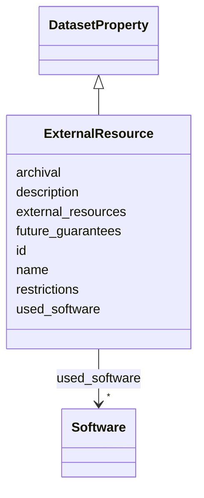

# Class: ExternalResource 


_Is the dataset self-contained or does it rely on external resources (e.g., websites, other datasets)? If external, are there guarantees that those resources will remain available and unchanged?_

__


URI: [data_sheets_schema:ExternalResource](https://w3id.org/bridge2ai/data-sheets-schema/ExternalResource)





## Inheritance
* [NamedThing](NamedThing.md)
    * [DatasetProperty](DatasetProperty.md)
        * **ExternalResource**


## Slots

| Name | Cardinality and Range | Description | Inheritance |
| ---  | --- | --- | --- |
| [external_resources](external_resources.md) | * <br/> [String](String.md) | List of links or identifiers for external resources | direct |
| [future_guarantees](future_guarantees.md) | * <br/> [String](String.md) | Explanation of any commitments that external resources will remain available ... | direct |
| [archival](archival.md) | * <br/> [Boolean](Boolean.md) | Indication whether official archival versions of external resources are inclu... | direct |
| [restrictions](restrictions.md) | * <br/> [String](String.md) | Description of any restrictions or fees associated with external resources | direct |
| [used_software](used_software.md) | * <br/> [Software](Software.md) | What software was used as part of this dataset property? | [DatasetProperty](DatasetProperty.md) |
| [id](id.md) | 1 <br/> [Uriorcurie](Uriorcurie.md) | A unique identifier for a thing | [NamedThing](NamedThing.md) |
| [name](name.md) | 0..1 <br/> [String](String.md) | A human-readable name for a thing | [NamedThing](NamedThing.md) |
| [description](description.md) | 0..1 <br/> [String](String.md) | A human-readable description for a thing | [NamedThing](NamedThing.md) |


## Usages

| used by | used in | type | used |
| ---  | --- | --- | --- |
| [Dataset](Dataset.md) | [external_resources](external_resources.md) | range | [ExternalResource](ExternalResource.md) |
| [DataSubset](DataSubset.md) | [external_resources](external_resources.md) | range | [ExternalResource](ExternalResource.md) |


## Identifier and Mapping Information


### Schema Source


* from schema: https://w3id.org/bridge2ai/data-sheets-schema


## Mappings

| Mapping Type | Mapped Value |
| ---  | ---  |
| self | data_sheets_schema:ExternalResource |
| native | data_sheets_schema:ExternalResource |


## LinkML Source

<!-- TODO: investigate https://stackoverflow.com/questions/37606292/how-to-create-tabbed-code-blocks-in-mkdocs-or-sphinx -->

### Direct

<details>
```yaml
name: ExternalResource
description: 'Is the dataset self-contained or does it rely on external resources
  (e.g., websites, other datasets)? If external, are there guarantees that those resources
  will remain available and unchanged?

  '
from_schema: https://w3id.org/bridge2ai/data-sheets-schema
is_a: DatasetProperty
attributes:
  external_resources:
    name: external_resources
    description: List of links or identifiers for external resources.
    from_schema: https://w3id.org/bridge2ai/data-sheets-schema/composition
    domain_of:
    - Dataset
    - ExternalResource
    range: string
    multivalued: true
  future_guarantees:
    name: future_guarantees
    description: 'Explanation of any commitments that external resources will remain
      available and stable over time.

      '
    from_schema: https://w3id.org/bridge2ai/data-sheets-schema/composition
    rank: 1000
    domain_of:
    - ExternalResource
    range: string
    multivalued: true
  archival:
    name: archival
    description: 'Indication whether official archival versions of external resources
      are included.

      '
    from_schema: https://w3id.org/bridge2ai/data-sheets-schema/composition
    rank: 1000
    domain_of:
    - ExternalResource
    range: boolean
    multivalued: true
  restrictions:
    name: restrictions
    description: 'Description of any restrictions or fees associated with external
      resources.

      '
    from_schema: https://w3id.org/bridge2ai/data-sheets-schema/composition
    rank: 1000
    domain_of:
    - ExternalResource
    range: string
    multivalued: true

```
</details>

### Induced

<details>
```yaml
name: ExternalResource
description: 'Is the dataset self-contained or does it rely on external resources
  (e.g., websites, other datasets)? If external, are there guarantees that those resources
  will remain available and unchanged?

  '
from_schema: https://w3id.org/bridge2ai/data-sheets-schema
is_a: DatasetProperty
attributes:
  external_resources:
    name: external_resources
    description: List of links or identifiers for external resources.
    from_schema: https://w3id.org/bridge2ai/data-sheets-schema/composition
    alias: external_resources
    owner: ExternalResource
    domain_of:
    - Dataset
    - ExternalResource
    range: string
    multivalued: true
  future_guarantees:
    name: future_guarantees
    description: 'Explanation of any commitments that external resources will remain
      available and stable over time.

      '
    from_schema: https://w3id.org/bridge2ai/data-sheets-schema/composition
    rank: 1000
    alias: future_guarantees
    owner: ExternalResource
    domain_of:
    - ExternalResource
    range: string
    multivalued: true
  archival:
    name: archival
    description: 'Indication whether official archival versions of external resources
      are included.

      '
    from_schema: https://w3id.org/bridge2ai/data-sheets-schema/composition
    rank: 1000
    alias: archival
    owner: ExternalResource
    domain_of:
    - ExternalResource
    range: boolean
    multivalued: true
  restrictions:
    name: restrictions
    description: 'Description of any restrictions or fees associated with external
      resources.

      '
    from_schema: https://w3id.org/bridge2ai/data-sheets-schema/composition
    rank: 1000
    alias: restrictions
    owner: ExternalResource
    domain_of:
    - ExternalResource
    range: string
    multivalued: true
  used_software:
    name: used_software
    description: What software was used as part of this dataset property?
    from_schema: https://w3id.org/bridge2ai/data-sheets-schema/base
    rank: 1000
    alias: used_software
    owner: ExternalResource
    domain_of:
    - DatasetProperty
    range: Software
    multivalued: true
  id:
    name: id
    description: A unique identifier for a thing.
    from_schema: https://w3id.org/bridge2ai/data-sheets-schema/base
    rank: 1000
    slot_uri: schema:identifier
    identifier: true
    alias: id
    owner: ExternalResource
    domain_of:
    - NamedThing
    range: uriorcurie
    required: true
  name:
    name: name
    description: A human-readable name for a thing.
    from_schema: https://w3id.org/bridge2ai/data-sheets-schema/base
    rank: 1000
    slot_uri: schema:name
    alias: name
    owner: ExternalResource
    domain_of:
    - NamedThing
    range: string
  description:
    name: description
    description: A human-readable description for a thing.
    from_schema: https://w3id.org/bridge2ai/data-sheets-schema/base
    rank: 1000
    slot_uri: schema:description
    alias: description
    owner: ExternalResource
    domain_of:
    - NamedThing
    - Relationships
    - Splits
    - DataAnomaly
    - Confidentiality
    - Deidentification
    - SensitiveElement
    - InstanceAcquisition
    - CollectionMechanism
    - DataCollector
    - CollectionTimeframe
    - DirectCollection
    - PreprocessingStrategy
    - CleaningStrategy
    - LabelingStrategy
    - RawData
    - ExistingUse
    - UseRepository
    - OtherTask
    - FutureUseImpact
    - DiscouragedUse
    - ThirdPartySharing
    - DistributionFormat
    - DistributionDate
    - Maintainer
    - Erratum
    - UpdatePlan
    - RetentionLimits
    - VersionAccess
    - ExtensionMechanism
    - EthicalReview
    - DataProtectionImpact
    - CollectionNotification
    - CollectionConsent
    - ConsentRevocation
    - LicenseAndUseTerms
    - IPRestrictions
    - ExportControlRegulatoryRestrictions
    range: string

```
</details>