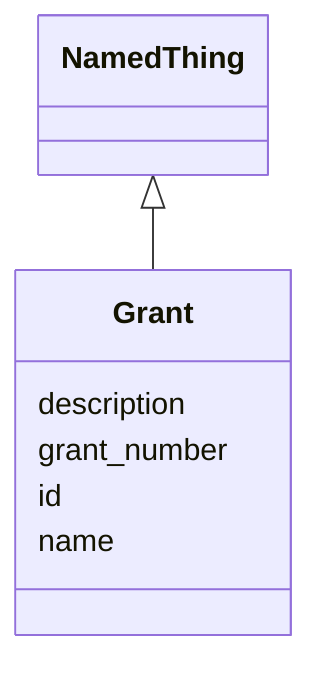

# Class: Grant 


_The name and/or identifier of the specific mechanism providing monetary support or other resources supporting creation of the dataset._

__


URI: [data_sheets_schema:Grant](https://w3id.org/bridge2ai/data-sheets-schema/Grant)





## Inheritance
* [NamedThing](NamedThing.md)
    * **Grant**


## Slots

| Name | Cardinality and Range | Description | Inheritance |
| ---  | --- | --- | --- |
| [grant_number](grant_number.md) | 0..1 <br/> [String](String.md) | The alphanumeric identifier for the grant | direct |
| [id](id.md) | 1 <br/> [Uriorcurie](Uriorcurie.md) | A unique identifier for a thing | [NamedThing](NamedThing.md) |
| [name](name.md) | 0..1 <br/> [String](String.md) | A human-readable name for a thing | [NamedThing](NamedThing.md) |
| [description](description.md) | 0..1 <br/> [String](String.md) | A human-readable description for a thing | [NamedThing](NamedThing.md) |


## Usages

| used by | used in | type | used |
| ---  | --- | --- | --- |
| [FundingMechanism](FundingMechanism.md) | [grants](grants.md) | range | [Grant](Grant.md) |


## Identifier and Mapping Information


### Schema Source


* from schema: https://w3id.org/bridge2ai/data-sheets-schema


## Mappings

| Mapping Type | Mapped Value |
| ---  | ---  |
| self | data_sheets_schema:Grant |
| native | data_sheets_schema:Grant |


## LinkML Source

<!-- TODO: investigate https://stackoverflow.com/questions/37606292/how-to-create-tabbed-code-blocks-in-mkdocs-or-sphinx -->

### Direct

<details>
```yaml
name: Grant
description: 'The name and/or identifier of the specific mechanism providing monetary
  support or other resources supporting creation of the dataset.

  '
from_schema: https://w3id.org/bridge2ai/data-sheets-schema
is_a: NamedThing
attributes:
  grant_number:
    name: grant_number
    description: The alphanumeric identifier for the grant.
    from_schema: https://w3id.org/bridge2ai/data-sheets-schema/motivation
    rank: 1000
    slot_uri: schema:identifier
    domain_of:
    - Grant
    range: string

```
</details>

### Induced

<details>
```yaml
name: Grant
description: 'The name and/or identifier of the specific mechanism providing monetary
  support or other resources supporting creation of the dataset.

  '
from_schema: https://w3id.org/bridge2ai/data-sheets-schema
is_a: NamedThing
attributes:
  grant_number:
    name: grant_number
    description: The alphanumeric identifier for the grant.
    from_schema: https://w3id.org/bridge2ai/data-sheets-schema/motivation
    rank: 1000
    slot_uri: schema:identifier
    alias: grant_number
    owner: Grant
    domain_of:
    - Grant
    range: string
  id:
    name: id
    description: A unique identifier for a thing.
    from_schema: https://w3id.org/bridge2ai/data-sheets-schema/base
    rank: 1000
    slot_uri: schema:identifier
    identifier: true
    alias: id
    owner: Grant
    domain_of:
    - NamedThing
    - DatasetProperty
    range: uriorcurie
    required: true
  name:
    name: name
    description: A human-readable name for a thing.
    from_schema: https://w3id.org/bridge2ai/data-sheets-schema/base
    rank: 1000
    slot_uri: schema:name
    alias: name
    owner: Grant
    domain_of:
    - NamedThing
    - DatasetProperty
    range: string
  description:
    name: description
    description: A human-readable description for a thing.
    from_schema: https://w3id.org/bridge2ai/data-sheets-schema/base
    rank: 1000
    slot_uri: schema:description
    alias: description
    owner: Grant
    domain_of:
    - NamedThing
    - DatasetProperty
    - DatasetRelationship
    range: string

```
</details>