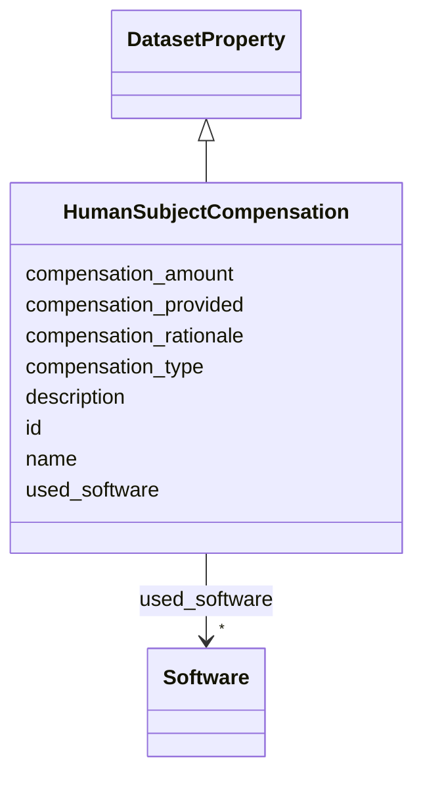

# Class: HumanSubjectCompensation 


_Information about compensation or incentives provided to human research participants._

__


URI: [data_sheets_schema:HumanSubjectCompensation](https://w3id.org/bridge2ai/data-sheets-schema/HumanSubjectCompensation)





## Inheritance
* [DatasetProperty](DatasetProperty.md)
    * **HumanSubjectCompensation**


## Slots

| Name | Cardinality and Range | Description | Inheritance |
| ---  | --- | --- | --- |
| [compensation_provided](compensation_provided.md) | 0..1 <br/> [Boolean](Boolean.md) | Were participants compensated for their participation? | direct |
| [compensation_type](compensation_type.md) | * <br/> [String](String.md) | What type of compensation was provided (e | direct |
| [compensation_amount](compensation_amount.md) | * <br/> [String](String.md) | What was the amount or value of compensation provided? Include currency or eq... | direct |
| [compensation_rationale](compensation_rationale.md) | * <br/> [String](String.md) | What was the rationale for the compensation structure? How was the amount det... | direct |
| [id](id.md) | 0..1 <br/> [Uriorcurie](Uriorcurie.md) | An optional identifier for this property | [DatasetProperty](DatasetProperty.md) |
| [name](name.md) | 0..1 <br/> [String](String.md) | A human-readable name for this property | [DatasetProperty](DatasetProperty.md) |
| [description](description.md) | 0..1 <br/> [String](String.md) | A human-readable description for this property | [DatasetProperty](DatasetProperty.md) |
| [used_software](used_software.md) | * <br/> [Software](Software.md) | What software was used as part of this dataset property? | [DatasetProperty](DatasetProperty.md) |


## Usages

| used by | used in | type | used |
| ---  | --- | --- | --- |
| [Dataset](Dataset.md) | [participant_compensation](participant_compensation.md) | range | [HumanSubjectCompensation](HumanSubjectCompensation.md) |
| [DataSubset](DataSubset.md) | [participant_compensation](participant_compensation.md) | range | [HumanSubjectCompensation](HumanSubjectCompensation.md) |


## Identifier and Mapping Information


### Schema Source


* from schema: https://w3id.org/bridge2ai/data-sheets-schema


## Mappings

| Mapping Type | Mapped Value |
| ---  | ---  |
| self | data_sheets_schema:HumanSubjectCompensation |
| native | data_sheets_schema:HumanSubjectCompensation |


## LinkML Source

<!-- TODO: investigate https://stackoverflow.com/questions/37606292/how-to-create-tabbed-code-blocks-in-mkdocs-or-sphinx -->

### Direct

<details>
```yaml
name: HumanSubjectCompensation
description: 'Information about compensation or incentives provided to human research
  participants.

  '
from_schema: https://w3id.org/bridge2ai/data-sheets-schema
is_a: DatasetProperty
attributes:
  compensation_provided:
    name: compensation_provided
    description: Were participants compensated for their participation?
    from_schema: https://w3id.org/bridge2ai/data-sheets-schema/human
    rank: 1000
    domain_of:
    - HumanSubjectCompensation
    range: boolean
  compensation_type:
    name: compensation_type
    description: 'What type of compensation was provided (e.g., monetary payment,
      gift cards, course credit, other incentives)?

      '
    from_schema: https://w3id.org/bridge2ai/data-sheets-schema/human
    rank: 1000
    domain_of:
    - HumanSubjectCompensation
    range: string
    multivalued: true
  compensation_amount:
    name: compensation_amount
    description: 'What was the amount or value of compensation provided? Include currency
      or equivalent value.

      '
    from_schema: https://w3id.org/bridge2ai/data-sheets-schema/human
    rank: 1000
    domain_of:
    - HumanSubjectCompensation
    range: string
    multivalued: true
  compensation_rationale:
    name: compensation_rationale
    description: 'What was the rationale for the compensation structure? How was the
      amount determined to be appropriate?

      '
    from_schema: https://w3id.org/bridge2ai/data-sheets-schema/human
    rank: 1000
    domain_of:
    - HumanSubjectCompensation
    range: string
    multivalued: true

```
</details>

### Induced

<details>
```yaml
name: HumanSubjectCompensation
description: 'Information about compensation or incentives provided to human research
  participants.

  '
from_schema: https://w3id.org/bridge2ai/data-sheets-schema
is_a: DatasetProperty
attributes:
  compensation_provided:
    name: compensation_provided
    description: Were participants compensated for their participation?
    from_schema: https://w3id.org/bridge2ai/data-sheets-schema/human
    rank: 1000
    alias: compensation_provided
    owner: HumanSubjectCompensation
    domain_of:
    - HumanSubjectCompensation
    range: boolean
  compensation_type:
    name: compensation_type
    description: 'What type of compensation was provided (e.g., monetary payment,
      gift cards, course credit, other incentives)?

      '
    from_schema: https://w3id.org/bridge2ai/data-sheets-schema/human
    rank: 1000
    alias: compensation_type
    owner: HumanSubjectCompensation
    domain_of:
    - HumanSubjectCompensation
    range: string
    multivalued: true
  compensation_amount:
    name: compensation_amount
    description: 'What was the amount or value of compensation provided? Include currency
      or equivalent value.

      '
    from_schema: https://w3id.org/bridge2ai/data-sheets-schema/human
    rank: 1000
    alias: compensation_amount
    owner: HumanSubjectCompensation
    domain_of:
    - HumanSubjectCompensation
    range: string
    multivalued: true
  compensation_rationale:
    name: compensation_rationale
    description: 'What was the rationale for the compensation structure? How was the
      amount determined to be appropriate?

      '
    from_schema: https://w3id.org/bridge2ai/data-sheets-schema/human
    rank: 1000
    alias: compensation_rationale
    owner: HumanSubjectCompensation
    domain_of:
    - HumanSubjectCompensation
    range: string
    multivalued: true
  id:
    name: id
    description: An optional identifier for this property.
    from_schema: https://w3id.org/bridge2ai/data-sheets-schema/base
    slot_uri: schema:identifier
    alias: id
    owner: HumanSubjectCompensation
    domain_of:
    - NamedThing
    - DatasetProperty
    range: uriorcurie
  name:
    name: name
    description: A human-readable name for this property.
    from_schema: https://w3id.org/bridge2ai/data-sheets-schema/base
    slot_uri: schema:name
    alias: name
    owner: HumanSubjectCompensation
    domain_of:
    - NamedThing
    - DatasetProperty
    range: string
  description:
    name: description
    description: A human-readable description for this property.
    from_schema: https://w3id.org/bridge2ai/data-sheets-schema/base
    slot_uri: schema:description
    alias: description
    owner: HumanSubjectCompensation
    domain_of:
    - NamedThing
    - DatasetProperty
    - DatasetRelationship
    range: string
  used_software:
    name: used_software
    description: What software was used as part of this dataset property?
    from_schema: https://w3id.org/bridge2ai/data-sheets-schema/base
    rank: 1000
    alias: used_software
    owner: HumanSubjectCompensation
    domain_of:
    - DatasetProperty
    range: Software
    multivalued: true
    inlined: true
    inlined_as_list: true

```
</details>