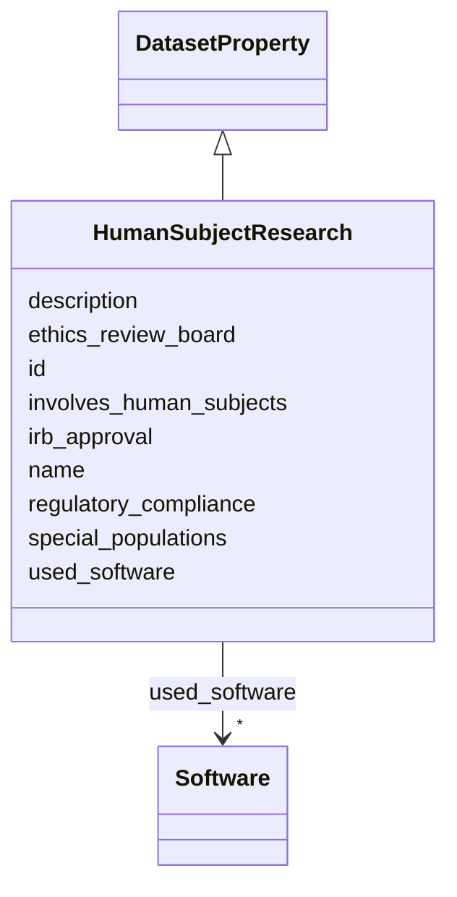

# Class: HumanSubjectResearch 


_Information about whether the dataset involves human subjects research and what regulatory or ethical review processes were followed._

__


URI: [data_sheets_schema:HumanSubjectResearch](https://w3id.org/bridge2ai/data-sheets-schema/HumanSubjectResearch)





## Inheritance
* [DatasetProperty](DatasetProperty.md)
    * **HumanSubjectResearch**


## Slots

| Name | Cardinality and Range | Description | Inheritance |
| ---  | --- | --- | --- |
| [involves_human_subjects](involves_human_subjects.md) | 0..1 <br/> [Boolean](Boolean.md) | Does this dataset involve human subjects research? | direct |
| [irb_approval](irb_approval.md) | * <br/> [String](String.md) | Was Institutional Review Board (IRB) approval obtained? Include approval numb... | direct |
| [ethics_review_board](ethics_review_board.md) | * <br/> [String](String.md) | What ethics review board(s) reviewed this research? Include institution names... | direct |
| [special_populations](special_populations.md) | * <br/> [String](String.md) | Does the research involve any special populations that require additional pro... | direct |
| [regulatory_compliance](regulatory_compliance.md) | * <br/> [String](String.md) | What regulatory frameworks govern this human subjects research (e | direct |
| [id](id.md) | 0..1 <br/> [Uriorcurie](Uriorcurie.md) | An optional identifier for this property | [DatasetProperty](DatasetProperty.md) |
| [name](name.md) | 0..1 <br/> [String](String.md) | A human-readable name for this property | [DatasetProperty](DatasetProperty.md) |
| [description](description.md) | 0..1 <br/> [String](String.md) | A human-readable description for this property | [DatasetProperty](DatasetProperty.md) |
| [used_software](used_software.md) | * <br/> [Software](Software.md) | What software was used as part of this dataset property? | [DatasetProperty](DatasetProperty.md) |


## Usages

| used by | used in | type | used |
| ---  | --- | --- | --- |
| [Dataset](Dataset.md) | [human_subject_research](human_subject_research.md) | range | [HumanSubjectResearch](HumanSubjectResearch.md) |
| [DataSubset](DataSubset.md) | [human_subject_research](human_subject_research.md) | range | [HumanSubjectResearch](HumanSubjectResearch.md) |


## Identifier and Mapping Information


### Schema Source


* from schema: https://w3id.org/bridge2ai/data-sheets-schema


## Mappings

| Mapping Type | Mapped Value |
| ---  | ---  |
| self | data_sheets_schema:HumanSubjectResearch |
| native | data_sheets_schema:HumanSubjectResearch |


## LinkML Source

<!-- TODO: investigate https://stackoverflow.com/questions/37606292/how-to-create-tabbed-code-blocks-in-mkdocs-or-sphinx -->

### Direct

<details>
```yaml
name: HumanSubjectResearch
description: 'Information about whether the dataset involves human subjects research
  and what regulatory or ethical review processes were followed.

  '
from_schema: https://w3id.org/bridge2ai/data-sheets-schema
is_a: DatasetProperty
attributes:
  involves_human_subjects:
    name: involves_human_subjects
    description: Does this dataset involve human subjects research?
    from_schema: https://w3id.org/bridge2ai/data-sheets-schema/human
    rank: 1000
    domain_of:
    - HumanSubjectResearch
    range: boolean
  irb_approval:
    name: irb_approval
    description: 'Was Institutional Review Board (IRB) approval obtained? Include
      approval number and institution if applicable.

      '
    from_schema: https://w3id.org/bridge2ai/data-sheets-schema/human
    rank: 1000
    domain_of:
    - HumanSubjectResearch
    range: string
    multivalued: true
  ethics_review_board:
    name: ethics_review_board
    description: 'What ethics review board(s) reviewed this research? Include institution
      names and approval details.

      '
    from_schema: https://w3id.org/bridge2ai/data-sheets-schema/human
    rank: 1000
    domain_of:
    - HumanSubjectResearch
    range: string
    multivalued: true
  special_populations:
    name: special_populations
    description: 'Does the research involve any special populations that require additional
      protections (e.g., minors, pregnant women, prisoners)?

      '
    from_schema: https://w3id.org/bridge2ai/data-sheets-schema/human
    rank: 1000
    domain_of:
    - HumanSubjectResearch
    range: string
    multivalued: true
  regulatory_compliance:
    name: regulatory_compliance
    description: 'What regulatory frameworks govern this human subjects research (e.g.,
      45 CFR 46, HIPAA)?

      '
    from_schema: https://w3id.org/bridge2ai/data-sheets-schema/human
    rank: 1000
    domain_of:
    - HumanSubjectResearch
    range: string
    multivalued: true

```
</details>

### Induced

<details>
```yaml
name: HumanSubjectResearch
description: 'Information about whether the dataset involves human subjects research
  and what regulatory or ethical review processes were followed.

  '
from_schema: https://w3id.org/bridge2ai/data-sheets-schema
is_a: DatasetProperty
attributes:
  involves_human_subjects:
    name: involves_human_subjects
    description: Does this dataset involve human subjects research?
    from_schema: https://w3id.org/bridge2ai/data-sheets-schema/human
    rank: 1000
    alias: involves_human_subjects
    owner: HumanSubjectResearch
    domain_of:
    - HumanSubjectResearch
    range: boolean
  irb_approval:
    name: irb_approval
    description: 'Was Institutional Review Board (IRB) approval obtained? Include
      approval number and institution if applicable.

      '
    from_schema: https://w3id.org/bridge2ai/data-sheets-schema/human
    rank: 1000
    alias: irb_approval
    owner: HumanSubjectResearch
    domain_of:
    - HumanSubjectResearch
    range: string
    multivalued: true
  ethics_review_board:
    name: ethics_review_board
    description: 'What ethics review board(s) reviewed this research? Include institution
      names and approval details.

      '
    from_schema: https://w3id.org/bridge2ai/data-sheets-schema/human
    rank: 1000
    alias: ethics_review_board
    owner: HumanSubjectResearch
    domain_of:
    - HumanSubjectResearch
    range: string
    multivalued: true
  special_populations:
    name: special_populations
    description: 'Does the research involve any special populations that require additional
      protections (e.g., minors, pregnant women, prisoners)?

      '
    from_schema: https://w3id.org/bridge2ai/data-sheets-schema/human
    rank: 1000
    alias: special_populations
    owner: HumanSubjectResearch
    domain_of:
    - HumanSubjectResearch
    range: string
    multivalued: true
  regulatory_compliance:
    name: regulatory_compliance
    description: 'What regulatory frameworks govern this human subjects research (e.g.,
      45 CFR 46, HIPAA)?

      '
    from_schema: https://w3id.org/bridge2ai/data-sheets-schema/human
    rank: 1000
    alias: regulatory_compliance
    owner: HumanSubjectResearch
    domain_of:
    - HumanSubjectResearch
    range: string
    multivalued: true
  id:
    name: id
    description: An optional identifier for this property.
    from_schema: https://w3id.org/bridge2ai/data-sheets-schema/base
    slot_uri: schema:identifier
    alias: id
    owner: HumanSubjectResearch
    domain_of:
    - NamedThing
    - DatasetProperty
    range: uriorcurie
  name:
    name: name
    description: A human-readable name for this property.
    from_schema: https://w3id.org/bridge2ai/data-sheets-schema/base
    slot_uri: schema:name
    alias: name
    owner: HumanSubjectResearch
    domain_of:
    - NamedThing
    - DatasetProperty
    range: string
  description:
    name: description
    description: A human-readable description for this property.
    from_schema: https://w3id.org/bridge2ai/data-sheets-schema/base
    slot_uri: schema:description
    alias: description
    owner: HumanSubjectResearch
    domain_of:
    - NamedThing
    - DatasetProperty
    - DatasetRelationship
    range: string
  used_software:
    name: used_software
    description: What software was used as part of this dataset property?
    from_schema: https://w3id.org/bridge2ai/data-sheets-schema/base
    rank: 1000
    alias: used_software
    owner: HumanSubjectResearch
    domain_of:
    - DatasetProperty
    range: Software
    multivalued: true
    inlined: true
    inlined_as_list: true

```
</details>