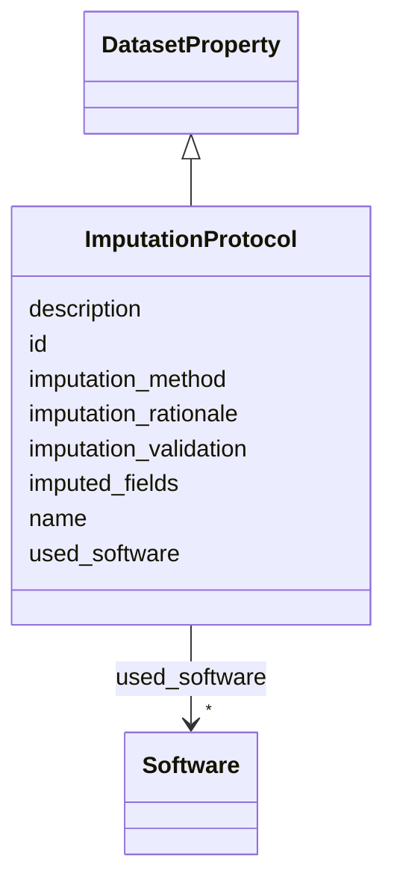

# Class: ImputationProtocol 


_Description of data imputation methodology, including techniques used to handle missing values and rationale for chosen approaches._

__


URI: [data_sheets_schema:ImputationProtocol](https://w3id.org/bridge2ai/data-sheets-schema/ImputationProtocol)





## Inheritance
* [DatasetProperty](DatasetProperty.md)
    * **ImputationProtocol**


## Slots

| Name | Cardinality and Range | Description | Inheritance |
| ---  | --- | --- | --- |
| [imputation_method](imputation_method.md) | * <br/> [String](String.md) | Specific imputation technique used (mean, median, mode, forward fill, backwar... | direct |
| [imputed_fields](imputed_fields.md) | * <br/> [String](String.md) | Fields or columns where imputation was applied | direct |
| [imputation_rationale](imputation_rationale.md) | 0..1 <br/> [String](String.md) | Justification for the imputation approach chosen, including assumptions made ... | direct |
| [imputation_validation](imputation_validation.md) | * <br/> [String](String.md) | Methods used to validate imputation quality (if any) | direct |
| [id](id.md) | 0..1 <br/> [Uriorcurie](Uriorcurie.md) | An optional identifier for this property | [DatasetProperty](DatasetProperty.md) |
| [name](name.md) | 0..1 <br/> [String](String.md) | A human-readable name for this property | [DatasetProperty](DatasetProperty.md) |
| [description](description.md) | 0..1 <br/> [String](String.md) | A human-readable description for this property | [DatasetProperty](DatasetProperty.md) |
| [used_software](used_software.md) | * <br/> [Software](Software.md) | What software was used as part of this dataset property? | [DatasetProperty](DatasetProperty.md) |


## Usages

| used by | used in | type | used |
| ---  | --- | --- | --- |
| [Dataset](Dataset.md) | [imputation_protocols](imputation_protocols.md) | range | [ImputationProtocol](ImputationProtocol.md) |
| [DataSubset](DataSubset.md) | [imputation_protocols](imputation_protocols.md) | range | [ImputationProtocol](ImputationProtocol.md) |


## Identifier and Mapping Information


### Schema Source


* from schema: https://w3id.org/bridge2ai/data-sheets-schema


## Mappings

| Mapping Type | Mapped Value |
| ---  | ---  |
| self | data_sheets_schema:ImputationProtocol |
| native | data_sheets_schema:ImputationProtocol |
| exact | rai:dataImputationProtocol |


## LinkML Source

<!-- TODO: investigate https://stackoverflow.com/questions/37606292/how-to-create-tabbed-code-blocks-in-mkdocs-or-sphinx -->

### Direct

<details>
```yaml
name: ImputationProtocol
description: 'Description of data imputation methodology, including techniques used
  to handle missing values and rationale for chosen approaches.

  '
from_schema: https://w3id.org/bridge2ai/data-sheets-schema
exact_mappings:
- rai:dataImputationProtocol
is_a: DatasetProperty
attributes:
  imputation_method:
    name: imputation_method
    description: 'Specific imputation technique used (mean, median, mode, forward
      fill, backward fill, interpolation, model-based imputation, etc.).

      '
    from_schema: https://w3id.org/bridge2ai/data-sheets-schema/preprocessing-cleaning-labeling
    rank: 1000
    domain_of:
    - ImputationProtocol
    range: string
    multivalued: true
  imputed_fields:
    name: imputed_fields
    description: 'Fields or columns where imputation was applied.

      '
    from_schema: https://w3id.org/bridge2ai/data-sheets-schema/preprocessing-cleaning-labeling
    rank: 1000
    domain_of:
    - ImputationProtocol
    range: string
    multivalued: true
  imputation_rationale:
    name: imputation_rationale
    description: 'Justification for the imputation approach chosen, including assumptions
      made about missing data mechanisms.

      '
    from_schema: https://w3id.org/bridge2ai/data-sheets-schema/preprocessing-cleaning-labeling
    rank: 1000
    domain_of:
    - ImputationProtocol
    range: string
  imputation_validation:
    name: imputation_validation
    description: 'Methods used to validate imputation quality (if any).

      '
    from_schema: https://w3id.org/bridge2ai/data-sheets-schema/preprocessing-cleaning-labeling
    rank: 1000
    domain_of:
    - ImputationProtocol
    range: string
    multivalued: true

```
</details>

### Induced

<details>
```yaml
name: ImputationProtocol
description: 'Description of data imputation methodology, including techniques used
  to handle missing values and rationale for chosen approaches.

  '
from_schema: https://w3id.org/bridge2ai/data-sheets-schema
exact_mappings:
- rai:dataImputationProtocol
is_a: DatasetProperty
attributes:
  imputation_method:
    name: imputation_method
    description: 'Specific imputation technique used (mean, median, mode, forward
      fill, backward fill, interpolation, model-based imputation, etc.).

      '
    from_schema: https://w3id.org/bridge2ai/data-sheets-schema/preprocessing-cleaning-labeling
    rank: 1000
    alias: imputation_method
    owner: ImputationProtocol
    domain_of:
    - ImputationProtocol
    range: string
    multivalued: true
  imputed_fields:
    name: imputed_fields
    description: 'Fields or columns where imputation was applied.

      '
    from_schema: https://w3id.org/bridge2ai/data-sheets-schema/preprocessing-cleaning-labeling
    rank: 1000
    alias: imputed_fields
    owner: ImputationProtocol
    domain_of:
    - ImputationProtocol
    range: string
    multivalued: true
  imputation_rationale:
    name: imputation_rationale
    description: 'Justification for the imputation approach chosen, including assumptions
      made about missing data mechanisms.

      '
    from_schema: https://w3id.org/bridge2ai/data-sheets-schema/preprocessing-cleaning-labeling
    rank: 1000
    alias: imputation_rationale
    owner: ImputationProtocol
    domain_of:
    - ImputationProtocol
    range: string
  imputation_validation:
    name: imputation_validation
    description: 'Methods used to validate imputation quality (if any).

      '
    from_schema: https://w3id.org/bridge2ai/data-sheets-schema/preprocessing-cleaning-labeling
    rank: 1000
    alias: imputation_validation
    owner: ImputationProtocol
    domain_of:
    - ImputationProtocol
    range: string
    multivalued: true
  id:
    name: id
    description: An optional identifier for this property.
    from_schema: https://w3id.org/bridge2ai/data-sheets-schema/base
    slot_uri: schema:identifier
    alias: id
    owner: ImputationProtocol
    domain_of:
    - NamedThing
    - DatasetProperty
    range: uriorcurie
  name:
    name: name
    description: A human-readable name for this property.
    from_schema: https://w3id.org/bridge2ai/data-sheets-schema/base
    slot_uri: schema:name
    alias: name
    owner: ImputationProtocol
    domain_of:
    - NamedThing
    - DatasetProperty
    range: string
  description:
    name: description
    description: A human-readable description for this property.
    from_schema: https://w3id.org/bridge2ai/data-sheets-schema/base
    slot_uri: schema:description
    alias: description
    owner: ImputationProtocol
    domain_of:
    - NamedThing
    - DatasetProperty
    - DatasetRelationship
    range: string
  used_software:
    name: used_software
    description: What software was used as part of this dataset property?
    from_schema: https://w3id.org/bridge2ai/data-sheets-schema/base
    rank: 1000
    alias: used_software
    owner: ImputationProtocol
    domain_of:
    - DatasetProperty
    range: Software
    multivalued: true
    inlined: true
    inlined_as_list: true

```
</details>