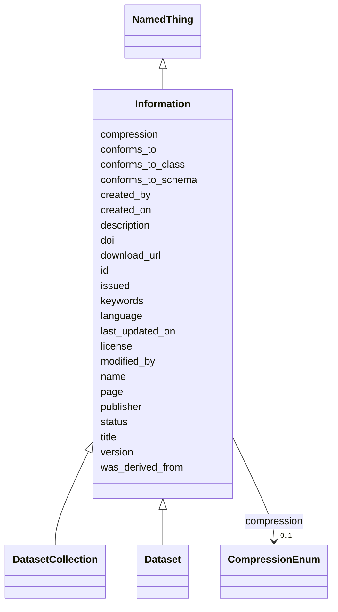

# Class: Information 


_Grouping for datasets and data files_


URI: [data_sheets_schema:Information](https://w3id.org/bridge2ai/data-sheets-schema/Information)





## Inheritance
* [NamedThing](NamedThing.md)
    * **Information**
        * [DatasetCollection](DatasetCollection.md)
        * [Dataset](Dataset.md)


## Slots

| Name | Cardinality and Range | Description | Inheritance |
| ---  | --- | --- | --- |
| [compression](compression.md) | 0..1 <br/> [CompressionEnum](CompressionEnum.md) | compression format used, if any | direct |
| [conforms_to](conforms_to.md) | 0..1 <br/> [String](String.md) |  | direct |
| [conforms_to_class](conforms_to_class.md) | 0..1 <br/> [String](String.md) |  | direct |
| [conforms_to_schema](conforms_to_schema.md) | 0..1 <br/> [String](String.md) |  | direct |
| [created_by](created_by.md) | 0..1 <br/> [String](String.md) |  | direct |
| [created_on](created_on.md) | 0..1 <br/> [Datetime](Datetime.md) |  | direct |
| [doi](doi.md) | 0..1 <br/> [String](String.md) | digital object identifier | direct |
| [download_url](download_url.md) | 0..1 <br/> [Uri](Uri.md) | URL from which the data can be downloaded | direct |
| [issued](issued.md) | 0..1 <br/> [Datetime](Datetime.md) |  | direct |
| [keywords](keywords.md) | * <br/> [String](String.md) |  | direct |
| [language](language.md) | 0..1 <br/> [String](String.md) | language in which the information is expressed | direct |
| [last_updated_on](last_updated_on.md) | 0..1 <br/> [Datetime](Datetime.md) |  | direct |
| [license](license.md) | 0..1 <br/> [String](String.md) |  | direct |
| [modified_by](modified_by.md) | 0..1 <br/> [String](String.md) |  | direct |
| [page](page.md) | 0..1 <br/> [String](String.md) |  | direct |
| [publisher](publisher.md) | 0..1 <br/> [Uriorcurie](Uriorcurie.md) |  | direct |
| [status](status.md) | 0..1 <br/> [String](String.md) |  | direct |
| [title](title.md) | 0..1 <br/> [String](String.md) | the official title of the element | direct |
| [version](version.md) | 0..1 <br/> [String](String.md) |  | direct |
| [was_derived_from](was_derived_from.md) | 0..1 <br/> [String](String.md) |  | direct |
| [id](id.md) | 1 <br/> [Uriorcurie](Uriorcurie.md) | A unique identifier for a thing | [NamedThing](NamedThing.md) |
| [name](name.md) | 0..1 <br/> [String](String.md) | A human-readable name for a thing | [NamedThing](NamedThing.md) |
| [description](description.md) | 0..1 <br/> [String](String.md) | A human-readable description for a thing | [NamedThing](NamedThing.md) |


## Identifier and Mapping Information


### Schema Source


* from schema: https://w3id.org/bridge2ai/data-sheets-schema


## Mappings

| Mapping Type | Mapped Value |
| ---  | ---  |
| self | data_sheets_schema:Information |
| native | data_sheets_schema:Information |
| close | schema:CreativeWork |


## LinkML Source

<!-- TODO: investigate https://stackoverflow.com/questions/37606292/how-to-create-tabbed-code-blocks-in-mkdocs-or-sphinx -->

### Direct

<details>
```yaml
name: Information
description: Grouping for datasets and data files
from_schema: https://w3id.org/bridge2ai/data-sheets-schema
close_mappings:
- schema:CreativeWork
is_a: NamedThing
slots:
- compression
- conforms_to
- conforms_to_class
- conforms_to_schema
- created_by
- created_on
- doi
- download_url
- issued
- keywords
- language
- last_updated_on
- license
- modified_by
- page
- publisher
- status
- title
- version
- was_derived_from

```
</details>

### Induced

<details>
```yaml
name: Information
description: Grouping for datasets and data files
from_schema: https://w3id.org/bridge2ai/data-sheets-schema
close_mappings:
- schema:CreativeWork
is_a: NamedThing
attributes:
  compression:
    name: compression
    description: compression format used, if any. e.g., gzip, bzip2, zip
    from_schema: https://w3id.org/bridge2ai/data-sheets-schema
    rank: 1000
    slot_uri: dcat:compressFormat
    alias: compression
    owner: Information
    domain_of:
    - Information
    range: CompressionEnum
  conforms_to:
    name: conforms_to
    from_schema: https://w3id.org/bridge2ai/data-sheets-schema
    rank: 1000
    slot_uri: dcterms:conformsTo
    alias: conforms_to
    owner: Information
    domain_of:
    - Information
    range: string
  conforms_to_class:
    name: conforms_to_class
    from_schema: https://w3id.org/bridge2ai/data-sheets-schema
    rank: 1000
    slot_uri: dcterms:conformsTo
    alias: conforms_to_class
    owner: Information
    domain_of:
    - Information
    range: string
  conforms_to_schema:
    name: conforms_to_schema
    from_schema: https://w3id.org/bridge2ai/data-sheets-schema
    rank: 1000
    slot_uri: dcterms:conformsTo
    alias: conforms_to_schema
    owner: Information
    domain_of:
    - Information
    range: string
  created_by:
    name: created_by
    from_schema: https://w3id.org/bridge2ai/data-sheets-schema
    rank: 1000
    slot_uri: dcterms:creator
    alias: created_by
    owner: Information
    domain_of:
    - Information
    range: string
  created_on:
    name: created_on
    from_schema: https://w3id.org/bridge2ai/data-sheets-schema
    rank: 1000
    slot_uri: dcterms:created
    alias: created_on
    owner: Information
    domain_of:
    - Information
    range: datetime
  doi:
    name: doi
    description: digital object identifier
    from_schema: https://w3id.org/bridge2ai/data-sheets-schema
    rank: 1000
    slot_uri: dcterms:identifier
    alias: doi
    owner: Information
    domain_of:
    - Information
    range: string
    pattern: 10\.\d{4,}\/.+
  download_url:
    name: download_url
    description: URL from which the data can be downloaded. This is not the same as
      the landing page, which is a page that describes the dataset. Rather, this URL
      points directly to the data itself.
    from_schema: https://w3id.org/bridge2ai/data-sheets-schema
    exact_mappings:
    - schema:url
    rank: 1000
    slot_uri: dcat:downloadURL
    alias: download_url
    owner: Information
    domain_of:
    - Information
    range: uri
  issued:
    name: issued
    from_schema: https://w3id.org/bridge2ai/data-sheets-schema
    rank: 1000
    slot_uri: dcterms:issued
    alias: issued
    owner: Information
    domain_of:
    - Information
    range: datetime
  keywords:
    name: keywords
    from_schema: https://w3id.org/bridge2ai/data-sheets-schema
    rank: 1000
    slot_uri: dcat:keyword
    alias: keywords
    owner: Information
    domain_of:
    - Information
    range: string
    multivalued: true
  language:
    name: language
    description: language in which the information is expressed
    from_schema: https://w3id.org/bridge2ai/data-sheets-schema
    exact_mappings:
    - schema:inLanguage
    rank: 1000
    slot_uri: dcterms:language
    alias: language
    owner: Information
    domain_of:
    - Information
    range: string
  last_updated_on:
    name: last_updated_on
    from_schema: https://w3id.org/bridge2ai/data-sheets-schema
    rank: 1000
    slot_uri: dcterms:modified
    alias: last_updated_on
    owner: Information
    domain_of:
    - Information
    range: datetime
  license:
    name: license
    from_schema: https://w3id.org/bridge2ai/data-sheets-schema
    rank: 1000
    slot_uri: dcterms:license
    alias: license
    owner: Information
    domain_of:
    - Software
    - Information
    range: string
  modified_by:
    name: modified_by
    from_schema: https://w3id.org/bridge2ai/data-sheets-schema
    rank: 1000
    slot_uri: dcterms:contributor
    alias: modified_by
    owner: Information
    domain_of:
    - Information
    range: string
  page:
    name: page
    from_schema: https://w3id.org/bridge2ai/data-sheets-schema
    rank: 1000
    slot_uri: dcat:landingPage
    alias: page
    owner: Information
    domain_of:
    - Information
    range: string
  publisher:
    name: publisher
    from_schema: https://w3id.org/bridge2ai/data-sheets-schema
    rank: 1000
    slot_uri: dcterms:publisher
    alias: publisher
    owner: Information
    domain_of:
    - Information
    range: uriorcurie
  status:
    name: status
    from_schema: https://w3id.org/bridge2ai/data-sheets-schema
    rank: 1000
    slot_uri: dcterms:type
    alias: status
    owner: Information
    domain_of:
    - Information
    range: string
  title:
    name: title
    description: the official title of the element
    from_schema: https://w3id.org/bridge2ai/data-sheets-schema
    rank: 1000
    slot_uri: dcterms:title
    alias: title
    owner: Information
    domain_of:
    - Information
    range: string
  version:
    name: version
    from_schema: https://w3id.org/bridge2ai/data-sheets-schema
    rank: 1000
    slot_uri: dcterms:hasVersion
    alias: version
    owner: Information
    domain_of:
    - Software
    - Information
    range: string
  was_derived_from:
    name: was_derived_from
    from_schema: https://w3id.org/bridge2ai/data-sheets-schema
    exact_mappings:
    - dcterms:source
    rank: 1000
    slot_uri: prov:wasDerivedFrom
    alias: was_derived_from
    owner: Information
    domain_of:
    - Information
    range: string
  id:
    name: id
    description: A unique identifier for a thing.
    from_schema: https://w3id.org/bridge2ai/data-sheets-schema/base
    rank: 1000
    slot_uri: schema:identifier
    identifier: true
    alias: id
    owner: Information
    domain_of:
    - NamedThing
    - DatasetProperty
    range: uriorcurie
    required: true
  name:
    name: name
    description: A human-readable name for a thing.
    from_schema: https://w3id.org/bridge2ai/data-sheets-schema/base
    rank: 1000
    slot_uri: schema:name
    alias: name
    owner: Information
    domain_of:
    - NamedThing
    - DatasetProperty
    range: string
  description:
    name: description
    description: A human-readable description for a thing.
    from_schema: https://w3id.org/bridge2ai/data-sheets-schema/base
    rank: 1000
    slot_uri: schema:description
    alias: description
    owner: Information
    domain_of:
    - NamedThing
    - DatasetProperty
    - DatasetRelationship
    range: string

```
</details>