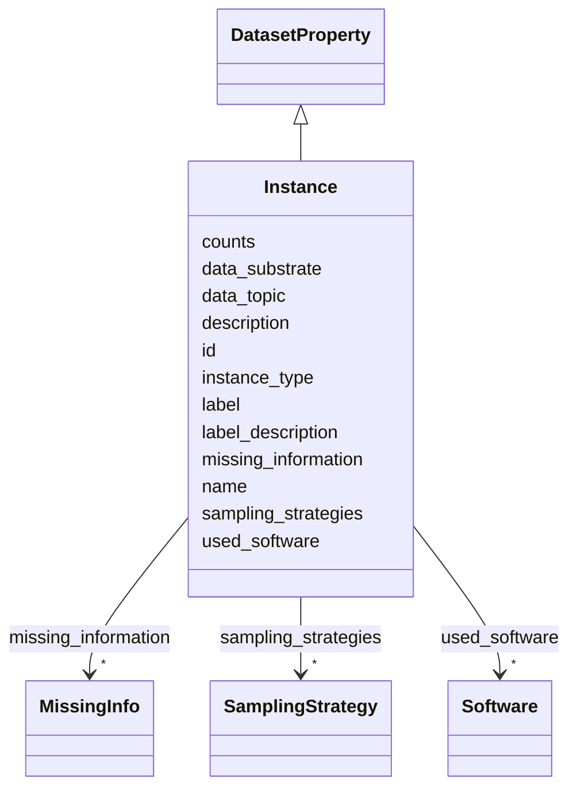

# Class: Instance 


_What do the instances that comprise the dataset represent (e.g., documents, photos, people, countries)?_

__


URI: [data_sheets_schema:Instance](https://w3id.org/bridge2ai/data-sheets-schema/Instance)





## Inheritance
* [NamedThing](NamedThing.md)
    * [DatasetProperty](DatasetProperty.md)
        * **Instance**


## Slots

| Name | Cardinality and Range | Description | Inheritance |
| ---  | --- | --- | --- |
| [data_topic](data_topic.md) | 0..1 <br/> [Uriorcurie](Uriorcurie.md) | General topic of each instance (e | direct |
| [instance_type](instance_type.md) | 0..1 <br/> [String](String.md) | Multiple types of instances? (e | direct |
| [data_substrate](data_substrate.md) | 0..1 <br/> [Uriorcurie](Uriorcurie.md) | Type of data (e | direct |
| [counts](counts.md) | 0..1 <br/> [Integer](Integer.md) | How many instances are there in total (of each type, if appropriate)? | direct |
| [label](label.md) | 0..1 <br/> [Boolean](Boolean.md) | Is there a label or target associated with each instance? | direct |
| [label_description](label_description.md) | 0..1 <br/> [String](String.md) | If labeled, what pattern or format do labels follow? | direct |
| [sampling_strategies](sampling_strategies.md) | * <br/> [SamplingStrategy](SamplingStrategy.md) | References to one or more SamplingStrategy objects | direct |
| [missing_information](missing_information.md) | * <br/> [MissingInfo](MissingInfo.md) | References to one or more MissingInfo objects describing missing data | direct |
| [used_software](used_software.md) | * <br/> [Software](Software.md) | What software was used as part of this dataset property? | [DatasetProperty](DatasetProperty.md) |
| [id](id.md) | 1 <br/> [Uriorcurie](Uriorcurie.md) | A unique identifier for a thing | [NamedThing](NamedThing.md) |
| [name](name.md) | 0..1 <br/> [String](String.md) | A human-readable name for a thing | [NamedThing](NamedThing.md) |
| [description](description.md) | 0..1 <br/> [String](String.md) | A human-readable description for a thing | [NamedThing](NamedThing.md) |


## Usages

| used by | used in | type | used |
| ---  | --- | --- | --- |
| [Dataset](Dataset.md) | [instances](instances.md) | range | [Instance](Instance.md) |
| [DataSubset](DataSubset.md) | [instances](instances.md) | range | [Instance](Instance.md) |


## Identifier and Mapping Information


### Schema Source


* from schema: https://w3id.org/bridge2ai/data-sheets-schema


## Mappings

| Mapping Type | Mapped Value |
| ---  | ---  |
| self | data_sheets_schema:Instance |
| native | data_sheets_schema:Instance |


## LinkML Source

<!-- TODO: investigate https://stackoverflow.com/questions/37606292/how-to-create-tabbed-code-blocks-in-mkdocs-or-sphinx -->

### Direct

<details>
```yaml
name: Instance
description: 'What do the instances that comprise the dataset represent (e.g., documents,
  photos, people, countries)?

  '
from_schema: https://w3id.org/bridge2ai/data-sheets-schema
is_a: DatasetProperty
attributes:
  data_topic:
    name: data_topic
    description: 'General topic of each instance (e.g., from Bridge2AI standards).

      '
    from_schema: https://w3id.org/bridge2ai/data-sheets-schema/composition
    rank: 1000
    values_from:
    - B2AI_TOPIC
    domain_of:
    - Instance
    range: uriorcurie
  instance_type:
    name: instance_type
    description: 'Multiple types of instances? (e.g., movies, users, and ratings).

      '
    from_schema: https://w3id.org/bridge2ai/data-sheets-schema/composition
    rank: 1000
    domain_of:
    - Instance
    range: string
  data_substrate:
    name: data_substrate
    description: 'Type of data (e.g., raw text, images) from Bridge2AI standards.

      '
    from_schema: https://w3id.org/bridge2ai/data-sheets-schema/composition
    rank: 1000
    values_from:
    - B2AI_SUBSTRATE
    domain_of:
    - Instance
    range: uriorcurie
  counts:
    name: counts
    description: 'How many instances are there in total (of each type, if appropriate)?

      '
    from_schema: https://w3id.org/bridge2ai/data-sheets-schema/composition
    rank: 1000
    domain_of:
    - Instance
    range: integer
  label:
    name: label
    description: 'Is there a label or target associated with each instance?

      '
    from_schema: https://w3id.org/bridge2ai/data-sheets-schema/composition
    rank: 1000
    domain_of:
    - Instance
    range: boolean
  label_description:
    name: label_description
    description: 'If labeled, what pattern or format do labels follow?

      '
    from_schema: https://w3id.org/bridge2ai/data-sheets-schema/composition
    rank: 1000
    domain_of:
    - Instance
    range: string
  sampling_strategies:
    name: sampling_strategies
    description: 'References to one or more SamplingStrategy objects.

      '
    from_schema: https://w3id.org/bridge2ai/data-sheets-schema/composition
    domain_of:
    - Dataset
    - Instance
    range: SamplingStrategy
    multivalued: true
  missing_information:
    name: missing_information
    description: 'References to one or more MissingInfo objects describing missing
      data.

      '
    from_schema: https://w3id.org/bridge2ai/data-sheets-schema/composition
    rank: 1000
    domain_of:
    - Instance
    range: MissingInfo
    multivalued: true

```
</details>

### Induced

<details>
```yaml
name: Instance
description: 'What do the instances that comprise the dataset represent (e.g., documents,
  photos, people, countries)?

  '
from_schema: https://w3id.org/bridge2ai/data-sheets-schema
is_a: DatasetProperty
attributes:
  data_topic:
    name: data_topic
    description: 'General topic of each instance (e.g., from Bridge2AI standards).

      '
    from_schema: https://w3id.org/bridge2ai/data-sheets-schema/composition
    rank: 1000
    values_from:
    - B2AI_TOPIC
    alias: data_topic
    owner: Instance
    domain_of:
    - Instance
    range: uriorcurie
  instance_type:
    name: instance_type
    description: 'Multiple types of instances? (e.g., movies, users, and ratings).

      '
    from_schema: https://w3id.org/bridge2ai/data-sheets-schema/composition
    rank: 1000
    alias: instance_type
    owner: Instance
    domain_of:
    - Instance
    range: string
  data_substrate:
    name: data_substrate
    description: 'Type of data (e.g., raw text, images) from Bridge2AI standards.

      '
    from_schema: https://w3id.org/bridge2ai/data-sheets-schema/composition
    rank: 1000
    values_from:
    - B2AI_SUBSTRATE
    alias: data_substrate
    owner: Instance
    domain_of:
    - Instance
    range: uriorcurie
  counts:
    name: counts
    description: 'How many instances are there in total (of each type, if appropriate)?

      '
    from_schema: https://w3id.org/bridge2ai/data-sheets-schema/composition
    rank: 1000
    alias: counts
    owner: Instance
    domain_of:
    - Instance
    range: integer
  label:
    name: label
    description: 'Is there a label or target associated with each instance?

      '
    from_schema: https://w3id.org/bridge2ai/data-sheets-schema/composition
    rank: 1000
    alias: label
    owner: Instance
    domain_of:
    - Instance
    range: boolean
  label_description:
    name: label_description
    description: 'If labeled, what pattern or format do labels follow?

      '
    from_schema: https://w3id.org/bridge2ai/data-sheets-schema/composition
    rank: 1000
    alias: label_description
    owner: Instance
    domain_of:
    - Instance
    range: string
  sampling_strategies:
    name: sampling_strategies
    description: 'References to one or more SamplingStrategy objects.

      '
    from_schema: https://w3id.org/bridge2ai/data-sheets-schema/composition
    alias: sampling_strategies
    owner: Instance
    domain_of:
    - Dataset
    - Instance
    range: SamplingStrategy
    multivalued: true
  missing_information:
    name: missing_information
    description: 'References to one or more MissingInfo objects describing missing
      data.

      '
    from_schema: https://w3id.org/bridge2ai/data-sheets-schema/composition
    rank: 1000
    alias: missing_information
    owner: Instance
    domain_of:
    - Instance
    range: MissingInfo
    multivalued: true
  used_software:
    name: used_software
    description: What software was used as part of this dataset property?
    from_schema: https://w3id.org/bridge2ai/data-sheets-schema/base
    rank: 1000
    alias: used_software
    owner: Instance
    domain_of:
    - DatasetProperty
    range: Software
    multivalued: true
  id:
    name: id
    description: A unique identifier for a thing.
    from_schema: https://w3id.org/bridge2ai/data-sheets-schema/base
    rank: 1000
    slot_uri: schema:identifier
    identifier: true
    alias: id
    owner: Instance
    domain_of:
    - NamedThing
    range: uriorcurie
    required: true
  name:
    name: name
    description: A human-readable name for a thing.
    from_schema: https://w3id.org/bridge2ai/data-sheets-schema/base
    rank: 1000
    slot_uri: schema:name
    alias: name
    owner: Instance
    domain_of:
    - NamedThing
    range: string
  description:
    name: description
    description: A human-readable description for a thing.
    from_schema: https://w3id.org/bridge2ai/data-sheets-schema/base
    rank: 1000
    slot_uri: schema:description
    alias: description
    owner: Instance
    domain_of:
    - NamedThing
    - Relationships
    - Splits
    - DataAnomaly
    - Confidentiality
    - Deidentification
    - SensitiveElement
    - InstanceAcquisition
    - CollectionMechanism
    - DataCollector
    - CollectionTimeframe
    - DirectCollection
    - PreprocessingStrategy
    - CleaningStrategy
    - LabelingStrategy
    - RawData
    - ExistingUse
    - UseRepository
    - OtherTask
    - FutureUseImpact
    - DiscouragedUse
    - ThirdPartySharing
    - DistributionFormat
    - DistributionDate
    - Maintainer
    - Erratum
    - UpdatePlan
    - RetentionLimits
    - VersionAccess
    - ExtensionMechanism
    - EthicalReview
    - DataProtectionImpact
    - CollectionNotification
    - CollectionConsent
    - ConsentRevocation
    - LicenseAndUseTerms
    - IPRestrictions
    - ExportControlRegulatoryRestrictions
    range: string

```
</details>