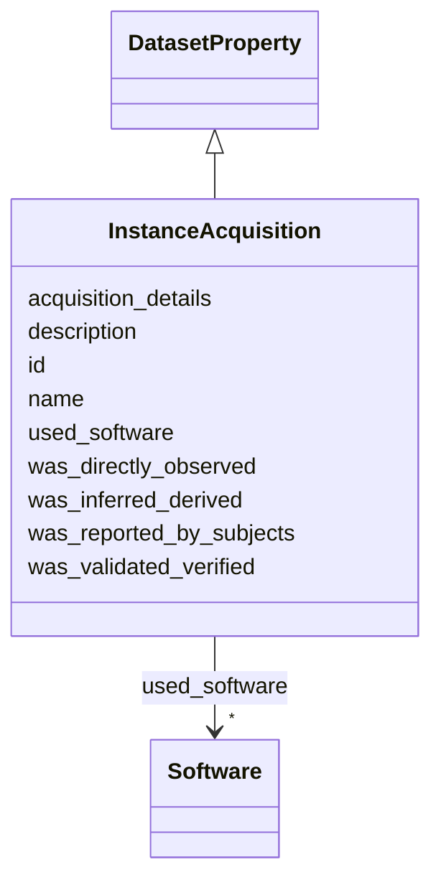

# Class: InstanceAcquisition 


_Describes how data associated with each instance was acquired (e.g., directly observed, reported by subjects, inferred)._

__


URI: [data_sheets_schema:InstanceAcquisition](https://w3id.org/bridge2ai/data-sheets-schema/InstanceAcquisition)





## Inheritance
* [DatasetProperty](DatasetProperty.md)
    * **InstanceAcquisition**


## Slots

| Name | Cardinality and Range | Description | Inheritance |
| ---  | --- | --- | --- |
| [was_directly_observed](was_directly_observed.md) | 0..1 <br/> [Boolean](Boolean.md) | Whether the data was directly observed | direct |
| [was_reported_by_subjects](was_reported_by_subjects.md) | 0..1 <br/> [Boolean](Boolean.md) | Whether the data was reported directly by the subjects themselves | direct |
| [was_inferred_derived](was_inferred_derived.md) | 0..1 <br/> [Boolean](Boolean.md) | Whether the data was inferred or derived from other data | direct |
| [was_validated_verified](was_validated_verified.md) | 0..1 <br/> [Boolean](Boolean.md) | Whether the data was validated or verified in any way | direct |
| [acquisition_details](acquisition_details.md) | * <br/> [String](String.md) | Details on how data was acquired for each instance | direct |
| [id](id.md) | 0..1 <br/> [Uriorcurie](Uriorcurie.md) | An optional identifier for this property | [DatasetProperty](DatasetProperty.md) |
| [name](name.md) | 0..1 <br/> [String](String.md) | A human-readable name for this property | [DatasetProperty](DatasetProperty.md) |
| [description](description.md) | 0..1 <br/> [String](String.md) | A human-readable description for this property | [DatasetProperty](DatasetProperty.md) |
| [used_software](used_software.md) | * <br/> [Software](Software.md) | What software was used as part of this dataset property? | [DatasetProperty](DatasetProperty.md) |


## Usages

| used by | used in | type | used |
| ---  | --- | --- | --- |
| [Dataset](Dataset.md) | [acquisition_methods](acquisition_methods.md) | range | [InstanceAcquisition](InstanceAcquisition.md) |
| [DataSubset](DataSubset.md) | [acquisition_methods](acquisition_methods.md) | range | [InstanceAcquisition](InstanceAcquisition.md) |


## Identifier and Mapping Information


### Schema Source


* from schema: https://w3id.org/bridge2ai/data-sheets-schema


## Mappings

| Mapping Type | Mapped Value |
| ---  | ---  |
| self | data_sheets_schema:InstanceAcquisition |
| native | data_sheets_schema:InstanceAcquisition |


## LinkML Source

<!-- TODO: investigate https://stackoverflow.com/questions/37606292/how-to-create-tabbed-code-blocks-in-mkdocs-or-sphinx -->

### Direct

<details>
```yaml
name: InstanceAcquisition
description: 'Describes how data associated with each instance was acquired (e.g.,
  directly observed, reported by subjects, inferred).

  '
from_schema: https://w3id.org/bridge2ai/data-sheets-schema
is_a: DatasetProperty
attributes:
  was_directly_observed:
    name: was_directly_observed
    description: Whether the data was directly observed
    from_schema: https://w3id.org/bridge2ai/data-sheets-schema/collection
    rank: 1000
    domain_of:
    - InstanceAcquisition
    range: boolean
  was_reported_by_subjects:
    name: was_reported_by_subjects
    description: Whether the data was reported directly by the subjects themselves
    from_schema: https://w3id.org/bridge2ai/data-sheets-schema/collection
    rank: 1000
    domain_of:
    - InstanceAcquisition
    range: boolean
  was_inferred_derived:
    name: was_inferred_derived
    description: Whether the data was inferred or derived from other data
    from_schema: https://w3id.org/bridge2ai/data-sheets-schema/collection
    rank: 1000
    domain_of:
    - InstanceAcquisition
    range: boolean
  was_validated_verified:
    name: was_validated_verified
    description: Whether the data was validated or verified in any way
    from_schema: https://w3id.org/bridge2ai/data-sheets-schema/collection
    rank: 1000
    domain_of:
    - InstanceAcquisition
    range: boolean
  acquisition_details:
    name: acquisition_details
    description: 'Details on how data was acquired for each instance.

      '
    from_schema: https://w3id.org/bridge2ai/data-sheets-schema/collection
    rank: 1000
    slot_uri: dcterms:description
    domain_of:
    - InstanceAcquisition
    range: string
    multivalued: true

```
</details>

### Induced

<details>
```yaml
name: InstanceAcquisition
description: 'Describes how data associated with each instance was acquired (e.g.,
  directly observed, reported by subjects, inferred).

  '
from_schema: https://w3id.org/bridge2ai/data-sheets-schema
is_a: DatasetProperty
attributes:
  was_directly_observed:
    name: was_directly_observed
    description: Whether the data was directly observed
    from_schema: https://w3id.org/bridge2ai/data-sheets-schema/collection
    rank: 1000
    alias: was_directly_observed
    owner: InstanceAcquisition
    domain_of:
    - InstanceAcquisition
    range: boolean
  was_reported_by_subjects:
    name: was_reported_by_subjects
    description: Whether the data was reported directly by the subjects themselves
    from_schema: https://w3id.org/bridge2ai/data-sheets-schema/collection
    rank: 1000
    alias: was_reported_by_subjects
    owner: InstanceAcquisition
    domain_of:
    - InstanceAcquisition
    range: boolean
  was_inferred_derived:
    name: was_inferred_derived
    description: Whether the data was inferred or derived from other data
    from_schema: https://w3id.org/bridge2ai/data-sheets-schema/collection
    rank: 1000
    alias: was_inferred_derived
    owner: InstanceAcquisition
    domain_of:
    - InstanceAcquisition
    range: boolean
  was_validated_verified:
    name: was_validated_verified
    description: Whether the data was validated or verified in any way
    from_schema: https://w3id.org/bridge2ai/data-sheets-schema/collection
    rank: 1000
    alias: was_validated_verified
    owner: InstanceAcquisition
    domain_of:
    - InstanceAcquisition
    range: boolean
  acquisition_details:
    name: acquisition_details
    description: 'Details on how data was acquired for each instance.

      '
    from_schema: https://w3id.org/bridge2ai/data-sheets-schema/collection
    rank: 1000
    slot_uri: dcterms:description
    alias: acquisition_details
    owner: InstanceAcquisition
    domain_of:
    - InstanceAcquisition
    range: string
    multivalued: true
  id:
    name: id
    description: An optional identifier for this property.
    from_schema: https://w3id.org/bridge2ai/data-sheets-schema/base
    slot_uri: schema:identifier
    alias: id
    owner: InstanceAcquisition
    domain_of:
    - NamedThing
    - DatasetProperty
    range: uriorcurie
  name:
    name: name
    description: A human-readable name for this property.
    from_schema: https://w3id.org/bridge2ai/data-sheets-schema/base
    slot_uri: schema:name
    alias: name
    owner: InstanceAcquisition
    domain_of:
    - NamedThing
    - DatasetProperty
    range: string
  description:
    name: description
    description: A human-readable description for this property.
    from_schema: https://w3id.org/bridge2ai/data-sheets-schema/base
    slot_uri: schema:description
    alias: description
    owner: InstanceAcquisition
    domain_of:
    - NamedThing
    - DatasetProperty
    - DatasetRelationship
    range: string
  used_software:
    name: used_software
    description: What software was used as part of this dataset property?
    from_schema: https://w3id.org/bridge2ai/data-sheets-schema/base
    rank: 1000
    alias: used_software
    owner: InstanceAcquisition
    domain_of:
    - DatasetProperty
    range: Software
    multivalued: true
    inlined: true
    inlined_as_list: true

```
</details>