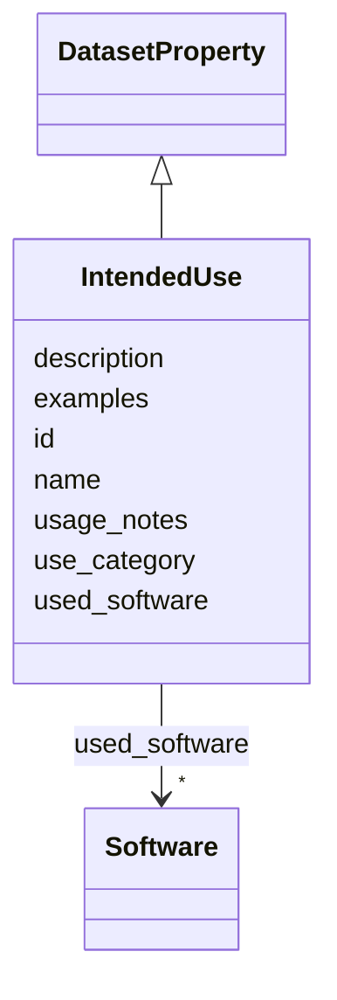

# Class: IntendedUse 


_Explicit statement of intended uses for this dataset. Complements FutureUseImpact by focusing on positive, recommended applications rather than risks. Aligns with RO-Crate "Intended Use" field._

__


URI: [data_sheets_schema:IntendedUse](https://w3id.org/bridge2ai/data-sheets-schema/IntendedUse)





## Inheritance
* [DatasetProperty](DatasetProperty.md)
    * **IntendedUse**


## Slots

| Name | Cardinality and Range | Description | Inheritance |
| ---  | --- | --- | --- |
| [examples](examples.md) | * <br/> [String](String.md) | List of example intended uses for this dataset | direct |
| [usage_notes](usage_notes.md) | 0..1 <br/> [String](String.md) | Notes or caveats about using the dataset for intended purposes | direct |
| [use_category](use_category.md) | * <br/> [String](String.md) | Category of intended use (e | direct |
| [id](id.md) | 0..1 <br/> [Uriorcurie](Uriorcurie.md) | An optional identifier for this property | [DatasetProperty](DatasetProperty.md) |
| [name](name.md) | 0..1 <br/> [String](String.md) | A human-readable name for this property | [DatasetProperty](DatasetProperty.md) |
| [description](description.md) | 0..1 <br/> [String](String.md) | A human-readable description for this property | [DatasetProperty](DatasetProperty.md) |
| [used_software](used_software.md) | * <br/> [Software](Software.md) | What software was used as part of this dataset property? | [DatasetProperty](DatasetProperty.md) |


## Usages

| used by | used in | type | used |
| ---  | --- | --- | --- |
| [Dataset](Dataset.md) | [intended_uses](intended_uses.md) | range | [IntendedUse](IntendedUse.md) |
| [DataSubset](DataSubset.md) | [intended_uses](intended_uses.md) | range | [IntendedUse](IntendedUse.md) |


## Identifier and Mapping Information


### Schema Source


* from schema: https://w3id.org/bridge2ai/data-sheets-schema


## Mappings

| Mapping Type | Mapped Value |
| ---  | ---  |
| self | data_sheets_schema:IntendedUse |
| native | data_sheets_schema:IntendedUse |
| exact | rai:dataUseCases |


## LinkML Source

<!-- TODO: investigate https://stackoverflow.com/questions/37606292/how-to-create-tabbed-code-blocks-in-mkdocs-or-sphinx -->

### Direct

<details>
```yaml
name: IntendedUse
description: 'Explicit statement of intended uses for this dataset. Complements FutureUseImpact
  by focusing on positive, recommended applications rather than risks. Aligns with
  RO-Crate "Intended Use" field.

  '
from_schema: https://w3id.org/bridge2ai/data-sheets-schema
exact_mappings:
- rai:dataUseCases
is_a: DatasetProperty
attributes:
  examples:
    name: examples
    description: List of example intended uses for this dataset.
    from_schema: https://w3id.org/bridge2ai/data-sheets-schema/uses
    domain_of:
    - ExistingUse
    - IntendedUse
    - VariableMetadata
    range: string
    multivalued: true
  usage_notes:
    name: usage_notes
    description: Notes or caveats about using the dataset for intended purposes.
    from_schema: https://w3id.org/bridge2ai/data-sheets-schema/uses
    rank: 1000
    domain_of:
    - IntendedUse
    range: string
  use_category:
    name: use_category
    description: Category of intended use (e.g., research, clinical, educational,
      commercial, policy).
    from_schema: https://w3id.org/bridge2ai/data-sheets-schema/uses
    rank: 1000
    domain_of:
    - IntendedUse
    range: string
    multivalued: true

```
</details>

### Induced

<details>
```yaml
name: IntendedUse
description: 'Explicit statement of intended uses for this dataset. Complements FutureUseImpact
  by focusing on positive, recommended applications rather than risks. Aligns with
  RO-Crate "Intended Use" field.

  '
from_schema: https://w3id.org/bridge2ai/data-sheets-schema
exact_mappings:
- rai:dataUseCases
is_a: DatasetProperty
attributes:
  examples:
    name: examples
    description: List of example intended uses for this dataset.
    from_schema: https://w3id.org/bridge2ai/data-sheets-schema/uses
    alias: examples
    owner: IntendedUse
    domain_of:
    - ExistingUse
    - IntendedUse
    - VariableMetadata
    range: string
    multivalued: true
  usage_notes:
    name: usage_notes
    description: Notes or caveats about using the dataset for intended purposes.
    from_schema: https://w3id.org/bridge2ai/data-sheets-schema/uses
    rank: 1000
    alias: usage_notes
    owner: IntendedUse
    domain_of:
    - IntendedUse
    range: string
  use_category:
    name: use_category
    description: Category of intended use (e.g., research, clinical, educational,
      commercial, policy).
    from_schema: https://w3id.org/bridge2ai/data-sheets-schema/uses
    rank: 1000
    alias: use_category
    owner: IntendedUse
    domain_of:
    - IntendedUse
    range: string
    multivalued: true
  id:
    name: id
    description: An optional identifier for this property.
    from_schema: https://w3id.org/bridge2ai/data-sheets-schema/base
    slot_uri: schema:identifier
    alias: id
    owner: IntendedUse
    domain_of:
    - NamedThing
    - DatasetProperty
    range: uriorcurie
  name:
    name: name
    description: A human-readable name for this property.
    from_schema: https://w3id.org/bridge2ai/data-sheets-schema/base
    slot_uri: schema:name
    alias: name
    owner: IntendedUse
    domain_of:
    - NamedThing
    - DatasetProperty
    range: string
  description:
    name: description
    description: A human-readable description for this property.
    from_schema: https://w3id.org/bridge2ai/data-sheets-schema/base
    slot_uri: schema:description
    alias: description
    owner: IntendedUse
    domain_of:
    - NamedThing
    - DatasetProperty
    - DatasetRelationship
    range: string
  used_software:
    name: used_software
    description: What software was used as part of this dataset property?
    from_schema: https://w3id.org/bridge2ai/data-sheets-schema/base
    rank: 1000
    alias: used_software
    owner: IntendedUse
    domain_of:
    - DatasetProperty
    range: Software
    multivalued: true
    inlined: true
    inlined_as_list: true

```
</details>