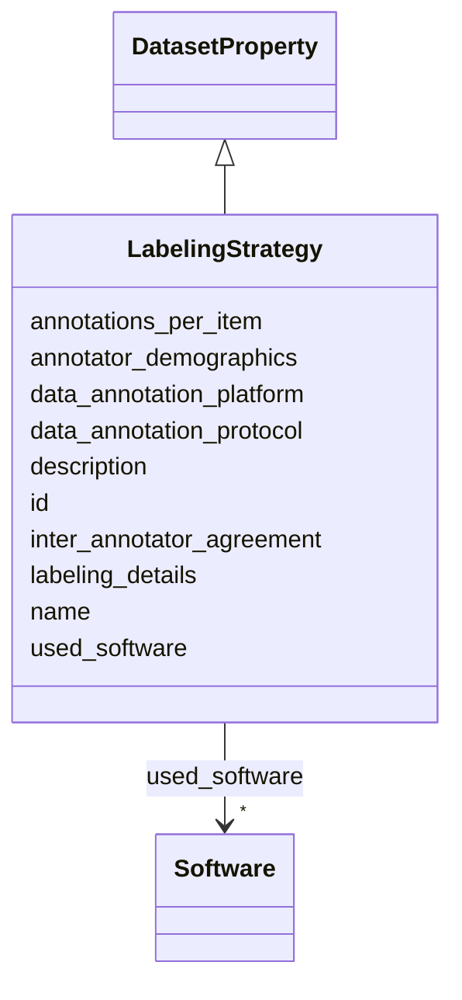

# Class: LabelingStrategy 


_Was any labeling of the data done (e.g., part-of-speech tagging)? This class documents the annotation process and quality metrics._

__


URI: [data_sheets_schema:LabelingStrategy](https://w3id.org/bridge2ai/data-sheets-schema/LabelingStrategy)





## Inheritance
* [DatasetProperty](DatasetProperty.md)
    * **LabelingStrategy**


## Slots

| Name | Cardinality and Range | Description | Inheritance |
| ---  | --- | --- | --- |
| [data_annotation_platform](data_annotation_platform.md) | 0..1 <br/> [String](String.md) | Platform or tool used for annotation (e | direct |
| [data_annotation_protocol](data_annotation_protocol.md) | * <br/> [String](String.md) | Annotation methodology, tasks, and protocols followed during labeling | direct |
| [annotations_per_item](annotations_per_item.md) | 0..1 <br/> [Integer](Integer.md) | Number of annotations collected per data item | direct |
| [inter_annotator_agreement](inter_annotator_agreement.md) | 0..1 <br/> [String](String.md) | Measure of agreement between annotators (e | direct |
| [annotator_demographics](annotator_demographics.md) | * <br/> [String](String.md) | Demographic information about annotators, if available and relevant (e | direct |
| [labeling_details](labeling_details.md) | * <br/> [String](String.md) | Details on labeling/annotation procedures and quality metrics | direct |
| [id](id.md) | 0..1 <br/> [Uriorcurie](Uriorcurie.md) | An optional identifier for this property | [DatasetProperty](DatasetProperty.md) |
| [name](name.md) | 0..1 <br/> [String](String.md) | A human-readable name for this property | [DatasetProperty](DatasetProperty.md) |
| [description](description.md) | 0..1 <br/> [String](String.md) | A human-readable description for this property | [DatasetProperty](DatasetProperty.md) |
| [used_software](used_software.md) | * <br/> [Software](Software.md) | What software was used as part of this dataset property? | [DatasetProperty](DatasetProperty.md) |


## Usages

| used by | used in | type | used |
| ---  | --- | --- | --- |
| [Dataset](Dataset.md) | [labeling_strategies](labeling_strategies.md) | range | [LabelingStrategy](LabelingStrategy.md) |
| [DataSubset](DataSubset.md) | [labeling_strategies](labeling_strategies.md) | range | [LabelingStrategy](LabelingStrategy.md) |


## Identifier and Mapping Information


### Schema Source


* from schema: https://w3id.org/bridge2ai/data-sheets-schema


## Mappings

| Mapping Type | Mapped Value |
| ---  | ---  |
| self | data_sheets_schema:LabelingStrategy |
| native | data_sheets_schema:LabelingStrategy |


## LinkML Source

<!-- TODO: investigate https://stackoverflow.com/questions/37606292/how-to-create-tabbed-code-blocks-in-mkdocs-or-sphinx -->

### Direct

<details>
```yaml
name: LabelingStrategy
description: 'Was any labeling of the data done (e.g., part-of-speech tagging)? This
  class documents the annotation process and quality metrics.

  '
from_schema: https://w3id.org/bridge2ai/data-sheets-schema
is_a: DatasetProperty
attributes:
  data_annotation_platform:
    name: data_annotation_platform
    description: Platform or tool used for annotation (e.g., Label Studio, Prodigy,
      Amazon Mechanical Turk, custom annotation tool).
    from_schema: https://w3id.org/bridge2ai/data-sheets-schema/preprocessing-cleaning-labeling
    exact_mappings:
    - rai:dataAnnotationPlatform
    rank: 1000
    slot_uri: schema:instrument
    domain_of:
    - LabelingStrategy
    range: string
  data_annotation_protocol:
    name: data_annotation_protocol
    description: Annotation methodology, tasks, and protocols followed during labeling.
      Includes annotation guidelines, quality control procedures, and task definitions.
    from_schema: https://w3id.org/bridge2ai/data-sheets-schema/preprocessing-cleaning-labeling
    exact_mappings:
    - rai:dataAnnotationProtocol
    rank: 1000
    domain_of:
    - LabelingStrategy
    range: string
    multivalued: true
  annotations_per_item:
    name: annotations_per_item
    description: Number of annotations collected per data item. Multiple annotations
      per item enable calculation of inter-annotator agreement.
    from_schema: https://w3id.org/bridge2ai/data-sheets-schema/preprocessing-cleaning-labeling
    exact_mappings:
    - rai:annotationsPerItem
    rank: 1000
    domain_of:
    - LabelingStrategy
    range: integer
  inter_annotator_agreement:
    name: inter_annotator_agreement
    description: Measure of agreement between annotators (e.g., Cohen's kappa, Fleiss'
      kappa, Krippendorff's alpha, percent agreement). Include both the metric name
      and value.
    from_schema: https://w3id.org/bridge2ai/data-sheets-schema/preprocessing-cleaning-labeling
    rank: 1000
    slot_uri: schema:measurementMethod
    domain_of:
    - LabelingStrategy
    range: string
  annotator_demographics:
    name: annotator_demographics
    description: Demographic information about annotators, if available and relevant
      (e.g., geographic location, language background, expertise level).
    from_schema: https://w3id.org/bridge2ai/data-sheets-schema/preprocessing-cleaning-labeling
    exact_mappings:
    - rai:annotatorDemographics
    rank: 1000
    domain_of:
    - LabelingStrategy
    range: string
    multivalued: true
  labeling_details:
    name: labeling_details
    description: 'Details on labeling/annotation procedures and quality metrics.

      '
    from_schema: https://w3id.org/bridge2ai/data-sheets-schema/preprocessing-cleaning-labeling
    rank: 1000
    slot_uri: dcterms:description
    domain_of:
    - LabelingStrategy
    range: string
    multivalued: true

```
</details>

### Induced

<details>
```yaml
name: LabelingStrategy
description: 'Was any labeling of the data done (e.g., part-of-speech tagging)? This
  class documents the annotation process and quality metrics.

  '
from_schema: https://w3id.org/bridge2ai/data-sheets-schema
is_a: DatasetProperty
attributes:
  data_annotation_platform:
    name: data_annotation_platform
    description: Platform or tool used for annotation (e.g., Label Studio, Prodigy,
      Amazon Mechanical Turk, custom annotation tool).
    from_schema: https://w3id.org/bridge2ai/data-sheets-schema/preprocessing-cleaning-labeling
    exact_mappings:
    - rai:dataAnnotationPlatform
    rank: 1000
    slot_uri: schema:instrument
    alias: data_annotation_platform
    owner: LabelingStrategy
    domain_of:
    - LabelingStrategy
    range: string
  data_annotation_protocol:
    name: data_annotation_protocol
    description: Annotation methodology, tasks, and protocols followed during labeling.
      Includes annotation guidelines, quality control procedures, and task definitions.
    from_schema: https://w3id.org/bridge2ai/data-sheets-schema/preprocessing-cleaning-labeling
    exact_mappings:
    - rai:dataAnnotationProtocol
    rank: 1000
    alias: data_annotation_protocol
    owner: LabelingStrategy
    domain_of:
    - LabelingStrategy
    range: string
    multivalued: true
  annotations_per_item:
    name: annotations_per_item
    description: Number of annotations collected per data item. Multiple annotations
      per item enable calculation of inter-annotator agreement.
    from_schema: https://w3id.org/bridge2ai/data-sheets-schema/preprocessing-cleaning-labeling
    exact_mappings:
    - rai:annotationsPerItem
    rank: 1000
    alias: annotations_per_item
    owner: LabelingStrategy
    domain_of:
    - LabelingStrategy
    range: integer
  inter_annotator_agreement:
    name: inter_annotator_agreement
    description: Measure of agreement between annotators (e.g., Cohen's kappa, Fleiss'
      kappa, Krippendorff's alpha, percent agreement). Include both the metric name
      and value.
    from_schema: https://w3id.org/bridge2ai/data-sheets-schema/preprocessing-cleaning-labeling
    rank: 1000
    slot_uri: schema:measurementMethod
    alias: inter_annotator_agreement
    owner: LabelingStrategy
    domain_of:
    - LabelingStrategy
    range: string
  annotator_demographics:
    name: annotator_demographics
    description: Demographic information about annotators, if available and relevant
      (e.g., geographic location, language background, expertise level).
    from_schema: https://w3id.org/bridge2ai/data-sheets-schema/preprocessing-cleaning-labeling
    exact_mappings:
    - rai:annotatorDemographics
    rank: 1000
    alias: annotator_demographics
    owner: LabelingStrategy
    domain_of:
    - LabelingStrategy
    range: string
    multivalued: true
  labeling_details:
    name: labeling_details
    description: 'Details on labeling/annotation procedures and quality metrics.

      '
    from_schema: https://w3id.org/bridge2ai/data-sheets-schema/preprocessing-cleaning-labeling
    rank: 1000
    slot_uri: dcterms:description
    alias: labeling_details
    owner: LabelingStrategy
    domain_of:
    - LabelingStrategy
    range: string
    multivalued: true
  id:
    name: id
    description: An optional identifier for this property.
    from_schema: https://w3id.org/bridge2ai/data-sheets-schema/base
    slot_uri: schema:identifier
    alias: id
    owner: LabelingStrategy
    domain_of:
    - NamedThing
    - DatasetProperty
    range: uriorcurie
  name:
    name: name
    description: A human-readable name for this property.
    from_schema: https://w3id.org/bridge2ai/data-sheets-schema/base
    slot_uri: schema:name
    alias: name
    owner: LabelingStrategy
    domain_of:
    - NamedThing
    - DatasetProperty
    range: string
  description:
    name: description
    description: A human-readable description for this property.
    from_schema: https://w3id.org/bridge2ai/data-sheets-schema/base
    slot_uri: schema:description
    alias: description
    owner: LabelingStrategy
    domain_of:
    - NamedThing
    - DatasetProperty
    - DatasetRelationship
    range: string
  used_software:
    name: used_software
    description: What software was used as part of this dataset property?
    from_schema: https://w3id.org/bridge2ai/data-sheets-schema/base
    rank: 1000
    alias: used_software
    owner: LabelingStrategy
    domain_of:
    - DatasetProperty
    range: Software
    multivalued: true
    inlined: true
    inlined_as_list: true

```
</details>