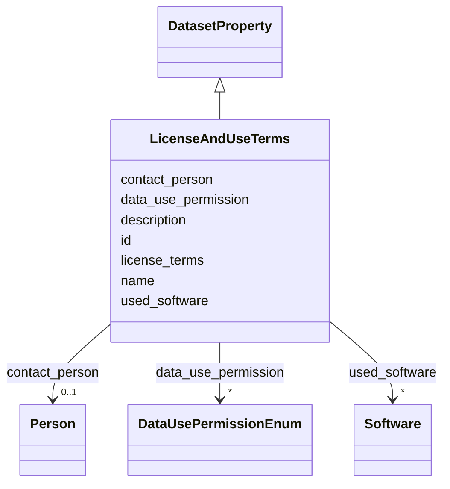

# Class: LicenseAndUseTerms 


_Will the dataset be distributed under a copyright or other IP license, and/or under applicable terms of use? Provide a link or copy of relevant licensing terms and any fees._

__


URI: [data_sheets_schema:LicenseAndUseTerms](https://w3id.org/bridge2ai/data-sheets-schema/LicenseAndUseTerms)





## Inheritance
* [DatasetProperty](DatasetProperty.md)
    * **LicenseAndUseTerms**


## Slots

| Name | Cardinality and Range | Description | Inheritance |
| ---  | --- | --- | --- |
| [license_terms](license_terms.md) | * <br/> [String](String.md) | Description of the dataset's license and terms of use (including links, costs... | direct |
| [data_use_permission](data_use_permission.md) | * <br/> [DataUsePermissionEnum](DataUsePermissionEnum.md) | Structured data use permissions using the Data Use Ontology (DUO) | direct |
| [contact_person](contact_person.md) | 0..1 <br/> [Person](Person.md) | Contact person for licensing questions | direct |
| [id](id.md) | 0..1 <br/> [Uriorcurie](Uriorcurie.md) | An optional identifier for this property | [DatasetProperty](DatasetProperty.md) |
| [name](name.md) | 0..1 <br/> [String](String.md) | A human-readable name for this property | [DatasetProperty](DatasetProperty.md) |
| [description](description.md) | 0..1 <br/> [String](String.md) | A human-readable description for this property | [DatasetProperty](DatasetProperty.md) |
| [used_software](used_software.md) | * <br/> [Software](Software.md) | What software was used as part of this dataset property? | [DatasetProperty](DatasetProperty.md) |


## Usages

| used by | used in | type | used |
| ---  | --- | --- | --- |
| [Dataset](Dataset.md) | [license_and_use_terms](license_and_use_terms.md) | range | [LicenseAndUseTerms](LicenseAndUseTerms.md) |
| [DataSubset](DataSubset.md) | [license_and_use_terms](license_and_use_terms.md) | range | [LicenseAndUseTerms](LicenseAndUseTerms.md) |


## Identifier and Mapping Information


### Schema Source


* from schema: https://w3id.org/bridge2ai/data-sheets-schema


## Mappings

| Mapping Type | Mapped Value |
| ---  | ---  |
| self | data_sheets_schema:LicenseAndUseTerms |
| native | data_sheets_schema:LicenseAndUseTerms |


## LinkML Source

<!-- TODO: investigate https://stackoverflow.com/questions/37606292/how-to-create-tabbed-code-blocks-in-mkdocs-or-sphinx -->

### Direct

<details>
```yaml
name: LicenseAndUseTerms
description: 'Will the dataset be distributed under a copyright or other IP license,
  and/or under applicable terms of use? Provide a link or copy of relevant licensing
  terms and any fees.

  '
from_schema: https://w3id.org/bridge2ai/data-sheets-schema
is_a: DatasetProperty
attributes:
  license_terms:
    name: license_terms
    description: 'Description of the dataset''s license and terms of use (including
      links, costs, or usage constraints).

      '
    from_schema: https://w3id.org/bridge2ai/data-sheets-schema/data-governance
    rank: 1000
    slot_uri: dcterms:license
    domain_of:
    - LicenseAndUseTerms
    range: string
    multivalued: true
  data_use_permission:
    name: data_use_permission
    description: Structured data use permissions using the Data Use Ontology (DUO).
      Specifies permitted uses (e.g., general research, health/medical research, disease-specific
      research) and restrictions (e.g., non-commercial use, ethics approval required,
      collaboration required). See https://github.com/EBISPOT/DUO
    from_schema: https://w3id.org/bridge2ai/data-sheets-schema/data-governance
    exact_mappings:
    - DUO:0000001
    rank: 1000
    slot_uri: DUO:0000001
    domain_of:
    - LicenseAndUseTerms
    range: DataUsePermissionEnum
    multivalued: true
  contact_person:
    name: contact_person
    description: Contact person for licensing questions. Provides structured contact
      information including name, email, affiliation, and optional ORCID. This person
      can answer questions about licensing terms, usage restrictions, fees, and permissions.
    from_schema: https://w3id.org/bridge2ai/data-sheets-schema/data-governance
    exact_mappings:
    - schema:contactPoint
    slot_uri: schema:contactPoint
    domain_of:
    - EthicalReview
    - LicenseAndUseTerms
    range: Person

```
</details>

### Induced

<details>
```yaml
name: LicenseAndUseTerms
description: 'Will the dataset be distributed under a copyright or other IP license,
  and/or under applicable terms of use? Provide a link or copy of relevant licensing
  terms and any fees.

  '
from_schema: https://w3id.org/bridge2ai/data-sheets-schema
is_a: DatasetProperty
attributes:
  license_terms:
    name: license_terms
    description: 'Description of the dataset''s license and terms of use (including
      links, costs, or usage constraints).

      '
    from_schema: https://w3id.org/bridge2ai/data-sheets-schema/data-governance
    rank: 1000
    slot_uri: dcterms:license
    alias: license_terms
    owner: LicenseAndUseTerms
    domain_of:
    - LicenseAndUseTerms
    range: string
    multivalued: true
  data_use_permission:
    name: data_use_permission
    description: Structured data use permissions using the Data Use Ontology (DUO).
      Specifies permitted uses (e.g., general research, health/medical research, disease-specific
      research) and restrictions (e.g., non-commercial use, ethics approval required,
      collaboration required). See https://github.com/EBISPOT/DUO
    from_schema: https://w3id.org/bridge2ai/data-sheets-schema/data-governance
    exact_mappings:
    - DUO:0000001
    rank: 1000
    slot_uri: DUO:0000001
    alias: data_use_permission
    owner: LicenseAndUseTerms
    domain_of:
    - LicenseAndUseTerms
    range: DataUsePermissionEnum
    multivalued: true
  contact_person:
    name: contact_person
    description: Contact person for licensing questions. Provides structured contact
      information including name, email, affiliation, and optional ORCID. This person
      can answer questions about licensing terms, usage restrictions, fees, and permissions.
    from_schema: https://w3id.org/bridge2ai/data-sheets-schema/data-governance
    exact_mappings:
    - schema:contactPoint
    slot_uri: schema:contactPoint
    alias: contact_person
    owner: LicenseAndUseTerms
    domain_of:
    - EthicalReview
    - LicenseAndUseTerms
    range: Person
  id:
    name: id
    description: An optional identifier for this property.
    from_schema: https://w3id.org/bridge2ai/data-sheets-schema/base
    slot_uri: schema:identifier
    alias: id
    owner: LicenseAndUseTerms
    domain_of:
    - NamedThing
    - DatasetProperty
    range: uriorcurie
  name:
    name: name
    description: A human-readable name for this property.
    from_schema: https://w3id.org/bridge2ai/data-sheets-schema/base
    slot_uri: schema:name
    alias: name
    owner: LicenseAndUseTerms
    domain_of:
    - NamedThing
    - DatasetProperty
    range: string
  description:
    name: description
    description: A human-readable description for this property.
    from_schema: https://w3id.org/bridge2ai/data-sheets-schema/base
    slot_uri: schema:description
    alias: description
    owner: LicenseAndUseTerms
    domain_of:
    - NamedThing
    - DatasetProperty
    - DatasetRelationship
    range: string
  used_software:
    name: used_software
    description: What software was used as part of this dataset property?
    from_schema: https://w3id.org/bridge2ai/data-sheets-schema/base
    rank: 1000
    alias: used_software
    owner: LicenseAndUseTerms
    domain_of:
    - DatasetProperty
    range: Software
    multivalued: true
    inlined: true
    inlined_as_list: true

```
</details>