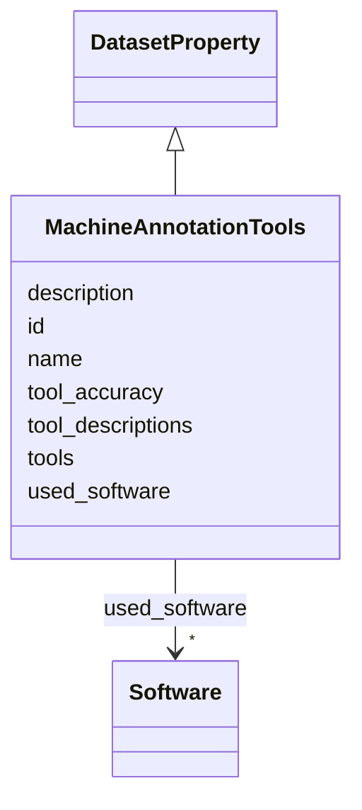

# Class: MachineAnnotationTools 


_Automated or machine-learning-based annotation tools used in dataset creation, including NLP pipelines, computer vision models, or other automated labeling systems._

__


URI: [data_sheets_schema:MachineAnnotationTools](https://w3id.org/bridge2ai/data-sheets-schema/MachineAnnotationTools)





## Inheritance
* [DatasetProperty](DatasetProperty.md)
    * **MachineAnnotationTools**


## Slots

| Name | Cardinality and Range | Description | Inheritance |
| ---  | --- | --- | --- |
| [tools](tools.md) | * <br/> [String](String.md) | List of automated annotation tools with their versions | direct |
| [tool_descriptions](tool_descriptions.md) | * <br/> [String](String.md) | Descriptions of what each tool does in the annotation process and what types ... | direct |
| [tool_accuracy](tool_accuracy.md) | * <br/> [String](String.md) | Known accuracy or performance metrics for the automated tools (if available) | direct |
| [id](id.md) | 0..1 <br/> [Uriorcurie](Uriorcurie.md) | An optional identifier for this property | [DatasetProperty](DatasetProperty.md) |
| [name](name.md) | 0..1 <br/> [String](String.md) | A human-readable name for this property | [DatasetProperty](DatasetProperty.md) |
| [description](description.md) | 0..1 <br/> [String](String.md) | A human-readable description for this property | [DatasetProperty](DatasetProperty.md) |
| [used_software](used_software.md) | * <br/> [Software](Software.md) | What software was used as part of this dataset property? | [DatasetProperty](DatasetProperty.md) |


## Usages

| used by | used in | type | used |
| ---  | --- | --- | --- |
| [Dataset](Dataset.md) | [machine_annotation_tools](machine_annotation_tools.md) | range | [MachineAnnotationTools](MachineAnnotationTools.md) |
| [DataSubset](DataSubset.md) | [machine_annotation_tools](machine_annotation_tools.md) | range | [MachineAnnotationTools](MachineAnnotationTools.md) |


## Identifier and Mapping Information


### Schema Source


* from schema: https://w3id.org/bridge2ai/data-sheets-schema


## Mappings

| Mapping Type | Mapped Value |
| ---  | ---  |
| self | data_sheets_schema:MachineAnnotationTools |
| native | data_sheets_schema:MachineAnnotationTools |
| exact | rai:machineAnnotationTools |


## LinkML Source

<!-- TODO: investigate https://stackoverflow.com/questions/37606292/how-to-create-tabbed-code-blocks-in-mkdocs-or-sphinx -->

### Direct

<details>
```yaml
name: MachineAnnotationTools
description: 'Automated or machine-learning-based annotation tools used in dataset
  creation, including NLP pipelines, computer vision models, or other automated labeling
  systems.

  '
from_schema: https://w3id.org/bridge2ai/data-sheets-schema
exact_mappings:
- rai:machineAnnotationTools
is_a: DatasetProperty
attributes:
  tools:
    name: tools
    description: 'List of automated annotation tools with their versions. Format each
      entry as "ToolName version" (e.g., "spaCy 3.5.0", "NLTK 3.8", "GPT-4 turbo").
      Use "unknown" for version if not available (e.g., "Custom NER Model unknown").

      '
    from_schema: https://w3id.org/bridge2ai/data-sheets-schema/preprocessing-cleaning-labeling
    rank: 1000
    domain_of:
    - MachineAnnotationTools
    range: string
    multivalued: true
  tool_descriptions:
    name: tool_descriptions
    description: 'Descriptions of what each tool does in the annotation process and
      what types of annotations it produces. Should correspond to the tools list.

      '
    from_schema: https://w3id.org/bridge2ai/data-sheets-schema/preprocessing-cleaning-labeling
    rank: 1000
    domain_of:
    - MachineAnnotationTools
    range: string
    multivalued: true
  tool_accuracy:
    name: tool_accuracy
    description: 'Known accuracy or performance metrics for the automated tools (if
      available). Include metric name and value (e.g., "spaCy F1: 0.95", "GPT-4 Accuracy:
      92%").

      '
    from_schema: https://w3id.org/bridge2ai/data-sheets-schema/preprocessing-cleaning-labeling
    rank: 1000
    domain_of:
    - MachineAnnotationTools
    range: string
    multivalued: true

```
</details>

### Induced

<details>
```yaml
name: MachineAnnotationTools
description: 'Automated or machine-learning-based annotation tools used in dataset
  creation, including NLP pipelines, computer vision models, or other automated labeling
  systems.

  '
from_schema: https://w3id.org/bridge2ai/data-sheets-schema
exact_mappings:
- rai:machineAnnotationTools
is_a: DatasetProperty
attributes:
  tools:
    name: tools
    description: 'List of automated annotation tools with their versions. Format each
      entry as "ToolName version" (e.g., "spaCy 3.5.0", "NLTK 3.8", "GPT-4 turbo").
      Use "unknown" for version if not available (e.g., "Custom NER Model unknown").

      '
    from_schema: https://w3id.org/bridge2ai/data-sheets-schema/preprocessing-cleaning-labeling
    rank: 1000
    alias: tools
    owner: MachineAnnotationTools
    domain_of:
    - MachineAnnotationTools
    range: string
    multivalued: true
  tool_descriptions:
    name: tool_descriptions
    description: 'Descriptions of what each tool does in the annotation process and
      what types of annotations it produces. Should correspond to the tools list.

      '
    from_schema: https://w3id.org/bridge2ai/data-sheets-schema/preprocessing-cleaning-labeling
    rank: 1000
    alias: tool_descriptions
    owner: MachineAnnotationTools
    domain_of:
    - MachineAnnotationTools
    range: string
    multivalued: true
  tool_accuracy:
    name: tool_accuracy
    description: 'Known accuracy or performance metrics for the automated tools (if
      available). Include metric name and value (e.g., "spaCy F1: 0.95", "GPT-4 Accuracy:
      92%").

      '
    from_schema: https://w3id.org/bridge2ai/data-sheets-schema/preprocessing-cleaning-labeling
    rank: 1000
    alias: tool_accuracy
    owner: MachineAnnotationTools
    domain_of:
    - MachineAnnotationTools
    range: string
    multivalued: true
  id:
    name: id
    description: An optional identifier for this property.
    from_schema: https://w3id.org/bridge2ai/data-sheets-schema/base
    slot_uri: schema:identifier
    alias: id
    owner: MachineAnnotationTools
    domain_of:
    - NamedThing
    - DatasetProperty
    range: uriorcurie
  name:
    name: name
    description: A human-readable name for this property.
    from_schema: https://w3id.org/bridge2ai/data-sheets-schema/base
    slot_uri: schema:name
    alias: name
    owner: MachineAnnotationTools
    domain_of:
    - NamedThing
    - DatasetProperty
    range: string
  description:
    name: description
    description: A human-readable description for this property.
    from_schema: https://w3id.org/bridge2ai/data-sheets-schema/base
    slot_uri: schema:description
    alias: description
    owner: MachineAnnotationTools
    domain_of:
    - NamedThing
    - DatasetProperty
    - DatasetRelationship
    range: string
  used_software:
    name: used_software
    description: What software was used as part of this dataset property?
    from_schema: https://w3id.org/bridge2ai/data-sheets-schema/base
    rank: 1000
    alias: used_software
    owner: MachineAnnotationTools
    domain_of:
    - DatasetProperty
    range: Software
    multivalued: true
    inlined: true
    inlined_as_list: true

```
</details>