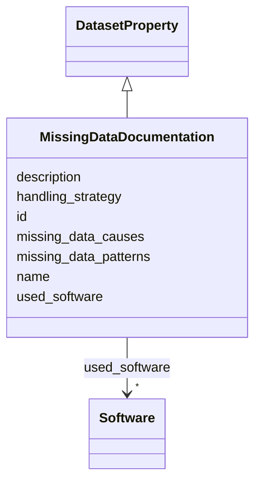

# Class: MissingDataDocumentation 


_Documentation of missing data in the dataset, including patterns, causes, and strategies for handling missing values._

__


URI: [data_sheets_schema:MissingDataDocumentation](https://w3id.org/bridge2ai/data-sheets-schema/MissingDataDocumentation)





## Inheritance
* [DatasetProperty](DatasetProperty.md)
    * **MissingDataDocumentation**


## Slots

| Name | Cardinality and Range | Description | Inheritance |
| ---  | --- | --- | --- |
| [missing_data_patterns](missing_data_patterns.md) | * <br/> [String](String.md) | Description of patterns in missing data (e | direct |
| [missing_data_causes](missing_data_causes.md) | * <br/> [String](String.md) | Known or suspected causes of missing data (e | direct |
| [handling_strategy](handling_strategy.md) | 0..1 <br/> [String](String.md) | Strategy used to handle missing data (e | direct |
| [id](id.md) | 0..1 <br/> [Uriorcurie](Uriorcurie.md) | An optional identifier for this property | [DatasetProperty](DatasetProperty.md) |
| [name](name.md) | 0..1 <br/> [String](String.md) | A human-readable name for this property | [DatasetProperty](DatasetProperty.md) |
| [description](description.md) | 0..1 <br/> [String](String.md) | A human-readable description for this property | [DatasetProperty](DatasetProperty.md) |
| [used_software](used_software.md) | * <br/> [Software](Software.md) | What software was used as part of this dataset property? | [DatasetProperty](DatasetProperty.md) |


## Usages

| used by | used in | type | used |
| ---  | --- | --- | --- |
| [Dataset](Dataset.md) | [missing_data_documentation](missing_data_documentation.md) | range | [MissingDataDocumentation](MissingDataDocumentation.md) |
| [DataSubset](DataSubset.md) | [missing_data_documentation](missing_data_documentation.md) | range | [MissingDataDocumentation](MissingDataDocumentation.md) |


## Identifier and Mapping Information


### Schema Source


* from schema: https://w3id.org/bridge2ai/data-sheets-schema


## Mappings

| Mapping Type | Mapped Value |
| ---  | ---  |
| self | data_sheets_schema:MissingDataDocumentation |
| native | data_sheets_schema:MissingDataDocumentation |
| exact | rai:dataCollectionMissingData |


## LinkML Source

<!-- TODO: investigate https://stackoverflow.com/questions/37606292/how-to-create-tabbed-code-blocks-in-mkdocs-or-sphinx -->

### Direct

<details>
```yaml
name: MissingDataDocumentation
description: 'Documentation of missing data in the dataset, including patterns, causes,
  and strategies for handling missing values.

  '
from_schema: https://w3id.org/bridge2ai/data-sheets-schema
exact_mappings:
- rai:dataCollectionMissingData
is_a: DatasetProperty
attributes:
  missing_data_patterns:
    name: missing_data_patterns
    description: 'Description of patterns in missing data (e.g., missing completely
      at random, missing at random, missing not at random).

      '
    from_schema: https://w3id.org/bridge2ai/data-sheets-schema/collection
    rank: 1000
    domain_of:
    - MissingDataDocumentation
    range: string
    multivalued: true
  missing_data_causes:
    name: missing_data_causes
    description: 'Known or suspected causes of missing data (e.g., sensor failures,
      participant dropout, privacy constraints).

      '
    from_schema: https://w3id.org/bridge2ai/data-sheets-schema/collection
    rank: 1000
    domain_of:
    - MissingDataDocumentation
    range: string
    multivalued: true
  handling_strategy:
    name: handling_strategy
    description: 'Strategy used to handle missing data (e.g., deletion, imputation,
      flagging, multiple imputation).

      '
    from_schema: https://w3id.org/bridge2ai/data-sheets-schema/collection
    rank: 1000
    domain_of:
    - MissingDataDocumentation
    range: string

```
</details>

### Induced

<details>
```yaml
name: MissingDataDocumentation
description: 'Documentation of missing data in the dataset, including patterns, causes,
  and strategies for handling missing values.

  '
from_schema: https://w3id.org/bridge2ai/data-sheets-schema
exact_mappings:
- rai:dataCollectionMissingData
is_a: DatasetProperty
attributes:
  missing_data_patterns:
    name: missing_data_patterns
    description: 'Description of patterns in missing data (e.g., missing completely
      at random, missing at random, missing not at random).

      '
    from_schema: https://w3id.org/bridge2ai/data-sheets-schema/collection
    rank: 1000
    alias: missing_data_patterns
    owner: MissingDataDocumentation
    domain_of:
    - MissingDataDocumentation
    range: string
    multivalued: true
  missing_data_causes:
    name: missing_data_causes
    description: 'Known or suspected causes of missing data (e.g., sensor failures,
      participant dropout, privacy constraints).

      '
    from_schema: https://w3id.org/bridge2ai/data-sheets-schema/collection
    rank: 1000
    alias: missing_data_causes
    owner: MissingDataDocumentation
    domain_of:
    - MissingDataDocumentation
    range: string
    multivalued: true
  handling_strategy:
    name: handling_strategy
    description: 'Strategy used to handle missing data (e.g., deletion, imputation,
      flagging, multiple imputation).

      '
    from_schema: https://w3id.org/bridge2ai/data-sheets-schema/collection
    rank: 1000
    alias: handling_strategy
    owner: MissingDataDocumentation
    domain_of:
    - MissingDataDocumentation
    range: string
  id:
    name: id
    description: An optional identifier for this property.
    from_schema: https://w3id.org/bridge2ai/data-sheets-schema/base
    slot_uri: schema:identifier
    alias: id
    owner: MissingDataDocumentation
    domain_of:
    - NamedThing
    - DatasetProperty
    range: uriorcurie
  name:
    name: name
    description: A human-readable name for this property.
    from_schema: https://w3id.org/bridge2ai/data-sheets-schema/base
    slot_uri: schema:name
    alias: name
    owner: MissingDataDocumentation
    domain_of:
    - NamedThing
    - DatasetProperty
    range: string
  description:
    name: description
    description: A human-readable description for this property.
    from_schema: https://w3id.org/bridge2ai/data-sheets-schema/base
    slot_uri: schema:description
    alias: description
    owner: MissingDataDocumentation
    domain_of:
    - NamedThing
    - DatasetProperty
    - DatasetRelationship
    range: string
  used_software:
    name: used_software
    description: What software was used as part of this dataset property?
    from_schema: https://w3id.org/bridge2ai/data-sheets-schema/base
    rank: 1000
    alias: used_software
    owner: MissingDataDocumentation
    domain_of:
    - DatasetProperty
    range: Software
    multivalued: true
    inlined: true
    inlined_as_list: true

```
</details>