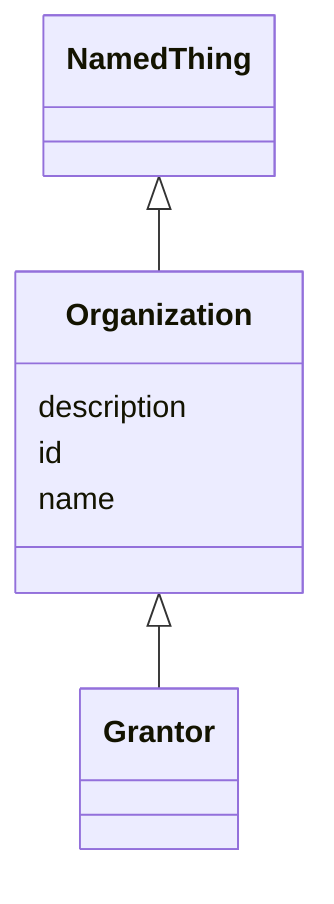

# Class: Organization 


_Represents a group or organization._


URI: [schema:Organization](http://schema.org/Organization)





## Inheritance
* [NamedThing](NamedThing.md)
    * **Organization**
        * [Grantor](Grantor.md)


## Slots

| Name | Cardinality and Range | Description | Inheritance |
| ---  | --- | --- | --- |
| [id](id.md) | 1 <br/> [Uriorcurie](Uriorcurie.md) | A unique identifier for a thing | [NamedThing](NamedThing.md) |
| [name](name.md) | 0..1 <br/> [String](String.md) | A human-readable name for a thing | [NamedThing](NamedThing.md) |
| [description](description.md) | 0..1 <br/> [String](String.md) | A human-readable description for a thing | [NamedThing](NamedThing.md) |


## Usages

| used by | used in | type | used |
| ---  | --- | --- | --- |
| [Person](Person.md) | [affiliation](affiliation.md) | range | [Organization](Organization.md) |
| [Creator](Creator.md) | [affiliations](affiliations.md) | range | [Organization](Organization.md) |
| [EthicalReview](EthicalReview.md) | [reviewing_organization](reviewing_organization.md) | range | [Organization](Organization.md) |


## Identifier and Mapping Information


### Schema Source


* from schema: https://w3id.org/bridge2ai/data-sheets-schema


## Mappings

| Mapping Type | Mapped Value |
| ---  | ---  |
| self | schema:Organization |
| native | data_sheets_schema:Organization |


## LinkML Source

<!-- TODO: investigate https://stackoverflow.com/questions/37606292/how-to-create-tabbed-code-blocks-in-mkdocs-or-sphinx -->

### Direct

<details>
```yaml
name: Organization
description: Represents a group or organization.
from_schema: https://w3id.org/bridge2ai/data-sheets-schema
is_a: NamedThing
class_uri: schema:Organization

```
</details>

### Induced

<details>
```yaml
name: Organization
description: Represents a group or organization.
from_schema: https://w3id.org/bridge2ai/data-sheets-schema
is_a: NamedThing
attributes:
  id:
    name: id
    description: A unique identifier for a thing.
    from_schema: https://w3id.org/bridge2ai/data-sheets-schema/base
    rank: 1000
    slot_uri: schema:identifier
    identifier: true
    alias: id
    owner: Organization
    domain_of:
    - NamedThing
    - DatasetProperty
    range: uriorcurie
    required: true
  name:
    name: name
    description: A human-readable name for a thing.
    from_schema: https://w3id.org/bridge2ai/data-sheets-schema/base
    rank: 1000
    slot_uri: schema:name
    alias: name
    owner: Organization
    domain_of:
    - NamedThing
    - DatasetProperty
    range: string
  description:
    name: description
    description: A human-readable description for a thing.
    from_schema: https://w3id.org/bridge2ai/data-sheets-schema/base
    rank: 1000
    slot_uri: schema:description
    alias: description
    owner: Organization
    domain_of:
    - NamedThing
    - DatasetProperty
    - DatasetRelationship
    range: string
class_uri: schema:Organization

```
</details>