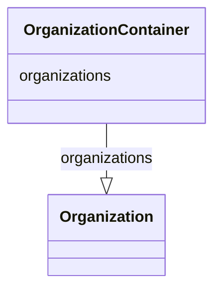

# Class: OrganizationContainer


_A container for Organizations._


URI: [data_sheets_schema:OrganizationContainer](https://w3id.org/bridge2ai/data-sheets-schema/OrganizationContainer)





<!-- no inheritance hierarchy -->


## Slots

| Name | Cardinality and Range | Description | Inheritance |
| ---  | --- | --- | --- |
| [organizations](organizations.md) | 0..* <br/> [Organization](Organization.md) | Collection of associated organizations | direct |


## Identifier and Mapping Information


### Schema Source


* from schema: https://w3id.org/bridge2ai/data-sheets-schema


## Mappings

| Mapping Type | Mapped Value |
| ---  | ---  |
| self | data_sheets_schema:OrganizationContainer |
| native | data_sheets_schema:OrganizationContainer |


## LinkML Source

<!-- TODO: investigate https://stackoverflow.com/questions/37606292/how-to-create-tabbed-code-blocks-in-mkdocs-or-sphinx -->

### Direct

<details>
```yaml
name: OrganizationContainer
description: A container for Organizations.
from_schema: https://w3id.org/bridge2ai/data-sheets-schema
slots:
- organizations

```
</details>

### Induced

<details>
```yaml
name: OrganizationContainer
description: A container for Organizations.
from_schema: https://w3id.org/bridge2ai/data-sheets-schema
attributes:
  organizations:
    name: organizations
    description: Collection of associated organizations.
    from_schema: https://w3id.org/bridge2ai/data-sheets-schema
    rank: 1000
    multivalued: true
    alias: organizations
    owner: OrganizationContainer
    domain_of:
    - OrganizationContainer
    range: Organization
    inlined: true
    inlined_as_list: true

```
</details>