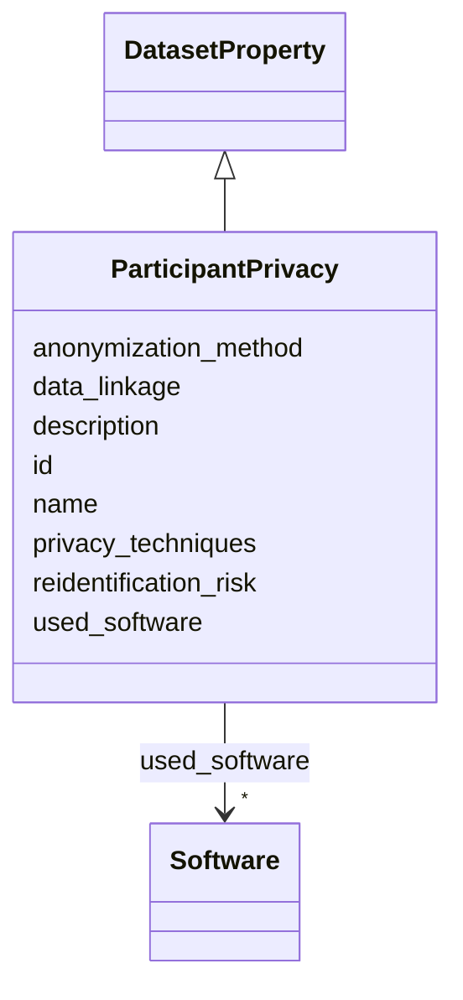

# Class: ParticipantPrivacy 


_Information about privacy protections and anonymization procedures for human research participants._

__


URI: [data_sheets_schema:ParticipantPrivacy](https://w3id.org/bridge2ai/data-sheets-schema/ParticipantPrivacy)





## Inheritance
* [DatasetProperty](DatasetProperty.md)
    * **ParticipantPrivacy**


## Slots

| Name | Cardinality and Range | Description | Inheritance |
| ---  | --- | --- | --- |
| [anonymization_method](anonymization_method.md) | * <br/> [String](String.md) | What methods were used to anonymize or de-identify participant data? Include ... | direct |
| [reidentification_risk](reidentification_risk.md) | * <br/> [String](String.md) | What is the assessed risk of re-identification? What measures were taken to m... | direct |
| [privacy_techniques](privacy_techniques.md) | * <br/> [String](String.md) | What privacy-preserving techniques were applied (e | direct |
| [data_linkage](data_linkage.md) | * <br/> [String](String.md) | Can this dataset be linked to other datasets in ways that might compromise pa... | direct |
| [id](id.md) | 0..1 <br/> [Uriorcurie](Uriorcurie.md) | An optional identifier for this property | [DatasetProperty](DatasetProperty.md) |
| [name](name.md) | 0..1 <br/> [String](String.md) | A human-readable name for this property | [DatasetProperty](DatasetProperty.md) |
| [description](description.md) | 0..1 <br/> [String](String.md) | A human-readable description for this property | [DatasetProperty](DatasetProperty.md) |
| [used_software](used_software.md) | * <br/> [Software](Software.md) | What software was used as part of this dataset property? | [DatasetProperty](DatasetProperty.md) |


## Usages

| used by | used in | type | used |
| ---  | --- | --- | --- |
| [Dataset](Dataset.md) | [participant_privacy](participant_privacy.md) | range | [ParticipantPrivacy](ParticipantPrivacy.md) |
| [DataSubset](DataSubset.md) | [participant_privacy](participant_privacy.md) | range | [ParticipantPrivacy](ParticipantPrivacy.md) |


## Identifier and Mapping Information


### Schema Source


* from schema: https://w3id.org/bridge2ai/data-sheets-schema


## Mappings

| Mapping Type | Mapped Value |
| ---  | ---  |
| self | data_sheets_schema:ParticipantPrivacy |
| native | data_sheets_schema:ParticipantPrivacy |


## LinkML Source

<!-- TODO: investigate https://stackoverflow.com/questions/37606292/how-to-create-tabbed-code-blocks-in-mkdocs-or-sphinx -->

### Direct

<details>
```yaml
name: ParticipantPrivacy
description: 'Information about privacy protections and anonymization procedures for
  human research participants.

  '
from_schema: https://w3id.org/bridge2ai/data-sheets-schema
is_a: DatasetProperty
attributes:
  anonymization_method:
    name: anonymization_method
    description: 'What methods were used to anonymize or de-identify participant data?
      Include technical details of privacy-preserving techniques.

      '
    from_schema: https://w3id.org/bridge2ai/data-sheets-schema/human
    rank: 1000
    domain_of:
    - ParticipantPrivacy
    range: string
    multivalued: true
  reidentification_risk:
    name: reidentification_risk
    description: 'What is the assessed risk of re-identification? What measures were
      taken to minimize this risk?

      '
    from_schema: https://w3id.org/bridge2ai/data-sheets-schema/human
    rank: 1000
    domain_of:
    - ParticipantPrivacy
    range: string
    multivalued: true
  privacy_techniques:
    name: privacy_techniques
    description: 'What privacy-preserving techniques were applied (e.g., differential
      privacy, k-anonymity, data masking)?

      '
    from_schema: https://w3id.org/bridge2ai/data-sheets-schema/human
    rank: 1000
    domain_of:
    - ParticipantPrivacy
    range: string
    multivalued: true
  data_linkage:
    name: data_linkage
    description: 'Can this dataset be linked to other datasets in ways that might
      compromise participant privacy?

      '
    from_schema: https://w3id.org/bridge2ai/data-sheets-schema/human
    rank: 1000
    domain_of:
    - ParticipantPrivacy
    range: string
    multivalued: true

```
</details>

### Induced

<details>
```yaml
name: ParticipantPrivacy
description: 'Information about privacy protections and anonymization procedures for
  human research participants.

  '
from_schema: https://w3id.org/bridge2ai/data-sheets-schema
is_a: DatasetProperty
attributes:
  anonymization_method:
    name: anonymization_method
    description: 'What methods were used to anonymize or de-identify participant data?
      Include technical details of privacy-preserving techniques.

      '
    from_schema: https://w3id.org/bridge2ai/data-sheets-schema/human
    rank: 1000
    alias: anonymization_method
    owner: ParticipantPrivacy
    domain_of:
    - ParticipantPrivacy
    range: string
    multivalued: true
  reidentification_risk:
    name: reidentification_risk
    description: 'What is the assessed risk of re-identification? What measures were
      taken to minimize this risk?

      '
    from_schema: https://w3id.org/bridge2ai/data-sheets-schema/human
    rank: 1000
    alias: reidentification_risk
    owner: ParticipantPrivacy
    domain_of:
    - ParticipantPrivacy
    range: string
    multivalued: true
  privacy_techniques:
    name: privacy_techniques
    description: 'What privacy-preserving techniques were applied (e.g., differential
      privacy, k-anonymity, data masking)?

      '
    from_schema: https://w3id.org/bridge2ai/data-sheets-schema/human
    rank: 1000
    alias: privacy_techniques
    owner: ParticipantPrivacy
    domain_of:
    - ParticipantPrivacy
    range: string
    multivalued: true
  data_linkage:
    name: data_linkage
    description: 'Can this dataset be linked to other datasets in ways that might
      compromise participant privacy?

      '
    from_schema: https://w3id.org/bridge2ai/data-sheets-schema/human
    rank: 1000
    alias: data_linkage
    owner: ParticipantPrivacy
    domain_of:
    - ParticipantPrivacy
    range: string
    multivalued: true
  id:
    name: id
    description: An optional identifier for this property.
    from_schema: https://w3id.org/bridge2ai/data-sheets-schema/base
    slot_uri: schema:identifier
    alias: id
    owner: ParticipantPrivacy
    domain_of:
    - NamedThing
    - DatasetProperty
    range: uriorcurie
  name:
    name: name
    description: A human-readable name for this property.
    from_schema: https://w3id.org/bridge2ai/data-sheets-schema/base
    slot_uri: schema:name
    alias: name
    owner: ParticipantPrivacy
    domain_of:
    - NamedThing
    - DatasetProperty
    range: string
  description:
    name: description
    description: A human-readable description for this property.
    from_schema: https://w3id.org/bridge2ai/data-sheets-schema/base
    slot_uri: schema:description
    alias: description
    owner: ParticipantPrivacy
    domain_of:
    - NamedThing
    - DatasetProperty
    - DatasetRelationship
    range: string
  used_software:
    name: used_software
    description: What software was used as part of this dataset property?
    from_schema: https://w3id.org/bridge2ai/data-sheets-schema/base
    rank: 1000
    alias: used_software
    owner: ParticipantPrivacy
    domain_of:
    - DatasetProperty
    range: Software
    multivalued: true
    inlined: true
    inlined_as_list: true

```
</details>