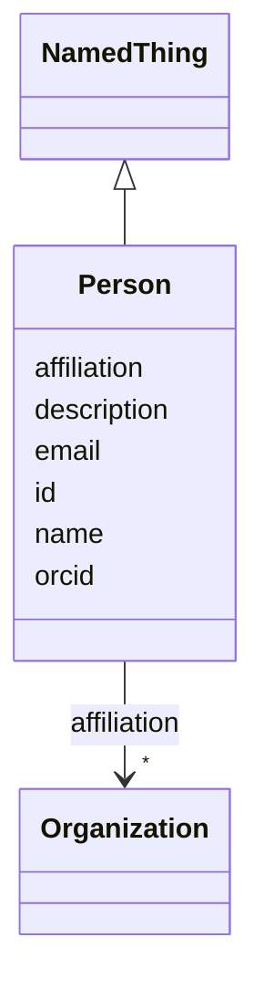

# Class: Person 


_An individual human being. This class represents a person in the context of a specific dataset. Attributes like affiliation and email represent the person's current or most relevant contact information for this dataset. For stable cross-dataset identification, use the ORCID field. Note that contributor roles (CRediT) are specified in the usage context (e.g., Creator class) rather than on the Person directly, since roles vary by dataset._


URI: [schema:Person](http://schema.org/Person)





## Inheritance
* [NamedThing](NamedThing.md)
    * **Person**


## Slots

| Name | Cardinality and Range | Description | Inheritance |
| ---  | --- | --- | --- |
| [affiliation](affiliation.md) | * <br/> [Organization](Organization.md) | The organization(s) to which the person belongs in the context of this datase... | direct |
| [email](email.md) | 0..1 <br/> [String](String.md) | The email address of the person | direct |
| [orcid](orcid.md) | 0..1 <br/> [String](String.md) | ORCID (Open Researcher and Contributor ID) - a persistent digital identifier ... | direct |
| [id](id.md) | 1 <br/> [Uriorcurie](Uriorcurie.md) | A unique identifier for a thing | [NamedThing](NamedThing.md) |
| [name](name.md) | 0..1 <br/> [String](String.md) | A human-readable name for a thing | [NamedThing](NamedThing.md) |
| [description](description.md) | 0..1 <br/> [String](String.md) | A human-readable description for a thing | [NamedThing](NamedThing.md) |


## Usages

| used by | used in | type | used |
| ---  | --- | --- | --- |
| [Creator](Creator.md) | [principal_investigator](principal_investigator.md) | range | [Person](Person.md) |
| [EthicalReview](EthicalReview.md) | [contact_person](contact_person.md) | range | [Person](Person.md) |
| [LicenseAndUseTerms](LicenseAndUseTerms.md) | [contact_person](contact_person.md) | range | [Person](Person.md) |
| [ExportControlRegulatoryRestrictions](ExportControlRegulatoryRestrictions.md) | [governance_committee_contact](governance_committee_contact.md) | range | [Person](Person.md) |


## Identifier and Mapping Information


### Schema Source


* from schema: https://w3id.org/bridge2ai/data-sheets-schema


## Mappings

| Mapping Type | Mapped Value |
| ---  | ---  |
| self | schema:Person |
| native | data_sheets_schema:Person |


## LinkML Source

<!-- TODO: investigate https://stackoverflow.com/questions/37606292/how-to-create-tabbed-code-blocks-in-mkdocs-or-sphinx -->

### Direct

<details>
```yaml
name: Person
description: An individual human being. This class represents a person in the context
  of a specific dataset. Attributes like affiliation and email represent the person's
  current or most relevant contact information for this dataset. For stable cross-dataset
  identification, use the ORCID field. Note that contributor roles (CRediT) are specified
  in the usage context (e.g., Creator class) rather than on the Person directly, since
  roles vary by dataset.
from_schema: https://w3id.org/bridge2ai/data-sheets-schema
is_a: NamedThing
attributes:
  affiliation:
    name: affiliation
    description: The organization(s) to which the person belongs in the context of
      this dataset. May vary across datasets; multivalued to support multiple affiliations.
    from_schema: https://w3id.org/bridge2ai/data-sheets-schema/base
    rank: 1000
    slot_uri: schema:affiliation
    domain_of:
    - Person
    range: Organization
    multivalued: true
  email:
    name: email
    description: The email address of the person. Represents current/preferred contact
      information in the context of this dataset.
    from_schema: https://w3id.org/bridge2ai/data-sheets-schema/base
    rank: 1000
    slot_uri: schema:email
    domain_of:
    - Person
    range: string
  orcid:
    name: orcid
    description: 'ORCID (Open Researcher and Contributor ID) - a persistent digital
      identifier for researchers. Format: 0000-0000-0000-0000 (16 digits in groups
      of 4). Use this for stable cross-dataset identification.'
    from_schema: https://w3id.org/bridge2ai/data-sheets-schema/base
    exact_mappings:
    - schema:identifier
    rank: 1000
    slot_uri: schema:identifier
    domain_of:
    - Person
    range: string
    pattern: ^\d{4}-\d{4}-\d{4}-\d{3}[0-9X]$
class_uri: schema:Person

```
</details>

### Induced

<details>
```yaml
name: Person
description: An individual human being. This class represents a person in the context
  of a specific dataset. Attributes like affiliation and email represent the person's
  current or most relevant contact information for this dataset. For stable cross-dataset
  identification, use the ORCID field. Note that contributor roles (CRediT) are specified
  in the usage context (e.g., Creator class) rather than on the Person directly, since
  roles vary by dataset.
from_schema: https://w3id.org/bridge2ai/data-sheets-schema
is_a: NamedThing
attributes:
  affiliation:
    name: affiliation
    description: The organization(s) to which the person belongs in the context of
      this dataset. May vary across datasets; multivalued to support multiple affiliations.
    from_schema: https://w3id.org/bridge2ai/data-sheets-schema/base
    rank: 1000
    slot_uri: schema:affiliation
    alias: affiliation
    owner: Person
    domain_of:
    - Person
    range: Organization
    multivalued: true
  email:
    name: email
    description: The email address of the person. Represents current/preferred contact
      information in the context of this dataset.
    from_schema: https://w3id.org/bridge2ai/data-sheets-schema/base
    rank: 1000
    slot_uri: schema:email
    alias: email
    owner: Person
    domain_of:
    - Person
    range: string
  orcid:
    name: orcid
    description: 'ORCID (Open Researcher and Contributor ID) - a persistent digital
      identifier for researchers. Format: 0000-0000-0000-0000 (16 digits in groups
      of 4). Use this for stable cross-dataset identification.'
    from_schema: https://w3id.org/bridge2ai/data-sheets-schema/base
    exact_mappings:
    - schema:identifier
    rank: 1000
    slot_uri: schema:identifier
    alias: orcid
    owner: Person
    domain_of:
    - Person
    range: string
    pattern: ^\d{4}-\d{4}-\d{4}-\d{3}[0-9X]$
  id:
    name: id
    description: A unique identifier for a thing.
    from_schema: https://w3id.org/bridge2ai/data-sheets-schema/base
    rank: 1000
    slot_uri: schema:identifier
    identifier: true
    alias: id
    owner: Person
    domain_of:
    - NamedThing
    - DatasetProperty
    range: uriorcurie
    required: true
  name:
    name: name
    description: A human-readable name for a thing.
    from_schema: https://w3id.org/bridge2ai/data-sheets-schema/base
    rank: 1000
    slot_uri: schema:name
    alias: name
    owner: Person
    domain_of:
    - NamedThing
    - DatasetProperty
    range: string
  description:
    name: description
    description: A human-readable description for a thing.
    from_schema: https://w3id.org/bridge2ai/data-sheets-schema/base
    rank: 1000
    slot_uri: schema:description
    alias: description
    owner: Person
    domain_of:
    - NamedThing
    - DatasetProperty
    - DatasetRelationship
    range: string
class_uri: schema:Person

```
</details>