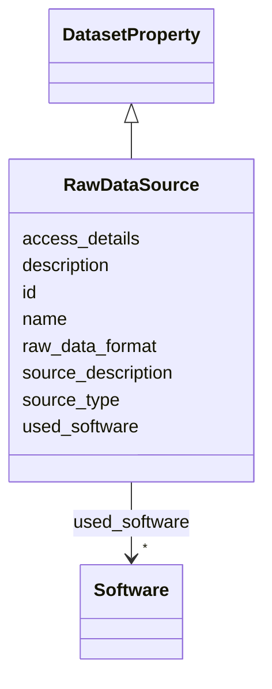

# Class: RawDataSource 


_Description of raw data sources before preprocessing, cleaning, or labeling. Documents where the original data comes from and how it can be accessed._

__


URI: [data_sheets_schema:RawDataSource](https://w3id.org/bridge2ai/data-sheets-schema/RawDataSource)





## Inheritance
* [DatasetProperty](DatasetProperty.md)
    * **RawDataSource**


## Slots

| Name | Cardinality and Range | Description | Inheritance |
| ---  | --- | --- | --- |
| [source_description](source_description.md) | 1 <br/> [String](String.md) | Detailed description of where raw data comes from (e | direct |
| [source_type](source_type.md) | * <br/> [String](String.md) | Type of raw source (sensor, database, user input, web scraping, etc | direct |
| [access_details](access_details.md) | 0..1 <br/> [String](String.md) | Information on how to access or retrieve the raw source data | direct |
| [raw_data_format](raw_data_format.md) | * <br/> [String](String.md) | Format of the raw data before any preprocessing | direct |
| [id](id.md) | 0..1 <br/> [Uriorcurie](Uriorcurie.md) | An optional identifier for this property | [DatasetProperty](DatasetProperty.md) |
| [name](name.md) | 0..1 <br/> [String](String.md) | A human-readable name for this property | [DatasetProperty](DatasetProperty.md) |
| [description](description.md) | 0..1 <br/> [String](String.md) | A human-readable description for this property | [DatasetProperty](DatasetProperty.md) |
| [used_software](used_software.md) | * <br/> [Software](Software.md) | What software was used as part of this dataset property? | [DatasetProperty](DatasetProperty.md) |


## Usages

| used by | used in | type | used |
| ---  | --- | --- | --- |
| [Dataset](Dataset.md) | [raw_data_sources](raw_data_sources.md) | range | [RawDataSource](RawDataSource.md) |
| [DataSubset](DataSubset.md) | [raw_data_sources](raw_data_sources.md) | range | [RawDataSource](RawDataSource.md) |


## Identifier and Mapping Information


### Schema Source


* from schema: https://w3id.org/bridge2ai/data-sheets-schema


## Mappings

| Mapping Type | Mapped Value |
| ---  | ---  |
| self | data_sheets_schema:RawDataSource |
| native | data_sheets_schema:RawDataSource |
| exact | rai:dataCollectionRawData |


## LinkML Source

<!-- TODO: investigate https://stackoverflow.com/questions/37606292/how-to-create-tabbed-code-blocks-in-mkdocs-or-sphinx -->

### Direct

<details>
```yaml
name: RawDataSource
description: 'Description of raw data sources before preprocessing, cleaning, or labeling.
  Documents where the original data comes from and how it can be accessed.

  '
from_schema: https://w3id.org/bridge2ai/data-sheets-schema
exact_mappings:
- rai:dataCollectionRawData
is_a: DatasetProperty
attributes:
  source_description:
    name: source_description
    description: 'Detailed description of where raw data comes from (e.g., sensors,
      databases, web APIs, manual collection).

      '
    from_schema: https://w3id.org/bridge2ai/data-sheets-schema/collection
    rank: 1000
    domain_of:
    - RawDataSource
    range: string
    required: true
  source_type:
    name: source_type
    description: 'Type of raw source (sensor, database, user input, web scraping,
      etc.).

      '
    from_schema: https://w3id.org/bridge2ai/data-sheets-schema/collection
    rank: 1000
    domain_of:
    - RawDataSource
    range: string
    multivalued: true
  access_details:
    name: access_details
    description: 'Information on how to access or retrieve the raw source data.

      '
    from_schema: https://w3id.org/bridge2ai/data-sheets-schema/collection
    rank: 1000
    domain_of:
    - RawDataSource
    range: string
  raw_data_format:
    name: raw_data_format
    description: 'Format of the raw data before any preprocessing.

      '
    from_schema: https://w3id.org/bridge2ai/data-sheets-schema/collection
    rank: 1000
    domain_of:
    - RawDataSource
    range: string
    multivalued: true

```
</details>

### Induced

<details>
```yaml
name: RawDataSource
description: 'Description of raw data sources before preprocessing, cleaning, or labeling.
  Documents where the original data comes from and how it can be accessed.

  '
from_schema: https://w3id.org/bridge2ai/data-sheets-schema
exact_mappings:
- rai:dataCollectionRawData
is_a: DatasetProperty
attributes:
  source_description:
    name: source_description
    description: 'Detailed description of where raw data comes from (e.g., sensors,
      databases, web APIs, manual collection).

      '
    from_schema: https://w3id.org/bridge2ai/data-sheets-schema/collection
    rank: 1000
    alias: source_description
    owner: RawDataSource
    domain_of:
    - RawDataSource
    range: string
    required: true
  source_type:
    name: source_type
    description: 'Type of raw source (sensor, database, user input, web scraping,
      etc.).

      '
    from_schema: https://w3id.org/bridge2ai/data-sheets-schema/collection
    rank: 1000
    alias: source_type
    owner: RawDataSource
    domain_of:
    - RawDataSource
    range: string
    multivalued: true
  access_details:
    name: access_details
    description: 'Information on how to access or retrieve the raw source data.

      '
    from_schema: https://w3id.org/bridge2ai/data-sheets-schema/collection
    rank: 1000
    alias: access_details
    owner: RawDataSource
    domain_of:
    - RawDataSource
    range: string
  raw_data_format:
    name: raw_data_format
    description: 'Format of the raw data before any preprocessing.

      '
    from_schema: https://w3id.org/bridge2ai/data-sheets-schema/collection
    rank: 1000
    alias: raw_data_format
    owner: RawDataSource
    domain_of:
    - RawDataSource
    range: string
    multivalued: true
  id:
    name: id
    description: An optional identifier for this property.
    from_schema: https://w3id.org/bridge2ai/data-sheets-schema/base
    slot_uri: schema:identifier
    alias: id
    owner: RawDataSource
    domain_of:
    - NamedThing
    - DatasetProperty
    range: uriorcurie
  name:
    name: name
    description: A human-readable name for this property.
    from_schema: https://w3id.org/bridge2ai/data-sheets-schema/base
    slot_uri: schema:name
    alias: name
    owner: RawDataSource
    domain_of:
    - NamedThing
    - DatasetProperty
    range: string
  description:
    name: description
    description: A human-readable description for this property.
    from_schema: https://w3id.org/bridge2ai/data-sheets-schema/base
    slot_uri: schema:description
    alias: description
    owner: RawDataSource
    domain_of:
    - NamedThing
    - DatasetProperty
    - DatasetRelationship
    range: string
  used_software:
    name: used_software
    description: What software was used as part of this dataset property?
    from_schema: https://w3id.org/bridge2ai/data-sheets-schema/base
    rank: 1000
    alias: used_software
    owner: RawDataSource
    domain_of:
    - DatasetProperty
    range: Software
    multivalued: true
    inlined: true
    inlined_as_list: true

```
</details>