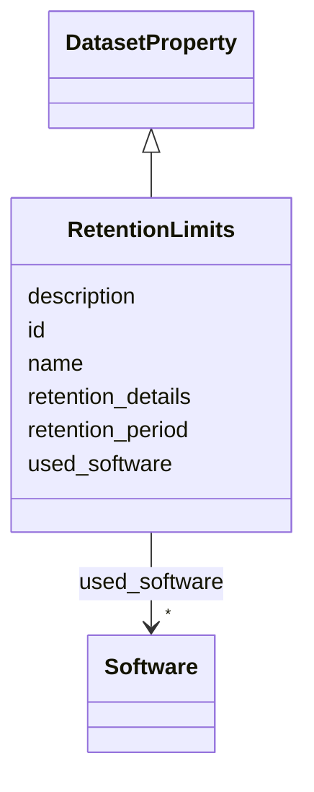

# Class: RetentionLimits 


_If the dataset relates to people, are there applicable limits on the retention of their data (e.g., were individuals told their data would be deleted after a certain time)? If so, please describe these limits and how they will be enforced._

__


URI: [data_sheets_schema:RetentionLimits](https://w3id.org/bridge2ai/data-sheets-schema/RetentionLimits)





## Inheritance
* [DatasetProperty](DatasetProperty.md)
    * **RetentionLimits**


## Slots

| Name | Cardinality and Range | Description | Inheritance |
| ---  | --- | --- | --- |
| [retention_period](retention_period.md) | 0..1 <br/> [String](String.md) | Time period for data retention | direct |
| [retention_details](retention_details.md) | * <br/> [String](String.md) | Details on data retention limits and enforcement procedures | direct |
| [id](id.md) | 0..1 <br/> [Uriorcurie](Uriorcurie.md) | An optional identifier for this property | [DatasetProperty](DatasetProperty.md) |
| [name](name.md) | 0..1 <br/> [String](String.md) | A human-readable name for this property | [DatasetProperty](DatasetProperty.md) |
| [description](description.md) | 0..1 <br/> [String](String.md) | A human-readable description for this property | [DatasetProperty](DatasetProperty.md) |
| [used_software](used_software.md) | * <br/> [Software](Software.md) | What software was used as part of this dataset property? | [DatasetProperty](DatasetProperty.md) |


## Usages

| used by | used in | type | used |
| ---  | --- | --- | --- |
| [Dataset](Dataset.md) | [retention_limit](retention_limit.md) | range | [RetentionLimits](RetentionLimits.md) |
| [DataSubset](DataSubset.md) | [retention_limit](retention_limit.md) | range | [RetentionLimits](RetentionLimits.md) |


## Identifier and Mapping Information


### Schema Source


* from schema: https://w3id.org/bridge2ai/data-sheets-schema


## Mappings

| Mapping Type | Mapped Value |
| ---  | ---  |
| self | data_sheets_schema:RetentionLimits |
| native | data_sheets_schema:RetentionLimits |


## LinkML Source

<!-- TODO: investigate https://stackoverflow.com/questions/37606292/how-to-create-tabbed-code-blocks-in-mkdocs-or-sphinx -->

### Direct

<details>
```yaml
name: RetentionLimits
description: 'If the dataset relates to people, are there applicable limits on the
  retention of their data (e.g., were individuals told their data would be deleted
  after a certain time)? If so, please describe these limits and how they will be
  enforced.

  '
from_schema: https://w3id.org/bridge2ai/data-sheets-schema
is_a: DatasetProperty
attributes:
  retention_period:
    name: retention_period
    description: Time period for data retention.
    from_schema: https://w3id.org/bridge2ai/data-sheets-schema/maintenance
    rank: 1000
    domain_of:
    - RetentionLimits
    range: string
  retention_details:
    name: retention_details
    description: 'Details on data retention limits and enforcement procedures.

      '
    from_schema: https://w3id.org/bridge2ai/data-sheets-schema/maintenance
    rank: 1000
    slot_uri: dcterms:description
    domain_of:
    - RetentionLimits
    range: string
    multivalued: true

```
</details>

### Induced

<details>
```yaml
name: RetentionLimits
description: 'If the dataset relates to people, are there applicable limits on the
  retention of their data (e.g., were individuals told their data would be deleted
  after a certain time)? If so, please describe these limits and how they will be
  enforced.

  '
from_schema: https://w3id.org/bridge2ai/data-sheets-schema
is_a: DatasetProperty
attributes:
  retention_period:
    name: retention_period
    description: Time period for data retention.
    from_schema: https://w3id.org/bridge2ai/data-sheets-schema/maintenance
    rank: 1000
    alias: retention_period
    owner: RetentionLimits
    domain_of:
    - RetentionLimits
    range: string
  retention_details:
    name: retention_details
    description: 'Details on data retention limits and enforcement procedures.

      '
    from_schema: https://w3id.org/bridge2ai/data-sheets-schema/maintenance
    rank: 1000
    slot_uri: dcterms:description
    alias: retention_details
    owner: RetentionLimits
    domain_of:
    - RetentionLimits
    range: string
    multivalued: true
  id:
    name: id
    description: An optional identifier for this property.
    from_schema: https://w3id.org/bridge2ai/data-sheets-schema/base
    slot_uri: schema:identifier
    alias: id
    owner: RetentionLimits
    domain_of:
    - NamedThing
    - DatasetProperty
    range: uriorcurie
  name:
    name: name
    description: A human-readable name for this property.
    from_schema: https://w3id.org/bridge2ai/data-sheets-schema/base
    slot_uri: schema:name
    alias: name
    owner: RetentionLimits
    domain_of:
    - NamedThing
    - DatasetProperty
    range: string
  description:
    name: description
    description: A human-readable description for this property.
    from_schema: https://w3id.org/bridge2ai/data-sheets-schema/base
    slot_uri: schema:description
    alias: description
    owner: RetentionLimits
    domain_of:
    - NamedThing
    - DatasetProperty
    - DatasetRelationship
    range: string
  used_software:
    name: used_software
    description: What software was used as part of this dataset property?
    from_schema: https://w3id.org/bridge2ai/data-sheets-schema/base
    rank: 1000
    alias: used_software
    owner: RetentionLimits
    domain_of:
    - DatasetProperty
    range: Software
    multivalued: true
    inlined: true
    inlined_as_list: true

```
</details>