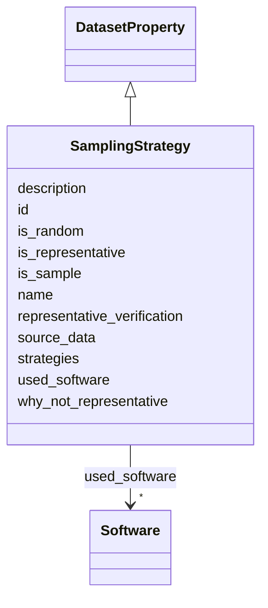

# Class: SamplingStrategy 


_Does the dataset contain all possible instances, or is it a sample (not necessarily random) of instances from a larger set? If so, how representative is it?_

__


URI: [data_sheets_schema:SamplingStrategy](https://w3id.org/bridge2ai/data-sheets-schema/SamplingStrategy)





## Inheritance
* [DatasetProperty](DatasetProperty.md)
    * **SamplingStrategy**


## Slots

| Name | Cardinality and Range | Description | Inheritance |
| ---  | --- | --- | --- |
| [is_sample](is_sample.md) | * <br/> [Boolean](Boolean.md) | Indicates whether it is a sample of a larger set | direct |
| [is_random](is_random.md) | * <br/> [Boolean](Boolean.md) | Indicates whether the sample is random | direct |
| [source_data](source_data.md) | * <br/> [String](String.md) | Description of the larger set from which the sample was drawn, if any | direct |
| [is_representative](is_representative.md) | * <br/> [Boolean](Boolean.md) | Indicates whether the sample is representative of the larger set | direct |
| [representative_verification](representative_verification.md) | * <br/> [String](String.md) | Explanation of how representativeness was validated or verified | direct |
| [why_not_representative](why_not_representative.md) | * <br/> [String](String.md) | Explanation of why the sample is not representative, if applicable | direct |
| [strategies](strategies.md) | * <br/> [String](String.md) | Description of the sampling strategy (deterministic, probabilistic, etc | direct |
| [id](id.md) | 0..1 <br/> [Uriorcurie](Uriorcurie.md) | An optional identifier for this property | [DatasetProperty](DatasetProperty.md) |
| [name](name.md) | 0..1 <br/> [String](String.md) | A human-readable name for this property | [DatasetProperty](DatasetProperty.md) |
| [description](description.md) | 0..1 <br/> [String](String.md) | A human-readable description for this property | [DatasetProperty](DatasetProperty.md) |
| [used_software](used_software.md) | * <br/> [Software](Software.md) | What software was used as part of this dataset property? | [DatasetProperty](DatasetProperty.md) |


## Usages

| used by | used in | type | used |
| ---  | --- | --- | --- |
| [Dataset](Dataset.md) | [sampling_strategies](sampling_strategies.md) | range | [SamplingStrategy](SamplingStrategy.md) |
| [DataSubset](DataSubset.md) | [sampling_strategies](sampling_strategies.md) | range | [SamplingStrategy](SamplingStrategy.md) |
| [Instance](Instance.md) | [sampling_strategies](sampling_strategies.md) | range | [SamplingStrategy](SamplingStrategy.md) |


## Identifier and Mapping Information


### Schema Source


* from schema: https://w3id.org/bridge2ai/data-sheets-schema


## Mappings

| Mapping Type | Mapped Value |
| ---  | ---  |
| self | data_sheets_schema:SamplingStrategy |
| native | data_sheets_schema:SamplingStrategy |


## LinkML Source

<!-- TODO: investigate https://stackoverflow.com/questions/37606292/how-to-create-tabbed-code-blocks-in-mkdocs-or-sphinx -->

### Direct

<details>
```yaml
name: SamplingStrategy
description: 'Does the dataset contain all possible instances, or is it a sample (not
  necessarily random) of instances from a larger set? If so, how representative is
  it?

  '
from_schema: https://w3id.org/bridge2ai/data-sheets-schema
is_a: DatasetProperty
attributes:
  is_sample:
    name: is_sample
    description: Indicates whether it is a sample of a larger set.
    from_schema: https://w3id.org/bridge2ai/data-sheets-schema/composition
    rank: 1000
    domain_of:
    - SamplingStrategy
    range: boolean
    multivalued: true
  is_random:
    name: is_random
    description: Indicates whether the sample is random.
    from_schema: https://w3id.org/bridge2ai/data-sheets-schema/composition
    rank: 1000
    domain_of:
    - SamplingStrategy
    range: boolean
    multivalued: true
  source_data:
    name: source_data
    description: 'Description of the larger set from which the sample was drawn, if
      any.

      '
    from_schema: https://w3id.org/bridge2ai/data-sheets-schema/composition
    rank: 1000
    domain_of:
    - SamplingStrategy
    range: string
    multivalued: true
  is_representative:
    name: is_representative
    description: 'Indicates whether the sample is representative of the larger set.

      '
    from_schema: https://w3id.org/bridge2ai/data-sheets-schema/composition
    rank: 1000
    domain_of:
    - SamplingStrategy
    range: boolean
    multivalued: true
  representative_verification:
    name: representative_verification
    description: 'Explanation of how representativeness was validated or verified.

      '
    from_schema: https://w3id.org/bridge2ai/data-sheets-schema/composition
    rank: 1000
    domain_of:
    - SamplingStrategy
    range: string
    multivalued: true
  why_not_representative:
    name: why_not_representative
    description: 'Explanation of why the sample is not representative, if applicable.

      '
    from_schema: https://w3id.org/bridge2ai/data-sheets-schema/composition
    rank: 1000
    domain_of:
    - SamplingStrategy
    range: string
    multivalued: true
  strategies:
    name: strategies
    description: 'Description of the sampling strategy (deterministic, probabilistic,
      etc.).

      '
    from_schema: https://w3id.org/bridge2ai/data-sheets-schema/composition
    rank: 1000
    domain_of:
    - SamplingStrategy
    range: string
    multivalued: true

```
</details>

### Induced

<details>
```yaml
name: SamplingStrategy
description: 'Does the dataset contain all possible instances, or is it a sample (not
  necessarily random) of instances from a larger set? If so, how representative is
  it?

  '
from_schema: https://w3id.org/bridge2ai/data-sheets-schema
is_a: DatasetProperty
attributes:
  is_sample:
    name: is_sample
    description: Indicates whether it is a sample of a larger set.
    from_schema: https://w3id.org/bridge2ai/data-sheets-schema/composition
    rank: 1000
    alias: is_sample
    owner: SamplingStrategy
    domain_of:
    - SamplingStrategy
    range: boolean
    multivalued: true
  is_random:
    name: is_random
    description: Indicates whether the sample is random.
    from_schema: https://w3id.org/bridge2ai/data-sheets-schema/composition
    rank: 1000
    alias: is_random
    owner: SamplingStrategy
    domain_of:
    - SamplingStrategy
    range: boolean
    multivalued: true
  source_data:
    name: source_data
    description: 'Description of the larger set from which the sample was drawn, if
      any.

      '
    from_schema: https://w3id.org/bridge2ai/data-sheets-schema/composition
    rank: 1000
    alias: source_data
    owner: SamplingStrategy
    domain_of:
    - SamplingStrategy
    range: string
    multivalued: true
  is_representative:
    name: is_representative
    description: 'Indicates whether the sample is representative of the larger set.

      '
    from_schema: https://w3id.org/bridge2ai/data-sheets-schema/composition
    rank: 1000
    alias: is_representative
    owner: SamplingStrategy
    domain_of:
    - SamplingStrategy
    range: boolean
    multivalued: true
  representative_verification:
    name: representative_verification
    description: 'Explanation of how representativeness was validated or verified.

      '
    from_schema: https://w3id.org/bridge2ai/data-sheets-schema/composition
    rank: 1000
    alias: representative_verification
    owner: SamplingStrategy
    domain_of:
    - SamplingStrategy
    range: string
    multivalued: true
  why_not_representative:
    name: why_not_representative
    description: 'Explanation of why the sample is not representative, if applicable.

      '
    from_schema: https://w3id.org/bridge2ai/data-sheets-schema/composition
    rank: 1000
    alias: why_not_representative
    owner: SamplingStrategy
    domain_of:
    - SamplingStrategy
    range: string
    multivalued: true
  strategies:
    name: strategies
    description: 'Description of the sampling strategy (deterministic, probabilistic,
      etc.).

      '
    from_schema: https://w3id.org/bridge2ai/data-sheets-schema/composition
    rank: 1000
    alias: strategies
    owner: SamplingStrategy
    domain_of:
    - SamplingStrategy
    range: string
    multivalued: true
  id:
    name: id
    description: An optional identifier for this property.
    from_schema: https://w3id.org/bridge2ai/data-sheets-schema/base
    slot_uri: schema:identifier
    alias: id
    owner: SamplingStrategy
    domain_of:
    - NamedThing
    - DatasetProperty
    range: uriorcurie
  name:
    name: name
    description: A human-readable name for this property.
    from_schema: https://w3id.org/bridge2ai/data-sheets-schema/base
    slot_uri: schema:name
    alias: name
    owner: SamplingStrategy
    domain_of:
    - NamedThing
    - DatasetProperty
    range: string
  description:
    name: description
    description: A human-readable description for this property.
    from_schema: https://w3id.org/bridge2ai/data-sheets-schema/base
    slot_uri: schema:description
    alias: description
    owner: SamplingStrategy
    domain_of:
    - NamedThing
    - DatasetProperty
    - DatasetRelationship
    range: string
  used_software:
    name: used_software
    description: What software was used as part of this dataset property?
    from_schema: https://w3id.org/bridge2ai/data-sheets-schema/base
    rank: 1000
    alias: used_software
    owner: SamplingStrategy
    domain_of:
    - DatasetProperty
    range: Software
    multivalued: true
    inlined: true
    inlined_as_list: true

```
</details>