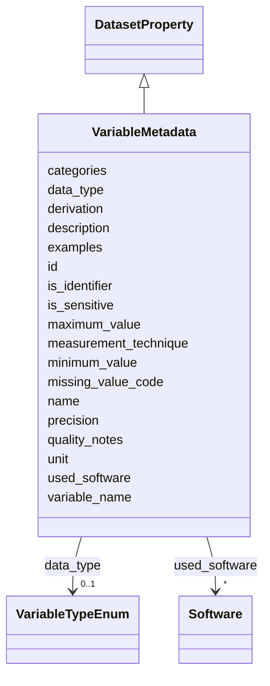

# Class: VariableMetadata 


_Metadata describing an individual variable, field, or column in a dataset. Variables may represent measurements, observations, derived values, or categorical attributes._


URI: [schema:PropertyValue](http://schema.org/PropertyValue)





## Inheritance
* [DatasetProperty](DatasetProperty.md)
    * **VariableMetadata**


## Slots

| Name | Cardinality and Range | Description | Inheritance |
| ---  | --- | --- | --- |
| [variable_name](variable_name.md) | 1 <br/> [String](String.md) | The name or identifier of the variable as it appears in the data files | direct |
| [data_type](data_type.md) | 0..1 <br/> [VariableTypeEnum](VariableTypeEnum.md) | The data type of the variable (e | direct |
| [unit](unit.md) | 0..1 <br/> [Uriorcurie](Uriorcurie.md) | The unit of measurement for the variable, preferably using QUDT units (http:/... | direct |
| [missing_value_code](missing_value_code.md) | * <br/> [String](String.md) | Code(s) used to represent missing values for this variable | direct |
| [minimum_value](minimum_value.md) | 0..1 <br/> [Float](Float.md) | The minimum value that the variable can take | direct |
| [maximum_value](maximum_value.md) | 0..1 <br/> [Float](Float.md) | The maximum value that the variable can take | direct |
| [categories](categories.md) | * <br/> [String](String.md) | The permitted categories or values for a categorical variable | direct |
| [examples](examples.md) | * <br/> [String](String.md) | Example values for this variable to illustrate typical data | direct |
| [is_identifier](is_identifier.md) | 0..1 <br/> [Boolean](Boolean.md) | Indicates whether this variable serves as a unique identifier or key for reco... | direct |
| [is_sensitive](is_sensitive.md) | 0..1 <br/> [Boolean](Boolean.md) | Indicates whether this variable contains sensitive information (e | direct |
| [precision](precision.md) | 0..1 <br/> [Integer](Integer.md) | The precision or number of decimal places for numeric variables | direct |
| [measurement_technique](measurement_technique.md) | 0..1 <br/> [String](String.md) | The technique or method used to measure this variable | direct |
| [derivation](derivation.md) | 0..1 <br/> [String](String.md) | Description of how this variable was derived or calculated from other variabl... | direct |
| [quality_notes](quality_notes.md) | * <br/> [String](String.md) | Notes about data quality, reliability, or known issues specific to this varia... | direct |
| [id](id.md) | 0..1 <br/> [Uriorcurie](Uriorcurie.md) | An optional identifier for this property | [DatasetProperty](DatasetProperty.md) |
| [name](name.md) | 0..1 <br/> [String](String.md) | A human-readable name for this property | [DatasetProperty](DatasetProperty.md) |
| [description](description.md) | 0..1 <br/> [String](String.md) | A human-readable description for this property | [DatasetProperty](DatasetProperty.md) |
| [used_software](used_software.md) | * <br/> [Software](Software.md) | What software was used as part of this dataset property? | [DatasetProperty](DatasetProperty.md) |


## Usages

| used by | used in | type | used |
| ---  | --- | --- | --- |
| [Dataset](Dataset.md) | [variables](variables.md) | range | [VariableMetadata](VariableMetadata.md) |
| [DataSubset](DataSubset.md) | [variables](variables.md) | range | [VariableMetadata](VariableMetadata.md) |


## Identifier and Mapping Information


### Schema Source


* from schema: https://w3id.org/bridge2ai/data-sheets-schema


## Mappings

| Mapping Type | Mapped Value |
| ---  | ---  |
| self | schema:PropertyValue |
| native | data_sheets_schema:VariableMetadata |
| exact | schema:PropertyValue |


## LinkML Source

<!-- TODO: investigate https://stackoverflow.com/questions/37606292/how-to-create-tabbed-code-blocks-in-mkdocs-or-sphinx -->

### Direct

<details>
```yaml
name: VariableMetadata
description: Metadata describing an individual variable, field, or column in a dataset.
  Variables may represent measurements, observations, derived values, or categorical
  attributes.
from_schema: https://w3id.org/bridge2ai/data-sheets-schema
exact_mappings:
- schema:PropertyValue
is_a: DatasetProperty
attributes:
  variable_name:
    name: variable_name
    description: The name or identifier of the variable as it appears in the data
      files.
    from_schema: https://w3id.org/bridge2ai/data-sheets-schema/variables
    exact_mappings:
    - schema:name
    rank: 1000
    slot_uri: schema:name
    domain_of:
    - VariableMetadata
    range: string
    required: true
  data_type:
    name: data_type
    description: The data type of the variable (e.g., integer, float, string, boolean,
      date, categorical). Use standard type names when possible.
    from_schema: https://w3id.org/bridge2ai/data-sheets-schema/variables
    exact_mappings:
    - schema:DataType
    rank: 1000
    slot_uri: schema:DataType
    domain_of:
    - VariableMetadata
    range: VariableTypeEnum
  unit:
    name: unit
    description: 'The unit of measurement for the variable, preferably using QUDT
      units (http://qudt.org/vocab/unit/). Examples: qudt:Kilogram, qudt:Meter, qudt:DegreeCelsius.'
    from_schema: https://w3id.org/bridge2ai/data-sheets-schema/variables
    exact_mappings:
    - qudt:hasUnit
    - schema:unitCode
    rank: 1000
    slot_uri: qudt:unit
    domain_of:
    - VariableMetadata
    range: uriorcurie
  missing_value_code:
    name: missing_value_code
    description: 'Code(s) used to represent missing values for this variable. Examples:
      "NA", "-999", "null", "". Multiple codes may be specified.'
    from_schema: https://w3id.org/bridge2ai/data-sheets-schema/variables
    rank: 1000
    domain_of:
    - VariableMetadata
    range: string
    multivalued: true
  minimum_value:
    name: minimum_value
    description: The minimum value that the variable can take. Applicable to numeric
      variables.
    from_schema: https://w3id.org/bridge2ai/data-sheets-schema/variables
    rank: 1000
    slot_uri: schema:minValue
    domain_of:
    - VariableMetadata
    range: float
  maximum_value:
    name: maximum_value
    description: The maximum value that the variable can take. Applicable to numeric
      variables.
    from_schema: https://w3id.org/bridge2ai/data-sheets-schema/variables
    rank: 1000
    slot_uri: schema:maxValue
    domain_of:
    - VariableMetadata
    range: float
  categories:
    name: categories
    description: The permitted categories or values for a categorical variable. Each
      entry should describe a possible value and its meaning.
    from_schema: https://w3id.org/bridge2ai/data-sheets-schema/variables
    rank: 1000
    slot_uri: schema:valueReference
    domain_of:
    - VariableMetadata
    range: string
    multivalued: true
  examples:
    name: examples
    description: Example values for this variable to illustrate typical data.
    from_schema: https://w3id.org/bridge2ai/data-sheets-schema/variables
    slot_uri: skos:example
    domain_of:
    - ExistingUse
    - IntendedUse
    - VariableMetadata
    range: string
    multivalued: true
  is_identifier:
    name: is_identifier
    description: Indicates whether this variable serves as a unique identifier or
      key for records in the dataset.
    from_schema: https://w3id.org/bridge2ai/data-sheets-schema/variables
    rank: 1000
    slot_uri: schema:identifier
    domain_of:
    - VariableMetadata
    range: boolean
  is_sensitive:
    name: is_sensitive
    description: Indicates whether this variable contains sensitive information (e.g.,
      personal data, protected health information).
    from_schema: https://w3id.org/bridge2ai/data-sheets-schema/variables
    rank: 1000
    domain_of:
    - VariableMetadata
    range: boolean
  precision:
    name: precision
    description: The precision or number of decimal places for numeric variables.
    from_schema: https://w3id.org/bridge2ai/data-sheets-schema/variables
    rank: 1000
    domain_of:
    - VariableMetadata
    range: integer
  measurement_technique:
    name: measurement_technique
    description: 'The technique or method used to measure this variable. Examples:
      "mass spectrometry", "self-report survey", "GPS coordinates".'
    from_schema: https://w3id.org/bridge2ai/data-sheets-schema/variables
    rank: 1000
    slot_uri: schema:measurementTechnique
    domain_of:
    - VariableMetadata
    range: string
  derivation:
    name: derivation
    description: Description of how this variable was derived or calculated from other
      variables, if applicable.
    from_schema: https://w3id.org/bridge2ai/data-sheets-schema/variables
    rank: 1000
    domain_of:
    - VariableMetadata
    range: string
  quality_notes:
    name: quality_notes
    description: Notes about data quality, reliability, or known issues specific to
      this variable.
    from_schema: https://w3id.org/bridge2ai/data-sheets-schema/variables
    rank: 1000
    domain_of:
    - VariableMetadata
    range: string
    multivalued: true
class_uri: schema:PropertyValue

```
</details>

### Induced

<details>
```yaml
name: VariableMetadata
description: Metadata describing an individual variable, field, or column in a dataset.
  Variables may represent measurements, observations, derived values, or categorical
  attributes.
from_schema: https://w3id.org/bridge2ai/data-sheets-schema
exact_mappings:
- schema:PropertyValue
is_a: DatasetProperty
attributes:
  variable_name:
    name: variable_name
    description: The name or identifier of the variable as it appears in the data
      files.
    from_schema: https://w3id.org/bridge2ai/data-sheets-schema/variables
    exact_mappings:
    - schema:name
    rank: 1000
    slot_uri: schema:name
    alias: variable_name
    owner: VariableMetadata
    domain_of:
    - VariableMetadata
    range: string
    required: true
  data_type:
    name: data_type
    description: The data type of the variable (e.g., integer, float, string, boolean,
      date, categorical). Use standard type names when possible.
    from_schema: https://w3id.org/bridge2ai/data-sheets-schema/variables
    exact_mappings:
    - schema:DataType
    rank: 1000
    slot_uri: schema:DataType
    alias: data_type
    owner: VariableMetadata
    domain_of:
    - VariableMetadata
    range: VariableTypeEnum
  unit:
    name: unit
    description: 'The unit of measurement for the variable, preferably using QUDT
      units (http://qudt.org/vocab/unit/). Examples: qudt:Kilogram, qudt:Meter, qudt:DegreeCelsius.'
    from_schema: https://w3id.org/bridge2ai/data-sheets-schema/variables
    exact_mappings:
    - qudt:hasUnit
    - schema:unitCode
    rank: 1000
    slot_uri: qudt:unit
    alias: unit
    owner: VariableMetadata
    domain_of:
    - VariableMetadata
    range: uriorcurie
  missing_value_code:
    name: missing_value_code
    description: 'Code(s) used to represent missing values for this variable. Examples:
      "NA", "-999", "null", "". Multiple codes may be specified.'
    from_schema: https://w3id.org/bridge2ai/data-sheets-schema/variables
    rank: 1000
    alias: missing_value_code
    owner: VariableMetadata
    domain_of:
    - VariableMetadata
    range: string
    multivalued: true
  minimum_value:
    name: minimum_value
    description: The minimum value that the variable can take. Applicable to numeric
      variables.
    from_schema: https://w3id.org/bridge2ai/data-sheets-schema/variables
    rank: 1000
    slot_uri: schema:minValue
    alias: minimum_value
    owner: VariableMetadata
    domain_of:
    - VariableMetadata
    range: float
  maximum_value:
    name: maximum_value
    description: The maximum value that the variable can take. Applicable to numeric
      variables.
    from_schema: https://w3id.org/bridge2ai/data-sheets-schema/variables
    rank: 1000
    slot_uri: schema:maxValue
    alias: maximum_value
    owner: VariableMetadata
    domain_of:
    - VariableMetadata
    range: float
  categories:
    name: categories
    description: The permitted categories or values for a categorical variable. Each
      entry should describe a possible value and its meaning.
    from_schema: https://w3id.org/bridge2ai/data-sheets-schema/variables
    rank: 1000
    slot_uri: schema:valueReference
    alias: categories
    owner: VariableMetadata
    domain_of:
    - VariableMetadata
    range: string
    multivalued: true
  examples:
    name: examples
    description: Example values for this variable to illustrate typical data.
    from_schema: https://w3id.org/bridge2ai/data-sheets-schema/variables
    slot_uri: skos:example
    alias: examples
    owner: VariableMetadata
    domain_of:
    - ExistingUse
    - IntendedUse
    - VariableMetadata
    range: string
    multivalued: true
  is_identifier:
    name: is_identifier
    description: Indicates whether this variable serves as a unique identifier or
      key for records in the dataset.
    from_schema: https://w3id.org/bridge2ai/data-sheets-schema/variables
    rank: 1000
    slot_uri: schema:identifier
    alias: is_identifier
    owner: VariableMetadata
    domain_of:
    - VariableMetadata
    range: boolean
  is_sensitive:
    name: is_sensitive
    description: Indicates whether this variable contains sensitive information (e.g.,
      personal data, protected health information).
    from_schema: https://w3id.org/bridge2ai/data-sheets-schema/variables
    rank: 1000
    alias: is_sensitive
    owner: VariableMetadata
    domain_of:
    - VariableMetadata
    range: boolean
  precision:
    name: precision
    description: The precision or number of decimal places for numeric variables.
    from_schema: https://w3id.org/bridge2ai/data-sheets-schema/variables
    rank: 1000
    alias: precision
    owner: VariableMetadata
    domain_of:
    - VariableMetadata
    range: integer
  measurement_technique:
    name: measurement_technique
    description: 'The technique or method used to measure this variable. Examples:
      "mass spectrometry", "self-report survey", "GPS coordinates".'
    from_schema: https://w3id.org/bridge2ai/data-sheets-schema/variables
    rank: 1000
    slot_uri: schema:measurementTechnique
    alias: measurement_technique
    owner: VariableMetadata
    domain_of:
    - VariableMetadata
    range: string
  derivation:
    name: derivation
    description: Description of how this variable was derived or calculated from other
      variables, if applicable.
    from_schema: https://w3id.org/bridge2ai/data-sheets-schema/variables
    rank: 1000
    alias: derivation
    owner: VariableMetadata
    domain_of:
    - VariableMetadata
    range: string
  quality_notes:
    name: quality_notes
    description: Notes about data quality, reliability, or known issues specific to
      this variable.
    from_schema: https://w3id.org/bridge2ai/data-sheets-schema/variables
    rank: 1000
    alias: quality_notes
    owner: VariableMetadata
    domain_of:
    - VariableMetadata
    range: string
    multivalued: true
  id:
    name: id
    description: An optional identifier for this property.
    from_schema: https://w3id.org/bridge2ai/data-sheets-schema/base
    slot_uri: schema:identifier
    alias: id
    owner: VariableMetadata
    domain_of:
    - NamedThing
    - DatasetProperty
    range: uriorcurie
  name:
    name: name
    description: A human-readable name for this property.
    from_schema: https://w3id.org/bridge2ai/data-sheets-schema/base
    slot_uri: schema:name
    alias: name
    owner: VariableMetadata
    domain_of:
    - NamedThing
    - DatasetProperty
    range: string
  description:
    name: description
    description: A human-readable description for this property.
    from_schema: https://w3id.org/bridge2ai/data-sheets-schema/base
    slot_uri: schema:description
    alias: description
    owner: VariableMetadata
    domain_of:
    - NamedThing
    - DatasetProperty
    - DatasetRelationship
    range: string
  used_software:
    name: used_software
    description: What software was used as part of this dataset property?
    from_schema: https://w3id.org/bridge2ai/data-sheets-schema/base
    rank: 1000
    alias: used_software
    owner: VariableMetadata
    domain_of:
    - DatasetProperty
    range: Software
    multivalued: true
    inlined: true
    inlined_as_list: true
class_uri: schema:PropertyValue

```
</details>