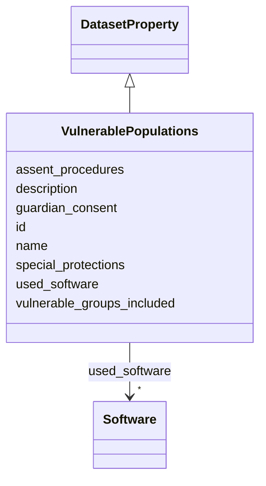

# Class: VulnerablePopulations 


_Information about protections for vulnerable populations in human subjects research._

__


URI: [data_sheets_schema:VulnerablePopulations](https://w3id.org/bridge2ai/data-sheets-schema/VulnerablePopulations)





## Inheritance
* [DatasetProperty](DatasetProperty.md)
    * **VulnerablePopulations**


## Slots

| Name | Cardinality and Range | Description | Inheritance |
| ---  | --- | --- | --- |
| [vulnerable_groups_included](vulnerable_groups_included.md) | 0..1 <br/> [Boolean](Boolean.md) | Are any vulnerable populations included (e | direct |
| [special_protections](special_protections.md) | * <br/> [String](String.md) | What additional protections were implemented for vulnerable populations? Incl... | direct |
| [assent_procedures](assent_procedures.md) | * <br/> [String](String.md) | For research involving minors, what assent procedures were used? How was deve... | direct |
| [guardian_consent](guardian_consent.md) | * <br/> [String](String.md) | For participants unable to provide their own consent, how was guardian or sur... | direct |
| [id](id.md) | 0..1 <br/> [Uriorcurie](Uriorcurie.md) | An optional identifier for this property | [DatasetProperty](DatasetProperty.md) |
| [name](name.md) | 0..1 <br/> [String](String.md) | A human-readable name for this property | [DatasetProperty](DatasetProperty.md) |
| [description](description.md) | 0..1 <br/> [String](String.md) | A human-readable description for this property | [DatasetProperty](DatasetProperty.md) |
| [used_software](used_software.md) | * <br/> [Software](Software.md) | What software was used as part of this dataset property? | [DatasetProperty](DatasetProperty.md) |


## Usages

| used by | used in | type | used |
| ---  | --- | --- | --- |
| [Dataset](Dataset.md) | [vulnerable_populations](vulnerable_populations.md) | range | [VulnerablePopulations](VulnerablePopulations.md) |
| [DataSubset](DataSubset.md) | [vulnerable_populations](vulnerable_populations.md) | range | [VulnerablePopulations](VulnerablePopulations.md) |


## Identifier and Mapping Information


### Schema Source


* from schema: https://w3id.org/bridge2ai/data-sheets-schema


## Mappings

| Mapping Type | Mapped Value |
| ---  | ---  |
| self | data_sheets_schema:VulnerablePopulations |
| native | data_sheets_schema:VulnerablePopulations |


## LinkML Source

<!-- TODO: investigate https://stackoverflow.com/questions/37606292/how-to-create-tabbed-code-blocks-in-mkdocs-or-sphinx -->

### Direct

<details>
```yaml
name: VulnerablePopulations
description: 'Information about protections for vulnerable populations in human subjects
  research.

  '
from_schema: https://w3id.org/bridge2ai/data-sheets-schema
is_a: DatasetProperty
attributes:
  vulnerable_groups_included:
    name: vulnerable_groups_included
    description: 'Are any vulnerable populations included (e.g., children, pregnant
      women, prisoners, cognitively impaired individuals)?

      '
    from_schema: https://w3id.org/bridge2ai/data-sheets-schema/human
    rank: 1000
    domain_of:
    - VulnerablePopulations
    range: boolean
  special_protections:
    name: special_protections
    description: 'What additional protections were implemented for vulnerable populations?
      Include safeguards, modified procedures, or additional oversight.

      '
    from_schema: https://w3id.org/bridge2ai/data-sheets-schema/human
    rank: 1000
    domain_of:
    - VulnerablePopulations
    range: string
    multivalued: true
  assent_procedures:
    name: assent_procedures
    description: 'For research involving minors, what assent procedures were used?
      How was developmentally appropriate assent obtained?

      '
    from_schema: https://w3id.org/bridge2ai/data-sheets-schema/human
    rank: 1000
    domain_of:
    - VulnerablePopulations
    range: string
    multivalued: true
  guardian_consent:
    name: guardian_consent
    description: 'For participants unable to provide their own consent, how was guardian
      or surrogate consent obtained?

      '
    from_schema: https://w3id.org/bridge2ai/data-sheets-schema/human
    rank: 1000
    domain_of:
    - VulnerablePopulations
    range: string
    multivalued: true

```
</details>

### Induced

<details>
```yaml
name: VulnerablePopulations
description: 'Information about protections for vulnerable populations in human subjects
  research.

  '
from_schema: https://w3id.org/bridge2ai/data-sheets-schema
is_a: DatasetProperty
attributes:
  vulnerable_groups_included:
    name: vulnerable_groups_included
    description: 'Are any vulnerable populations included (e.g., children, pregnant
      women, prisoners, cognitively impaired individuals)?

      '
    from_schema: https://w3id.org/bridge2ai/data-sheets-schema/human
    rank: 1000
    alias: vulnerable_groups_included
    owner: VulnerablePopulations
    domain_of:
    - VulnerablePopulations
    range: boolean
  special_protections:
    name: special_protections
    description: 'What additional protections were implemented for vulnerable populations?
      Include safeguards, modified procedures, or additional oversight.

      '
    from_schema: https://w3id.org/bridge2ai/data-sheets-schema/human
    rank: 1000
    alias: special_protections
    owner: VulnerablePopulations
    domain_of:
    - VulnerablePopulations
    range: string
    multivalued: true
  assent_procedures:
    name: assent_procedures
    description: 'For research involving minors, what assent procedures were used?
      How was developmentally appropriate assent obtained?

      '
    from_schema: https://w3id.org/bridge2ai/data-sheets-schema/human
    rank: 1000
    alias: assent_procedures
    owner: VulnerablePopulations
    domain_of:
    - VulnerablePopulations
    range: string
    multivalued: true
  guardian_consent:
    name: guardian_consent
    description: 'For participants unable to provide their own consent, how was guardian
      or surrogate consent obtained?

      '
    from_schema: https://w3id.org/bridge2ai/data-sheets-schema/human
    rank: 1000
    alias: guardian_consent
    owner: VulnerablePopulations
    domain_of:
    - VulnerablePopulations
    range: string
    multivalued: true
  id:
    name: id
    description: An optional identifier for this property.
    from_schema: https://w3id.org/bridge2ai/data-sheets-schema/base
    slot_uri: schema:identifier
    alias: id
    owner: VulnerablePopulations
    domain_of:
    - NamedThing
    - DatasetProperty
    range: uriorcurie
  name:
    name: name
    description: A human-readable name for this property.
    from_schema: https://w3id.org/bridge2ai/data-sheets-schema/base
    slot_uri: schema:name
    alias: name
    owner: VulnerablePopulations
    domain_of:
    - NamedThing
    - DatasetProperty
    range: string
  description:
    name: description
    description: A human-readable description for this property.
    from_schema: https://w3id.org/bridge2ai/data-sheets-schema/base
    slot_uri: schema:description
    alias: description
    owner: VulnerablePopulations
    domain_of:
    - NamedThing
    - DatasetProperty
    - DatasetRelationship
    range: string
  used_software:
    name: used_software
    description: What software was used as part of this dataset property?
    from_schema: https://w3id.org/bridge2ai/data-sheets-schema/base
    rank: 1000
    alias: used_software
    owner: VulnerablePopulations
    domain_of:
    - DatasetProperty
    range: Software
    multivalued: true
    inlined: true
    inlined_as_list: true

```
</details>