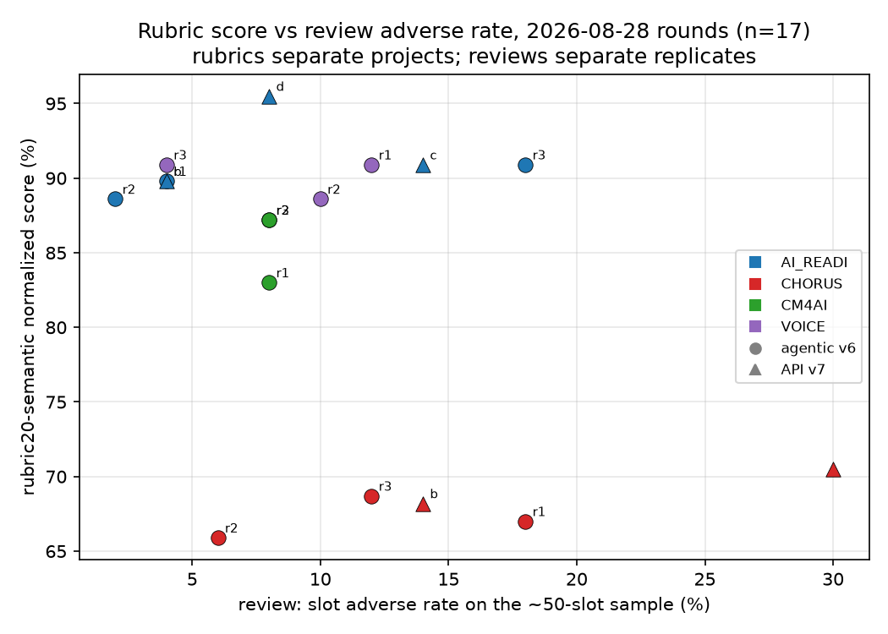

# Cross-read: rubric scores vs review adverse rates (2026-08-30)

The 2026-08-28 rounds were measured twice: label-aware rubric10/20-semantic
evaluations (`data/evaluation_llm/rubric{10,20}_semantic/label_aware/`,
interpreted in `notes/arm_2026-08-28_interpretation.md`) and the
`d4d-review-record` pass (`notes/review_pass_2026-08-30.md`). This note joins
them per record — all 17 records (12 agentic v6, 5 API v7 canaries) have both.

**Question.** Do the two instruments agree per record, and is the claim that
"rubrics reward coverage while reviews penalise unsupported content" true in
the numbers?

## The table

`r10`/`r20` are the rubric normalized percentages. `leaves` is
`populated_leaves` of the full record. `slot adverse` counts non-affirmative
verdicts on the ~50 sampled slots (weak + misread + unsupported + inferred +
not_in_bundle); `rate` divides by the slots actually sampled. `rules
violated` is out of 15 (v6) or 16 (v7).

| arm | project | rep | r10 | r20 | leaves | slot adverse | rate | rules violated |
|---|---|---|---|---|---|---|---|---|
| v6 | AI_READI | rep1 ✓ | 100.0 | 89.8 | 667 | 2 | 4% | 2 |
| v6 | AI_READI | rep2 | 96.0 | 88.6 | 558 | 1 | 2% | 3 |
| v6 | AI_READI | rep3 | 98.0 | 90.9 | 585 | 9 | 18% | 4 |
| v6 | CHORUS | rep1 | 61.2 | 67.0 | 197 | 9 | 18% | 3 |
| v6 | CHORUS | rep2 | 53.1 | 65.9 | 281 | 3 | 6% | 6 |
| v6 | CHORUS | rep3 ✓ | 61.2 | 68.7 | 205 | 6 | 12% | 3 |
| v6 | CM4AI | rep1 | 86.7 | 83.0 | 765 | 4 | 8% | 0 |
| v6 | CM4AI | rep2 | 88.9 | 87.2 | 493 | 4 | 8% | 5 |
| v6 | CM4AI | rep3 ✓ | 93.3 | 87.2 | 860 | 4 | 8% | 0 |
| v6 | VOICE | rep1 | 98.0 | 90.9 | 617 | 6 | 12% | 3 |
| v6 | VOICE | rep2 | 94.0 | 88.6 | 460 | 5 | 10% | 5 |
| v6 | VOICE | rep3 ✓ | 98.0 | 90.9 | 560 | 2 | 4% | 3 |
| v7 | AI_READI | 28b | 98.0 | 89.8 | 446 | 2 | 4% | 8 |
| v7 | AI_READI | 28c | 98.0 | 90.9 | 434 | 7 | 14% | 7 |
| v7 | AI_READI | 28d | 98.0 | 95.5 | 685 | 4 | 8% | 9 |
| v7 | CHORUS | 28 | 65.3 | 70.5 | 209 | 15 | 30% | 5 |
| v7 | CHORUS | 28b | 63.3 | 68.2 | 195 | 7 | 14% | 6 |

(✓ = the v6 canonical selection.)

## What correlates with what

Spearman rank correlations (all 17; v6-only in parentheses to remove the arm
confound):

| pair | ρ |
|---|---|
| r10 vs r20 | **+0.93** (+0.95) |
| r10 vs populated leaves | **+0.59** (+0.57) |
| r20 vs populated leaves | **+0.58** (+0.50) |
| r10 vs slot adverse rate | −0.32 (−0.23) |
| r20 vs slot adverse rate | −0.20 (−0.09) |
| r20 vs rules violated | +0.16 (−0.08) |
| slot adverse rate vs leaves | −0.43 (−0.27) |

Three readings, all visible in the raw table without the statistics:

1. **The rubrics measure the project, not the record.** Both rubrics
   correlate strongly with each other and with leaf coverage, and their
   variance is almost entirely between projects: every CHORUS record scores
   53–71 and every AI_READI/VOICE record 88–100, whichever arm and whatever
   its review found. Within a project the rubric spread across replicates is
   ≤4.2 points of r20 while the review adverse rate spans 2%→18% (AI_READI
   v6) — the rubric cannot see the difference between the cleanest and the
   most inference-laden replicate of the same project.
2. **The review is near-orthogonal to the rubrics.** ρ(rubric, adverse) is
   −0.3 to −0.1 overall and −0.2 to 0.0 within v6 — nothing, at this n.
   The two clearest single records: **AI_READI v6 rep3** has the *highest*
   r20 of its triplet (90.9) and the *worst* adverse rate (18%: five
   inferred values, one not in the bundle, three weak receipts); **AI_READI
   v7 28d** has the highest r20 of all seventeen (95.5) alongside 9 of 16
   rules violated, an ungrounded ROR attachment, and the pass's only
   `missed_content` chunk. Unsupported content *helps* a coverage-shaped
   score: an inferred `data_type` fills a sub-element the rubric awards.
3. **Rule violations are invisible to the rubrics** (ρ ≈ 0, sign unstable).
   The v7 canaries average 7 violations against v6's 3.1 — plan-as-done,
   Person-ranged strings, absence statements — with rubric scores
   indistinguishable from v6's on the same projects.

So the asserted claim in the interpretation note is now shown: the rubrics
reward what the bundle makes possible (coverage of rubric elements), the
reviews penalise what the record did with it (inference, laundered
receipts, misfiled content), and per record they carry close to independent
information. Neither subsumes the other; a record needs both numbers.

## Caveats

- n=17, and only 5 on the v7 side — three of them AI_READI canaries under
  successive instrument fixes, two CHORUS. Arm-level conclusions wait for
  Monday's 12-record v7 fan-out; the rubric-vs-review orthogonality does not,
  since it holds within v6 alone (n=12).
- The adverse rate sits on a ~50-slot sample per record: its binomial
  standard error is ±4–6 percentage points, so single-record rates of 4% vs
  8% do not separate; 2–4% vs 18% does.
- One reviewer per record, no inter-rater figure; the rubric evaluations are
  single runs of the rubric agents. Both instruments are Claude judging
  Claude.
- `slots` (the selection metric) and `leaves` are equal per record here, so
  the canonical selection's coverage criterion inherits the rubric's
  blindness: it, too, cannot distinguish AI_READI rep1 (4%) from a
  hypothetical rep at 18% unless validation fails. #660 (quality metrics
  unused in selection) now has the concrete form: the *review adverse rate*
  is the number the selection has no view of. In this round it happened not
  to matter — every selected replicate is also at or tied for the fewest
  adverse items — but nothing enforced that.

## What this implies for the instruments (feeds the issue list)

- The rubric agents evaluate quality *given the documentation*; they do not
  check grounding and should not be read as a correctness signal (#158/#159
  scope this; no new issue).
- The review's slot-level adverse rate is the only per-record correctness
  number the pipeline has. If it is to gate or rank anything (e.g. join the
  canonical criterion per #660), it first needs the sampling noise stated
  (±5pp) and ideally a second reviewer on disagreement-prone records.
- The deterministic receipt validator sits between the two: it verifies
  attribution, not support. The three receipt-shaped gaps it could close
  (#804 one-leaf entry receipts, #806 irrelevant-verbatim flags, #807 v7
  never-receipted split) would each move part of the review's judgement into
  the checkable column.
